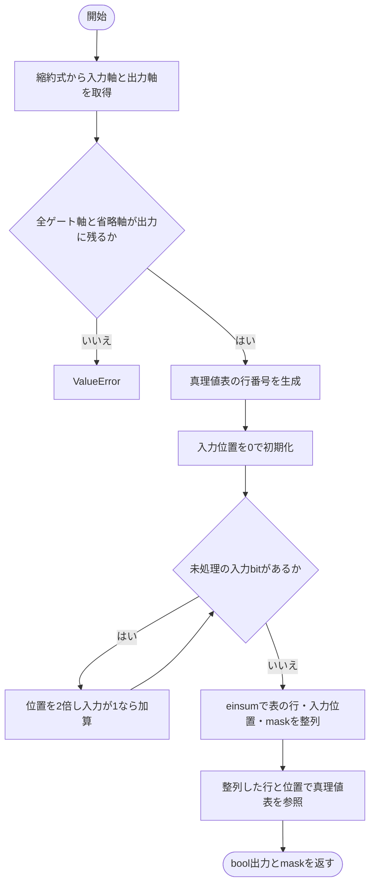
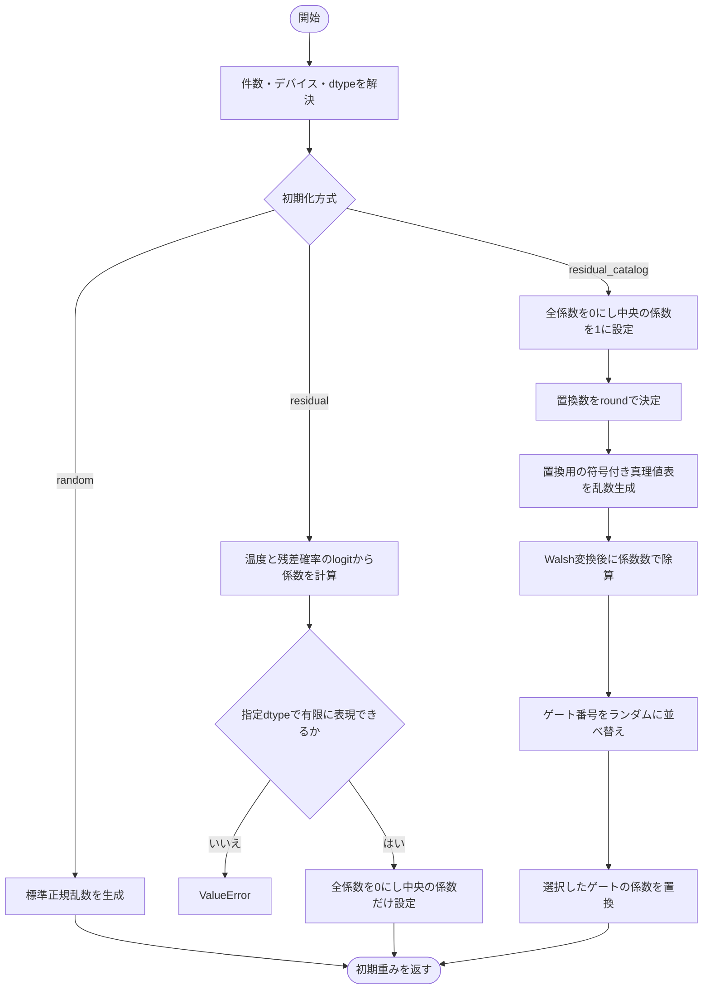
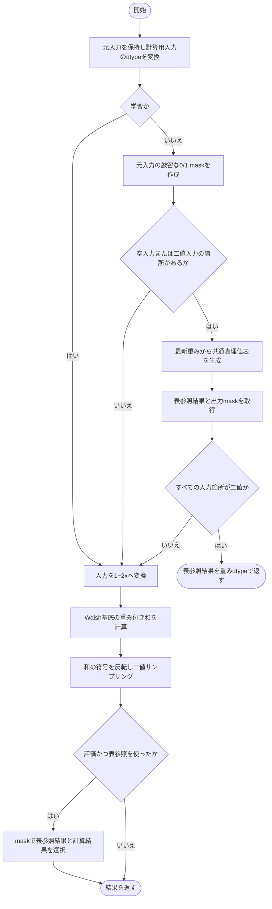
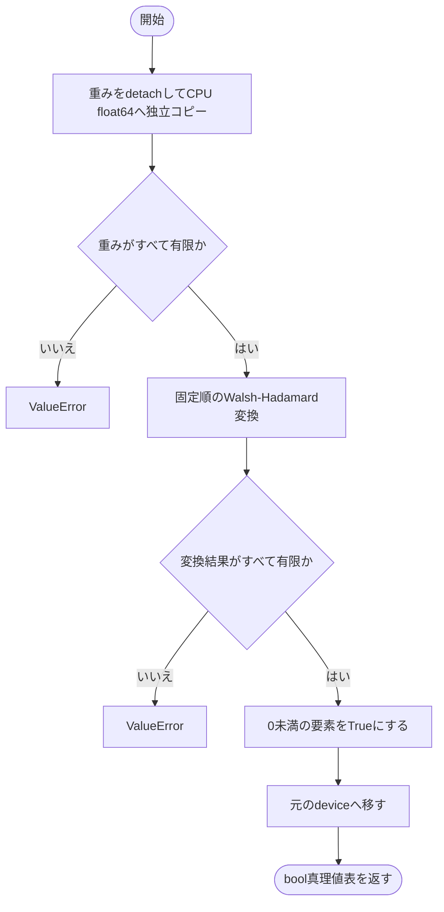

# warp.py

`utils/logicNN_core/src/logicnn_core/parametrizations/warp.py`

Walsh基底の係数で論理関数を表すWarp方式です。学習時は基底和をsigmoidで連続化します。通常評価の完全な0/1入力はCPU float64で生成した共通真理値表を参照し、回路出力とのbitの違いを抑えます。

{/* source-sha256: de03a4632de95922447035246d3492dd5096614dde6f9770192e85cb15c43d4b */}

{/* function: _lookup_binary_outputs@21 */}

## \_lookup\_binary\_outputs() {/* #lookup-binary-outputs */}

```python
def _lookup_binary_outputs(inputs: Tensor, tables: Tensor, binary: Tensor, contraction: str) -> tuple[Tensor, Tensor]:
```

### 機能概要

各ゲートの真理値表の行番号、入力bit列の整数位置、二値入力のマスクをcontractionに従って整列します。ゲート軸を消す縮約は受け付けません。

### 引数

| 引数 | 型 | 既定値 | 説明 |
|---|---|---|---|
| `inputs` | `Tensor` | `必須` | 第1軸にゲート入力を並べた元の入力Tensor。 |
| `tables` | `Tensor` | `必須` | 末尾に2**num_inputs行を持つbool真理値表。 |
| `binary` | `Tensor` | `必須` | 各ゲート入力がすべて厳密な0/1かを表すbool Tensor。inputsの第1軸を除いたshape。 |
| `contraction` | `str` | `必須` | 重み側と入力側の軸を出力へ残すeinsum式。 |

### 処理の流れ



### 戻り値

型：`tuple[Tensor, Tensor]`

出力軸へ揃えたboolの表参照結果と、同じ出力軸へ揃えた二値入力マスクの組。

### ソースコード

<details>
<summary>\_lookup\_binary\_outputs() の実装を開く</summary>

```python
def _lookup_binary_outputs(inputs: Tensor, tables: Tensor, binary: Tensor, contraction: str) -> tuple[Tensor, Tensor]:
    """ゲート軸を保つ縮約に沿って表の行・入力bit列・二値maskを整列し、bool出力を引く。"""
    operands, output = contraction.replace(" ", "").split("->")
    labels           = set(operands.replace(",", "").replace(".", ""))
    if not labels <= set(output) or ("..." in operands and "..." not in output):
        raise ValueError("Warpの二値evalでは各ゲートの軸を出力へ残してください。複数ゲートを還元するcontractionは未対応です")

    entries = tables.shape[-1]
    rows    = torch.arange(tables.numel() // entries, device=tables.device).reshape(tables.shape[:-1])
    indices = torch.zeros_like(binary, dtype=torch.int64)
    for bit in (inputs == 1).unbind(dim=1):
        indices = 2 * indices + bit.to(dtype=torch.int64)
    row_ones   = torch.ones_like(rows)
    input_ones = torch.ones_like(indices)
    aligned_rows    = torch.einsum(contraction, rows, input_ones)
    aligned_indices = torch.einsum(contraction, row_ones, indices)
    aligned_binary  = torch.einsum(contraction, row_ones, binary.to(dtype=torch.int64)).bool()
    return tables.reshape(-1, entries)[aligned_rows, aligned_indices], aligned_binary
```

</details>

## WarpLUTParametrization {/* #warplutparametrization-class */}

1・2・4・6入力のWalsh係数を生成・計算・離散化する方式。係数そのものは呼び出し元の層が所有します。

継承元：`LUTParametrization`

{/* function: WarpLUTParametrization.initialize@46 */}

## WarpLUTParametrization.initialize() {/* #warplutparametrization-initialize */}

```python
def initialize(self, count: int, *, device: torch.device | str | None = None, dtype: torch.dtype | None = None) -> Tensor:
```

### 機能概要

randomは標準正規乱数、residualは最初の入力に対応する係数だけを設定します。residual_catalogは最初の入力を通す係数を基本に、一部のゲートをランダムな真理値表のWalsh係数へ置き換えます。

### 引数

| 引数 | 型 | 既定値 | 説明 |
|---|---|---|---|
| `count` | `int` | `必須` | 生成するゲート数。正のPython整数。 |
| `device` | `torch.device \| str \| None` | `None` | 生成先デバイス。NoneはPyTorchの既定値。 |
| `dtype` | `torch.dtype \| None` | `None` | 生成する浮動小数点型。NoneはPyTorchの既定dtype。 |

### 処理の流れ



### 戻り値

型：`Tensor`

[count, 2**num_inputs]の初期Walsh係数Tensor。

### 状態の変更・ファイル出力

- randomとresidual_catalogで乱数を消費します。

### 例外・注意事項

- residual係数はtemperature × log(p / (1−p))、catalogの置換数はround(count × (1−p))です。

### ソースコード

<details>
<summary>WarpLUTParametrization.initialize() の実装を開く</summary>

```python
def initialize(self, count: int, *, device: torch.device | str | None = None, dtype: torch.dtype | None = None) -> Tensor:
    """通常residual・真理値表catalog・正規乱数から指定数のWalsh係数を生成する。"""
    device, dtype  = self._initialization_options(count, device, dtype)
    initialization = self.config.weight_init
    probability    = self.config.residual_probability
    if initialization == "random":
        return torch.randn(count, self.num_coefficients, device=device, dtype=dtype)
    if initialization == "residual":
        coefficient = self.temperature * (math.log(probability) - math.log1p(-probability))
        if not math.isfinite(coefficient) or abs(coefficient) > torch.finfo(dtype).max:
            raise ValueError("residualの初期係数が指定dtypeの有限値で表現できません")
        weights = torch.zeros(count, self.num_coefficients, device=device, dtype=dtype)
        weights[:, self.num_coefficients // 2] = coefficient
        return weights

    weights = torch.zeros(count, self.num_coefficients, device=device, dtype=dtype)
    weights[:, self.num_coefficients // 2] = 1
    resampled_count = round(count * (1 - probability))
    truth_tables    = 1 - 2 * torch.randint(0, 2, (resampled_count, self.num_coefficients), device=device)
    coefficients    = fast_walsh_hadamard(truth_tables, self.num_inputs).to(dtype=dtype) / self.num_coefficients
    indices         = torch.randperm(count, device=device)
    weights[indices[:resampled_count]] = coefficients
    return weights
```

</details>

{/* function: WarpLUTParametrization.forward@70 */}

## WarpLUTParametrization.forward() {/* #warplutparametrization-forward */}

```python
def forward(self, inputs: Tensor, weights: Tensor, *, training: bool, contraction: str) -> Tensor:
```

### 機能概要

学習時は入力に `1−2x` を適用して符号付きの表現へ変換してWalsh和を求め、符号を反転した値をサンプリングします。評価時は元の入力が厳密な0/1の箇所を共通真理値表で計算し、それ以外をWalsh式で計算して結果を統合します。

### 引数

| 引数 | 型 | 既定値 | 説明 |
|---|---|---|---|
| `inputs` | `Tensor` | `必須` | 入力本数が第1軸に並ぶTensor。Denseでは[batch, num_inputs, gates]、Convでは[batch, num_inputs, channels, positions, nodes]。 |
| `weights` | `Tensor` | `必須` | 末尾が係数軸のLUT重み。先行軸はゲートを表します。 |
| `training` | `bool` | `必須` | 学習時のサンプリングか、決定的な通常評価かを指定します。 |
| `contraction` | `str` | `必須` | 重みのゲート軸と入力の軸を対応させるeinsum式。例はn,bn->bn、fc,bcsf->bcsf。 |

### 処理の流れ



### 戻り値

型：`Tensor`

contractionの出力軸に従う、重みと同じdtypeのTensor。評価時は0/1。

### 状態の変更・ファイル出力

- 学習時にGumbel方式を選んだ場合は乱数を消費します。

### 例外・注意事項

- 二値判定はdtype変換前の入力で行います。連続入力を勝手に閾値で二値化する処理ではありません。

### ソースコード

<details>
<summary>WarpLUTParametrization.forward() の実装を開く</summary>

```python
def forward(self, inputs: Tensor, weights: Tensor, *, training: bool, contraction: str) -> Tensor:
    """学習・連続evalはWalsh和を使い、二値evalは共通の高精度真理値表を参照する。"""
    original_inputs = inputs
    inputs          = inputs.to(dtype=weights.dtype)
    if not training:
        binary     = ((original_inputs == 0) | (original_inputs == 1)).all(dim=1)
        use_tables = binary.numel() == 0 or bool(binary.any())
        if use_tables:
            tables                = self.truth_tables(weights)
            discrete, output_mask = _lookup_binary_outputs(original_inputs, tables, binary, contraction)
            discrete              = discrete.to(dtype=weights.dtype)
            if bool(binary.all()):
                return discrete

    signed_inputs   = 1 - 2 * inputs
    result = weighted_walsh_basis_sum(signed_inputs, weights, contraction, self.num_inputs, materialize_basis=self.config.materialize_basis)
    output = self._sample_binary(-result, training)
    return torch.where(output_mask, discrete, output) if not training and use_tables else output
```

</details>

{/* function: WarpLUTParametrization.truth_tables@89 */}

## WarpLUTParametrization.truth\_tables() {/* #warplutparametrization-truth-tables */}

```python
def truth_tables(self, weights: Tensor) -> Tensor:
```

### 機能概要

重みを独立したCPU float64のコピーへ変換し、固定順のWalsh-Hadamard変換を行います。変換結果が厳密に負の位置をTrueとし、元のデバイスへ返します。

### 引数

| 引数 | 型 | 既定値 | 説明 |
|---|---|---|---|
| `weights` | `Tensor` | `必須` | 末尾がLUT係数軸の重みTensor。先行軸のゲート配置を保持します。 |

### 処理の流れ



### 戻り値

型：`Tensor`

weightsと同じshapeのbool真理値表。重みと同じdeviceへ戻します。

### 例外・注意事項

- 変換結果が0の行はFalseです。元の重みやその勾配は変更しません。

### ソースコード

<details>
<summary>WarpLUTParametrization.truth\_tables() の実装を開く</summary>

```python
def truth_tables(self, weights: Tensor) -> Tensor:
    """CPU float64の固定順Walsh変換で負の要素を選び、独立したbool表を元deviceへ返す。"""
    snapshot = weights.detach().to(device="cpu", dtype=torch.float64, copy=True)
    if not bool(torch.isfinite(snapshot).all()):
        raise ValueError("Warpの真理値表は有限の重みから生成してください")
    transformed = fast_walsh_hadamard(snapshot, self.num_inputs)
    # FWHT途中のInf／NaNは和差の後も残るため、最終結果の検証で途中overflowも拒否できる。
    if not bool(torch.isfinite(transformed).all()):
        raise ValueError("Warpの真理値表生成で非有限値が発生しました。float64の変換範囲を超えています")
    return (transformed < 0).to(device=weights.device)
```

</details>

## 関連ファイル

- [utils/logicNN_core/src/logicnn_core/functional/walsh.py](/code-reference/utils/logicNN_core/src/logicnn_core/functional/walsh)
- [utils/logicNN_core/src/logicnn_core/parametrizations/base.py](/code-reference/utils/logicNN_core/src/logicnn_core/parametrizations/base)
