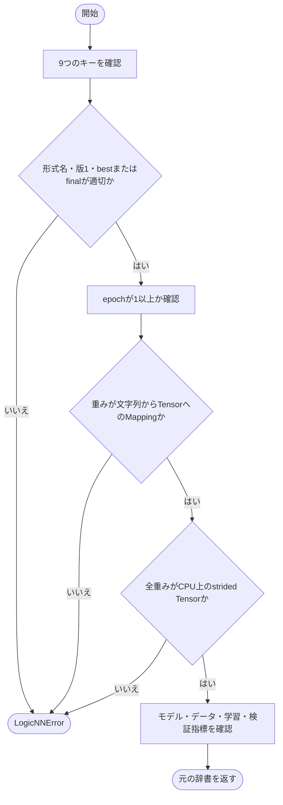
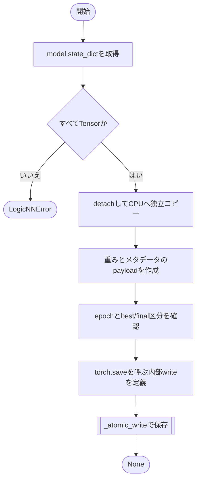
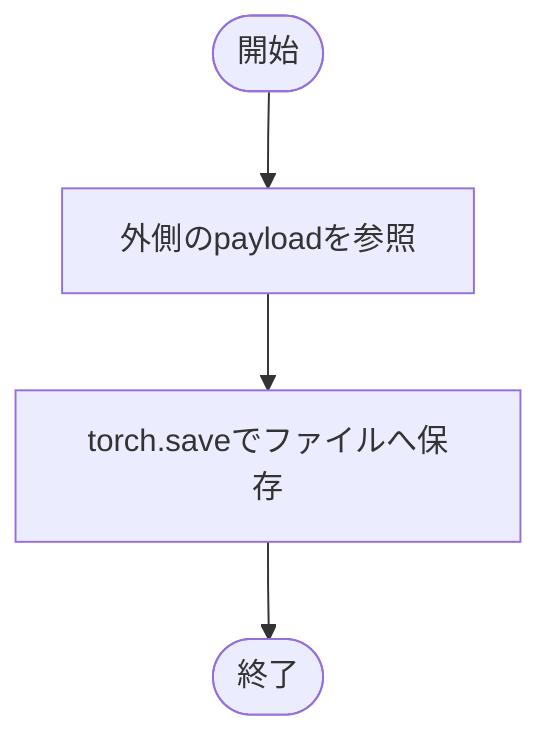
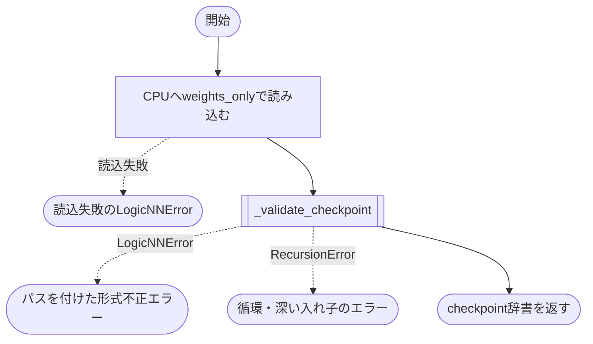

# checkpoint.py

`utils/results/checkpoint.py`

モデルの重みと再構築・照合用情報を保存し、重みだけを次の学習の初期値として読み込みます。optimizerやschedulerの実行状態は保存しません。

{/* source-sha256: 3e376b7f817bc5fd0aef6341fb725bae02956326089d576c809606bf2329081a */}

{/* function: _validate_checkpoint@23 */}

## \_validate\_checkpoint() {/* #validate-checkpoint */}

```python
def _validate_checkpoint(value: object) -> dict[str, object]:
```

### 機能概要

チェックポイントの9つの必須項目、形式名、形式版、best/final区分、epoch、重み辞書を検証します。重みは文字列キーからCPU上のstrided Tensorへの対応を要求し、各メタデータを専用関数で確認します。

### 引数

| 引数 | 型 | 既定値 | 説明 |
|---|---|---|---|
| `value` | `object` | `必須` | torch.loadで取得した値。 |

### 処理の流れ



### 戻り値

型：`dict[str, object]`

検証済みの元のチェックポイント辞書。モデルへの適用は行いません。

### ソースコード

<details>
<summary>\_validate\_checkpoint() の実装を開く</summary>

```python
def _validate_checkpoint(value: object) -> dict[str, object]:
    """checkpointの全必須項目・基本型・Tensor領域を重み適用前に検証する。"""
    value = _object(value, _FIELDS, "checkpoint")
    if type(value["format_name"]) is not str or value["format_name"] != "logicNN_checkpoint":
        _fail("format_name", "logicNN_checkpoint形式だけを読み込めます")
    if type(value["format_version"]) is not int or value["format_version"] != 1:
        _fail("format_version", "対応する形式版は整数1です")
    if type(value["checkpoint_type"]) is not str or value["checkpoint_type"] not in ("best", "final"):
        _fail("checkpoint_type", "bestまたはfinalが必要です")
    _integer(value["epoch"], "epoch", 1)
    state = value["model_state_dict"]
    if not isinstance(state, Mapping) or any(type(key) is not str or not isinstance(item, Tensor) for key, item in state.items()):
        _fail("model_state_dict", "strからTensorへの辞書が必要です")
    if any(tensor.layout is not torch.strided or tensor.device.type != "cpu" for tensor in state.values()):
        _fail("model_state_dict", "CPU上のstrided Tensorが必要です")
    _model_metadata(value["model"])
    _dataset_metadata(value["dataset"])
    _training_metadata(value["training"])
    _metric_values(value["validation_metrics"], "validation_metrics")
    return value
```

</details>

{/* function: save_checkpoint@45 */}

## save\_checkpoint() {/* #save-checkpoint */}

```python
def save_checkpoint(
    path: Path,
    model: nn.Module,
    *,
    checkpoint_type: Literal["best", "final"],
    epoch: int,
    model_metadata: Mapping[str, object],
    dataset_metadata: DatasetMetadata,
    training_metadata: Mapping[str, object],
    validation_metrics: EpochMetrics,
) -> None:
```

### 機能概要

state_dict内のTensorをdetachしてCPUへコピーし、重みと登録済みバッファの独立したスナップショットを作ります。モデル・データ・学習情報と検証指標をまとめ、torch.saveで保存します。

### 引数

| 引数 | 型 | 既定値 | 説明 |
|---|---|---|---|
| `path` | `Path` | `必須` | 保存先の.pthファイル。 |
| `model` | `nn.Module` | `必須` | 保存する重みを持つモデル。 |
| `checkpoint_type` | `Literal['best', 'final']` | `必須` | bestまたはfinal。 |
| `epoch` | `int` | `必須` | 保存対象のepoch番号。1以上。 |
| `model_metadata` | `Mapping[str, object]` | `必須` | モデル名・形状・構造情報。 |
| `dataset_metadata` | `DatasetMetadata` | `必須` | データセットの共通情報。 |
| `training_metadata` | `Mapping[str, object]` | `必須` | 学習回数・最適化条件。 |
| `validation_metrics` | `EpochMetrics` | `必須` | 保存対象epochの検証指標。 |

### 処理の流れ



### 戻り値

型：`None`

`None`。

### 状態の変更・ファイル出力

- 保存先を原子的に置き換えます。元のモデルのデバイス・重み・モードは変更しません。

### 例外・注意事項

- ここではload側と同じ全項目検証を繰り返しません。Tensor以外のextra stateを含む場合は、除外して続行せず、LogicNNErrorで保存を中断します。

### ソースコード

<details>
<summary>save\_checkpoint() の実装を開く</summary>

```python
def save_checkpoint(
    path: Path,
    model: nn.Module,
    *,
    checkpoint_type: Literal["best", "final"],
    epoch: int,
    model_metadata: Mapping[str, object],
    dataset_metadata: DatasetMetadata,
    training_metadata: Mapping[str, object],
    validation_metrics: EpochMetrics,
) -> None:
    """元modelを変更せずCPU重みのsnapshotとmetadataだけを原子的に保存する。"""
    path  = Path(path)
    state = model.state_dict()
    if any(not isinstance(value, Tensor) for value in state.values()):
        _fail("model_state_dict", "Tensor以外のextra stateは保存対象ではありません")
    snapshot = {key: value.detach().to(device="cpu", copy=True) for key, value in state.items()}
    payload = {
        "format_name": "logicNN_checkpoint", "format_version": 1, "checkpoint_type": checkpoint_type, "epoch": epoch,
        "model_state_dict": snapshot, "model": _json_value(model_metadata), "dataset": _json_value(asdict(dataset_metadata)),
        "training": _json_value(training_metadata), "validation_metrics": asdict(validation_metrics),
    }
    _integer(epoch, "epoch", 1)
    if checkpoint_type not in ("best", "final"):
        _fail("checkpoint_type", "bestまたはfinalが必要です")

    def write(file: BinaryIO) -> None:
        """検証済みpayloadをoptimizer等の実行状態を含めず保存する。"""
        torch.save(payload, file)

    _atomic_write(path, write)
```

</details>

{/* function: save_checkpoint.write@71 */}

## save\_checkpoint.write() {/* #save-checkpoint-write */}

```python
def write(file: BinaryIO) -> None:
```

### 機能概要

外側のsave_checkpointが作ったpayloadを、渡されたファイルへtorch.saveで書き込みます。optimizerなどの状態を後から追加することはありません。

### 引数

| 引数 | 型 | 既定値 | 説明 |
|---|---|---|---|
| `file` | `BinaryIO` | `必須` | _atomic_writeが開いたバイナリ一時ファイル。 |

### 処理の流れ



### 戻り値

型：`None`

`None`。

### ソースコード

<details>
<summary>save\_checkpoint.write() の実装を開く</summary>

```python
def write(file: BinaryIO) -> None:
    """検証済みpayloadをoptimizer等の実行状態を含めず保存する。"""
    torch.save(payload, file)
```

</details>

{/* function: load_checkpoint@78 */}

## load\_checkpoint() {/* #load-checkpoint */}

```python
def load_checkpoint(path: Path) -> dict[str, object]:
```

### 機能概要

torch.loadをmap_location='cpu'・weights_only=Trueで実行し、形式を検証します。ファイルの読み込み失敗と内容の不正を区別して報告します。

### 引数

| 引数 | 型 | 既定値 | 説明 |
|---|---|---|---|
| `path` | `Path` | `必須` | 読み込むチェックポイント。 |

### 処理の流れ



### 戻り値

型：`dict[str, object]`

検証済みの辞書。CPUの重みTensorを含みますが、モデルへは未適用です。

### 例外・注意事項

- 重みをモデルへ適用するのはworkflowの_restore_modelです。weights_only=Trueであっても、出所が不明なファイルを安全だと保証するものではありません。

### ソースコード

<details>
<summary>load\_checkpoint() の実装を開く</summary>

```python
def load_checkpoint(path: Path) -> dict[str, object]:
    """安全なweights-only読込と形式検証を行い、モデルへ未適用のpayloadを返す。"""
    path = Path(path)
    try:
        payload = torch.load(path, map_location="cpu", weights_only=True)
    except (OSError, RuntimeError, ValueError, EOFError, pickle.UnpicklingError) as error:
        raise LogicNNError("チェックポイントを読み込めません", detail=f"{path}: {error}", hint="logicNN形式の破損していないpthファイルを指定してください") from error
    try:
        return _validate_checkpoint(payload)
    except LogicNNError as error:
        raise LogicNNError("チェックポイントの形式が不正です", detail=f"{path}: {error.detail}", hint=error.hint) from error
    except RecursionError as error:
        raise LogicNNError("チェックポイントの形式が不正です", detail=f"{path}: metadataに循環または深過ぎる入れ子があります",
                           hint="循環しないJSON互換metadataを持つcheckpointを指定してください") from error
```

</details>

## 関連ファイル

- [utils/data/types.py](/code-reference/utils/data/types)
- [utils/exceptions.py](/code-reference/utils/exceptions)
- [utils/results/metadata.py](/code-reference/utils/results/metadata)
- [utils/trainer/epoch.py](/code-reference/utils/trainer/epoch)
