# metadata.py

`utils/results/metadata.py`

成果物に格納するメタデータの基本型・必須項目を検証し、JSON互換形式への変換と保存を行います。チェックポイントの読み込みでも利用します。

{/* source-sha256: 447a0a50c5bc68a7b83a392e08d19944f3721cd4ba948453460dc85bee5e63af */}

{/* function: _fail@17 */}

## \_fail() {/* #fail */}

```python
def _fail(target: str, message: str) -> NoReturn:
```

### 機能概要

保存内容の不正を、対象項目と原因を持つLogicNNErrorとして送出します。

### 引数

| 引数 | 型 | 既定値 | 説明 |
|---|---|---|---|
| `target` | `str` | `必須` | エラーになった項目のパス。 |
| `message` | `str` | `必須` | その項目に必要な形式などの説明。 |

### 処理の流れ

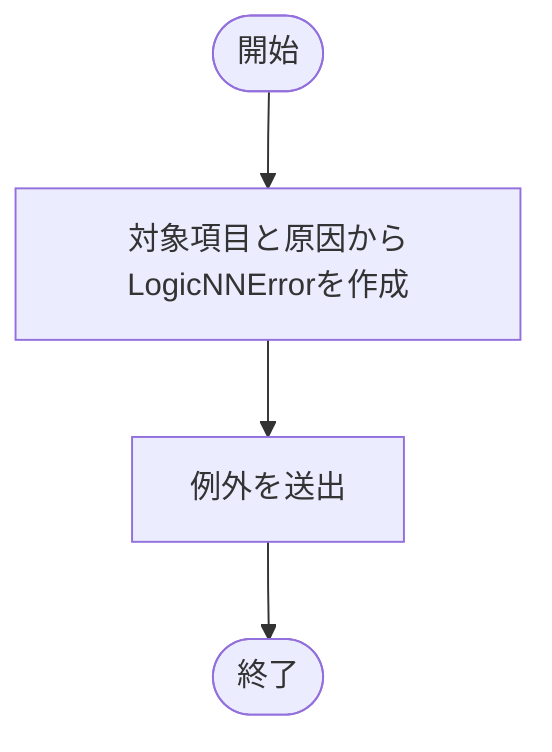

### 戻り値

型：`NoReturn`

値を返しません。必ずLogicNNErrorを送出します。

### ソースコード

<details>
<summary>\_fail() の実装を開く</summary>

```python
def _fail(target: str, message: str) -> NoReturn:
    """保存内容の不正を対象fieldと修正方針を持つ共通例外にする。"""
    raise LogicNNError("成果物の形式が不正です", detail=f"{target}: {message}", hint="仕様に従うmetadataの型・必須項目・有限値を確認してください")
```

</details>

{/* function: _json_value@22 */}

## \_json\_value() {/* #json-value */}

```python
def _json_value(value: object, target: str = "metadata") -> object:
```

### 機能概要

入れ子の辞書・リストを再帰的に複製し、tupleをlistに変換します。None・str・bool・int・有限floatだけを値として許可し、辞書のキーをstrに限定します。

### 引数

| 引数 | 型 | 既定値 | 説明 |
|---|---|---|---|
| `value` | `object` | `必須` | JSON互換の基本型へ変換する値。 |
| `target` | `str` | `'metadata'` | エラー位置を表す項目パス。再帰呼び出しでキーや添字を付けます。 |

### 処理の流れ

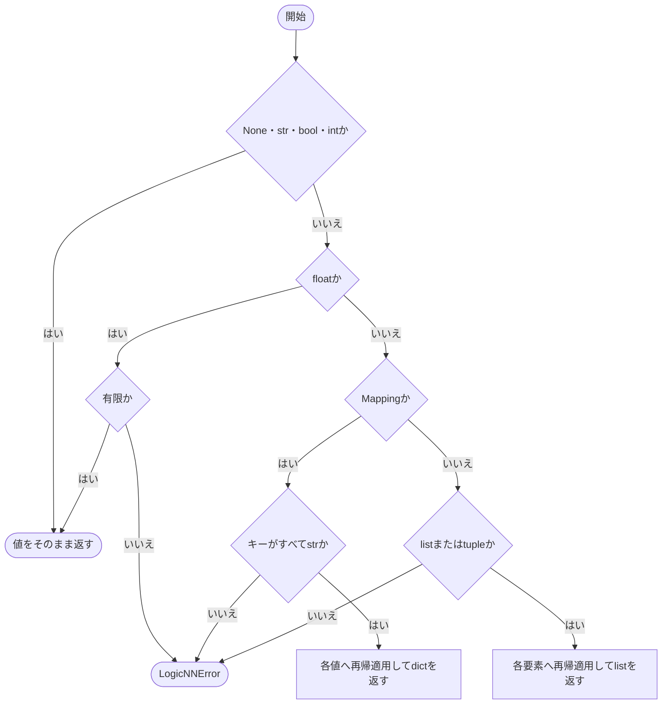

### 戻り値

型：`object`

JSON互換形式の値。コンテナは新しく作成し、基本型の値はそのまま返します。

### 例外・注意事項

- Tensor、Path、独自クラスなどを自動的に文字列へ変換することはありません。循環検出用の独自機構はなく、循環や深い入れ子はRecursionErrorになります。

### ソースコード

<details>
<summary>\_json\_value() の実装を開く</summary>

```python
def _json_value(value: object, target: str = "metadata") -> object:
    """基本型だけを再帰的に複製し、tupleをJSON arrayへ正規化する。"""
    if value is None or type(value) in (str, bool, int):
        return value
    if type(value) is float:
        if not math.isfinite(value):
            _fail(target, "NaN・Infinityを保存できません")
        return value
    if isinstance(value, Mapping):
        if any(type(key) is not str for key in value):
            _fail(target, "辞書のkeyはstrが必要です")
        return {key: _json_value(item, f"{target}.{key}") for key, item in value.items()}
    if type(value) in (list, tuple):
        return [_json_value(item, f"{target}[{index}]") for index, item in enumerate(value)]
    _fail(target, f"基本Python型ではありません: {type(value).__name__}")
```

</details>

{/* function: _object@39 */}

## \_object() {/* #object */}

```python
def _object(value: object, fields: set[str], target: str) -> dict[str, object]:
```

### 機能概要

値が通常のdictで、キー集合が指定された必須項目と完全に一致することを確認します。欠落キーと未知キーを分けて報告します。

### 引数

| 引数 | 型 | 既定値 | 説明 |
|---|---|---|---|
| `value` | `object` | `必須` | 検証する値。 |
| `fields` | `set[str]` | `必須` | 許可する必須キーの集合。 |
| `target` | `str` | `必須` | エラー表示用の項目パス。 |

### 処理の流れ

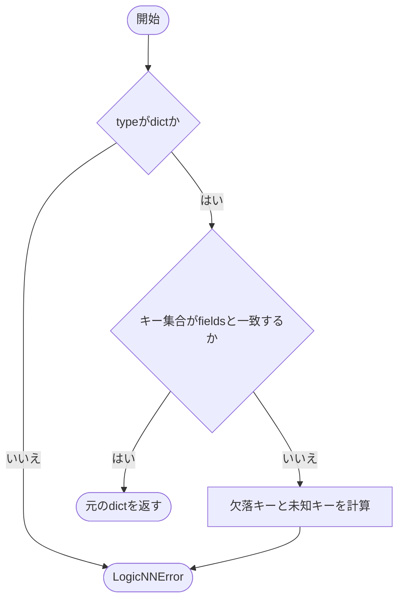

### 戻り値

型：`dict[str, object]`

検証済みの元の辞書。コピーは作りません。

### ソースコード

<details>
<summary>\_object() の実装を開く</summary>

```python
def _object(value: object, fields: set[str], target: str) -> dict[str, object]:
    """必須キーと未知キーを検証し、objectを辞書として返す。"""
    if type(value) is not dict:
        _fail(target, f"必要なキーは{sorted(fields)}です")
    if set(value) != fields:
        missing = sorted(fields - set(value))
        unknown = sorted(repr(key) for key in set(value) - fields)
        _fail(target, f"必須field欠落={missing}、未知field={unknown}")
    return value
```

</details>

{/* function: _text@50 */}

## \_text() {/* #text */}

```python
def _text(value: object, target: str) -> None:
```

### 機能概要

空白だけでない通常のPython文字列かを確認します。値をstripして保存し直すのではなく、検証だけを行います。

### 引数

| 引数 | 型 | 既定値 | 説明 |
|---|---|---|---|
| `value` | `object` | `必須` | 検証する値。 |
| `target` | `str` | `必須` | エラー表示用の項目パス。 |

### 処理の流れ

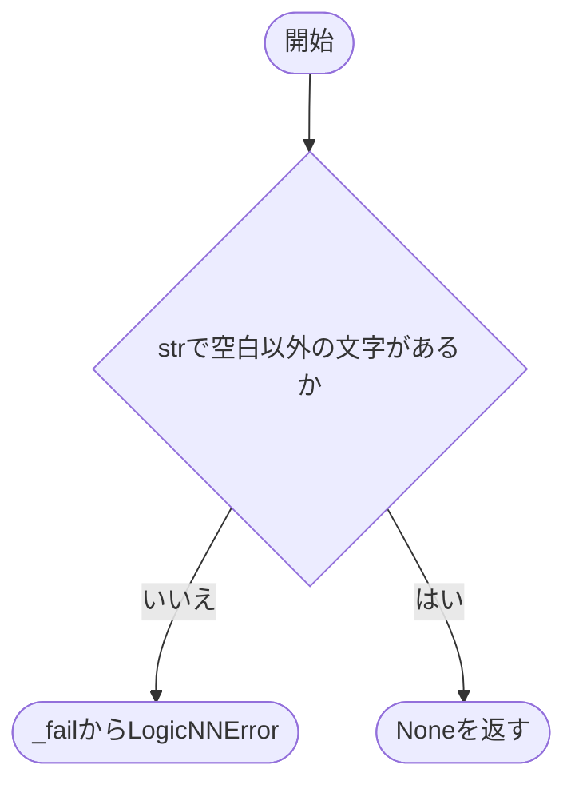

### 戻り値

型：`None`

`None`。

### ソースコード

<details>
<summary>\_text() の実装を開く</summary>

```python
def _text(value: object, target: str) -> None:
    """空でない通常文字列であることを確認する。"""
    if type(value) is not str or not value.strip():
        _fail(target, "空でないstrが必要です")
```

</details>

{/* function: _integer@56 */}

## \_integer() {/* #integer */}

```python
def _integer(value: object, target: str, minimum: int = 0) -> None:
```

### 機能概要

通常のPython intで、指定した下限以上かを確認します。boolはintの派生型ですが、ここでは許可しません。

### 引数

| 引数 | 型 | 既定値 | 説明 |
|---|---|---|---|
| `value` | `object` | `必須` | 検証する値。 |
| `target` | `str` | `必須` | エラー表示用の項目パス。 |
| `minimum` | `int` | `0` | 許容する最小値。境界値を含みます。 |

### 処理の流れ

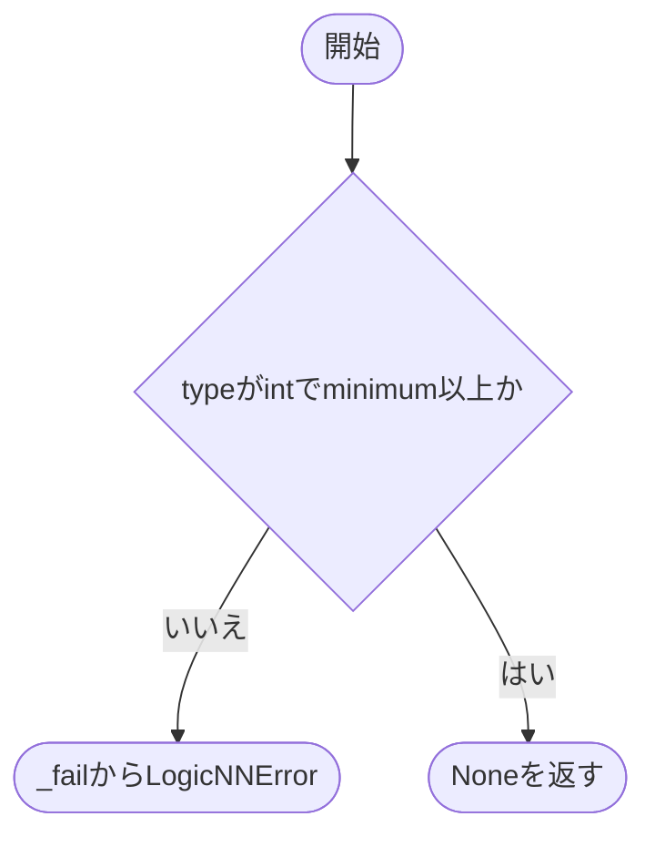

### 戻り値

型：`None`

`None`。

### ソースコード

<details>
<summary>\_integer() の実装を開く</summary>

```python
def _integer(value: object, target: str, minimum: int = 0) -> None:
    """boolを除外し、下限を満たすPython整数であることを確認する。"""
    if type(value) is not int or value < minimum:
        _fail(target, f"{minimum}以上のPython intが必要です")
```

</details>

{/* function: _float@62 */}

## \_float() {/* #float */}

```python
def _float(value: object, target: str, *, probability: bool = False) -> None:
```

### 機能概要

通常のPython floatで有限の値かを確認します。probability=Trueなら0～1の範囲も検証します。整数をfloatへ変換する処理はありません。

### 引数

| 引数 | 型 | 既定値 | 説明 |
|---|---|---|---|
| `value` | `object` | `必須` | 検証する値。 |
| `target` | `str` | `必須` | エラー表示用の項目パス。 |
| `probability` | `bool` | `False` | 確率・正解率として0～1を要求する場合はTrue。 |

### 処理の流れ

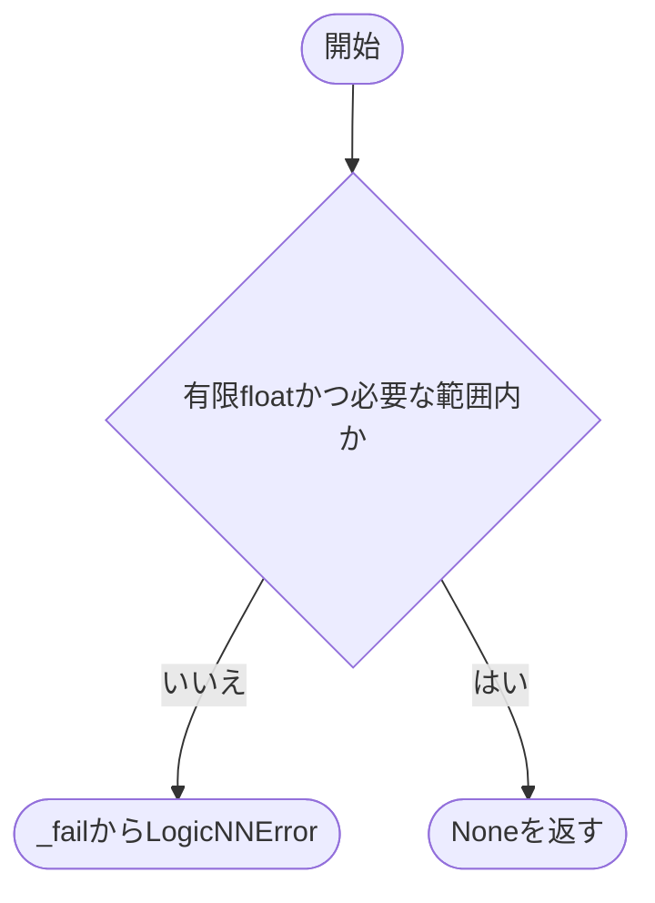

### 戻り値

型：`None`

`None`。

### ソースコード

<details>
<summary>\_float() の実装を開く</summary>

```python
def _float(value: object, target: str, *, probability: bool = False) -> None:
    """有限なPython floatと、必要なら0～1の範囲を確認する。"""
    if type(value) is not float or not math.isfinite(value) or (probability and not 0 <= value <= 1):
        _fail(target, "0～1の有限floatが必要です" if probability else "有限なPython floatが必要です")
```

</details>

{/* function: _shape@68 */}

## \_shape() {/* #shape */}

```python
def _shape(value: object, target: str) -> None:
```

### 機能概要

形状が非空のlistで、全要素が1以上のPython intかを確認します。バッチ次元を含めない形状情報に使用します。

### 引数

| 引数 | 型 | 既定値 | 説明 |
|---|---|---|---|
| `value` | `object` | `必須` | 検証する形状。 |
| `target` | `str` | `必須` | エラー表示用の項目パス。 |

### 処理の流れ

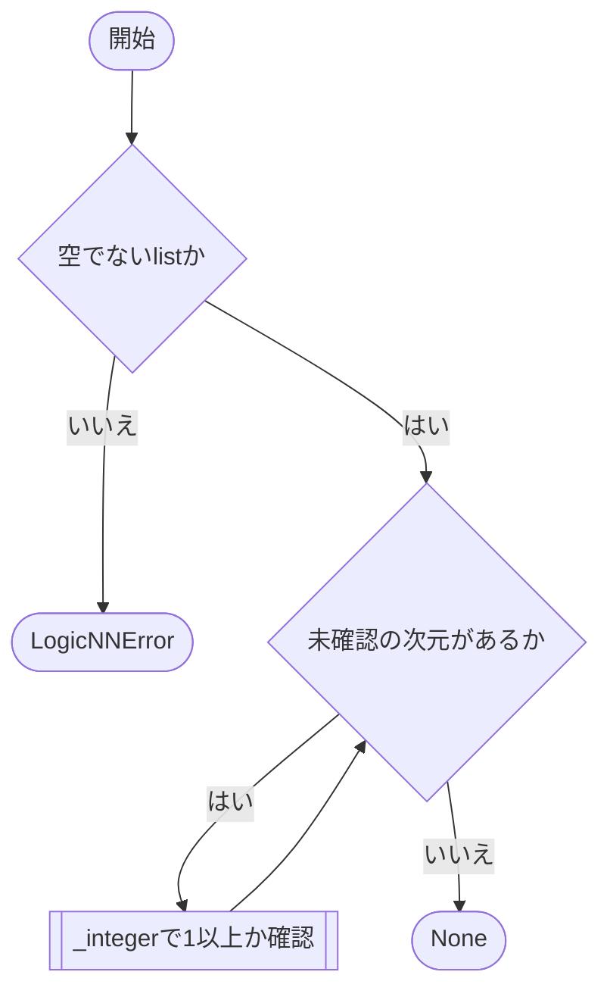

### 戻り値

型：`None`

`None`。

### ソースコード

<details>
<summary>\_shape() の実装を開く</summary>

```python
def _shape(value: object, target: str) -> None:
    """batchを除く形状が非空の正整数listであることを確認する。"""
    if type(value) is not list or not value:
        _fail(target, "非空の正整数listが必要です")
    for index, size in enumerate(value):
        _integer(size, f"{target}[{index}]", 1)
```

</details>

{/* function: _model_metadata@76 */}

## \_model\_metadata() {/* #model-metadata */}

```python
def _model_metadata(value: object) -> dict[str, object]:
```

### 機能概要

モデル名、入力形状、入力要素数、クラス数、構造情報の5項目を検証します。input_sizeが形状の積と一致し、architectureがJSON互換のdictであることも確認します。

### 引数

| 引数 | 型 | 既定値 | 説明 |
|---|---|---|---|
| `value` | `object` | `必須` | 保存形式のモデル情報。 |

### 処理の流れ

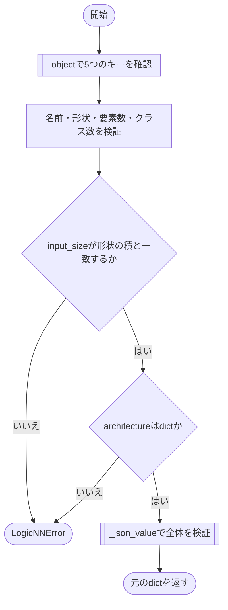

### 戻り値

型：`dict[str, object]`

検証済みの元の辞書。

### ソースコード

<details>
<summary>\_model\_metadata() の実装を開く</summary>

```python
def _model_metadata(value: object) -> dict[str, object]:
    """モデル名・形状・構造の保存形式を検証する。"""
    value = _object(value, {"name", "input_shape", "input_size", "num_classes", "architecture"}, "model")
    _text(value["name"], "model.name")
    _shape(value["input_shape"], "model.input_shape")
    _integer(value["input_size"], "model.input_size", 1)
    _integer(value["num_classes"], "model.num_classes", 1)
    if value["input_size"] != math.prod(value["input_shape"]):
        _fail("model.input_size", "input_shapeの積と一致しません")
    if type(value["architecture"]) is not dict:
        _fail("model.architecture", "構造情報のdictが必要です")
    _json_value(value, "model")
    return value
```

</details>

{/* function: _dataset_metadata@91 */}

## \_dataset\_metadata() {/* #dataset-metadata */}

```python
def _dataset_metadata(value: object) -> dict[str, object]:
```

### 機能概要

データセット共通情報の9項目を検証します。クラス名の数をnum_classesと照合し、各件数と任意の分割seed、前処理名・設定・出力型を確認します。MNIST固有の形状や件数は要求しません。

### 引数

| 引数 | 型 | 既定値 | 説明 |
|---|---|---|---|
| `value` | `object` | `必須` | 保存形式のデータセット情報。 |

### 処理の流れ

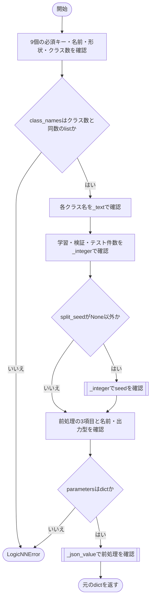

### 戻り値

型：`dict[str, object]`

検証済みの元の辞書。

### ソースコード

<details>
<summary>\_dataset\_metadata() の実装を開く</summary>

```python
def _dataset_metadata(value: object) -> dict[str, object]:
    """特定データセットに依存せず、全DatasetMetadata fieldを検証する。"""
    fields = {"name", "input_shape", "num_classes", "class_names", "train_size", "validation_size", "test_size", "split_seed", "preprocessing"}
    value  = _object(value, fields, "dataset")
    _text(value["name"], "dataset.name")
    _shape(value["input_shape"], "dataset.input_shape")
    _integer(value["num_classes"], "dataset.num_classes", 1)
    names = value["class_names"]
    if type(names) is not list or len(names) != value["num_classes"]:
        _fail("dataset.class_names", "num_classesと同数のlistが必要です")
    for index, name in enumerate(names):
        _text(name, f"dataset.class_names[{index}]")
    for field in ("train_size", "validation_size", "test_size"):
        _integer(value[field], f"dataset.{field}")
    if value["split_seed"] is not None:
        _integer(value["split_seed"], "dataset.split_seed")
    preprocessing = _object(value["preprocessing"], {"name", "parameters", "output_dtype"}, "dataset.preprocessing")
    _text(preprocessing["name"], "dataset.preprocessing.name")
    _text(preprocessing["output_dtype"], "dataset.preprocessing.output_dtype")
    if type(preprocessing["parameters"]) is not dict:
        _fail("dataset.preprocessing.parameters", "前処理設定のdictが必要です")
    _json_value(preprocessing, "dataset.preprocessing")
    return value
```

</details>

{/* function: _training_metadata@116 */}

## \_training\_metadata() {/* #training-metadata */}

```python
def _training_metadata(value: object, target: str = "training") -> dict[str, object]:
```

### 機能概要

学習回数とloss・optimizer・schedulerの設定形式を確認します。各方式はnameを含むdictであることを要求しますが、登録済みの方式かどうかの照合はここでは行いません。

### 引数

| 引数 | 型 | 既定値 | 説明 |
|---|---|---|---|
| `value` | `object` | `必須` | 保存形式の学習情報。 |
| `target` | `str` | `'training'` | エラー表示で使う最上位の項目名。 |

### 処理の流れ

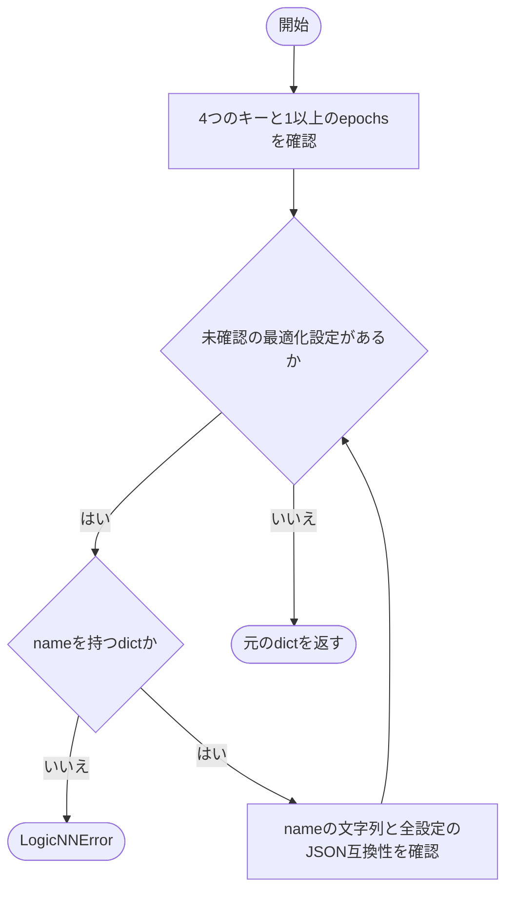

### 戻り値

型：`dict[str, object]`

検証済みの元の辞書。

### ソースコード

<details>
<summary>\_training\_metadata() の実装を開く</summary>

```python
def _training_metadata(value: object, target: str = "training") -> dict[str, object]:
    """学習回数と各最適化方式の名前・実設定を検証する。"""
    value = _object(value, {"epochs", "loss", "optimizer", "scheduler"}, target)
    _integer(value["epochs"], f"{target}.epochs", 1)
    for field in ("loss", "optimizer", "scheduler"):
        settings = value[field]
        if type(settings) is not dict or "name" not in settings:
            _fail(f"{target}.{field}", "nameと実際の設定値を含むdictが必要です")
        _text(settings["name"], f"{target}.{field}.name")
        _json_value(settings, f"{target}.{field}")
    return value
```

</details>

{/* function: _metric_values@129 */}

## \_metric\_values() {/* #metric-values */}

```python
def _metric_values(value: object, target: str) -> dict[str, object]:
```

### 機能概要

loss・accuracy・samplesの3項目を検証します。lossは有限float、accuracyは0～1の有限float、samplesは1以上のintを要求します。

### 引数

| 引数 | 型 | 既定値 | 説明 |
|---|---|---|---|
| `value` | `object` | `必須` | 検証する指標辞書。 |
| `target` | `str` | `必須` | エラー表示用の項目パス。 |

### 処理の流れ

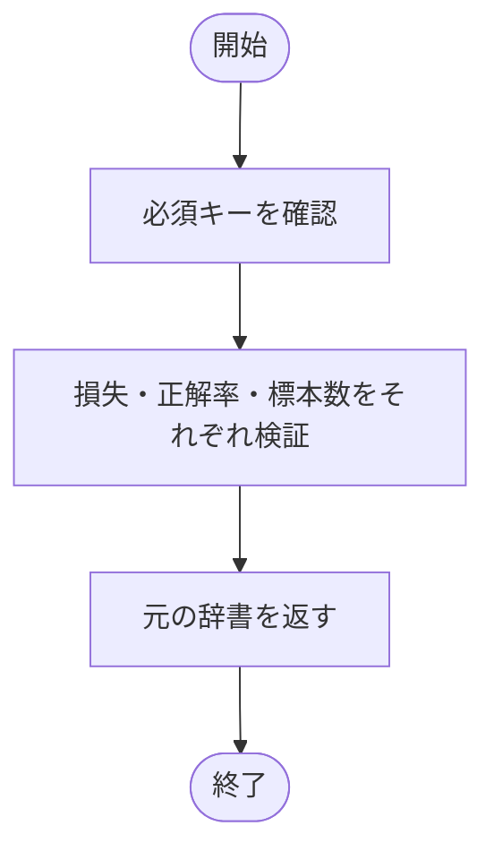

### 戻り値

型：`dict[str, object]`

検証済みの元の辞書。

### ソースコード

<details>
<summary>\_metric\_values() の実装を開く</summary>

```python
def _metric_values(value: object, target: str) -> dict[str, object]:
    """EpochMetricsの保存形式と有限値・正解率・件数を検証する。"""
    value = _object(value, {"loss", "accuracy", "samples"}, target)
    _float(value["loss"], f"{target}.loss")
    _float(value["accuracy"], f"{target}.accuracy", probability=True)
    _integer(value["samples"], f"{target}.samples", 1)
    return value
```

</details>

{/* function: _atomic_write@138 */}

## \_atomic\_write() {/* #atomic-write */}

```python
def _atomic_write(path: Path, write: Callable[[BinaryIO], None]) -> None:
```

### 機能概要

保存先と同じディレクトリに一時ファイルを作り、writeコールバックへ渡します。書き込み・flush・fsync・closeが成功した場合にのみos.replaceで保存先を置き換えます。

### 引数

| 引数 | 型 | 既定値 | 説明 |
|---|---|---|---|
| `path` | `Path` | `必須` | 完成した内容を配置する保存先。親ディレクトリは作成済みであること。 |
| `write` | `Callable[[BinaryIO], None]` | `必須` | バイナリファイルへ書き込むコールバック。ファイルの置換はこの関数で行います。 |

### 処理の流れ

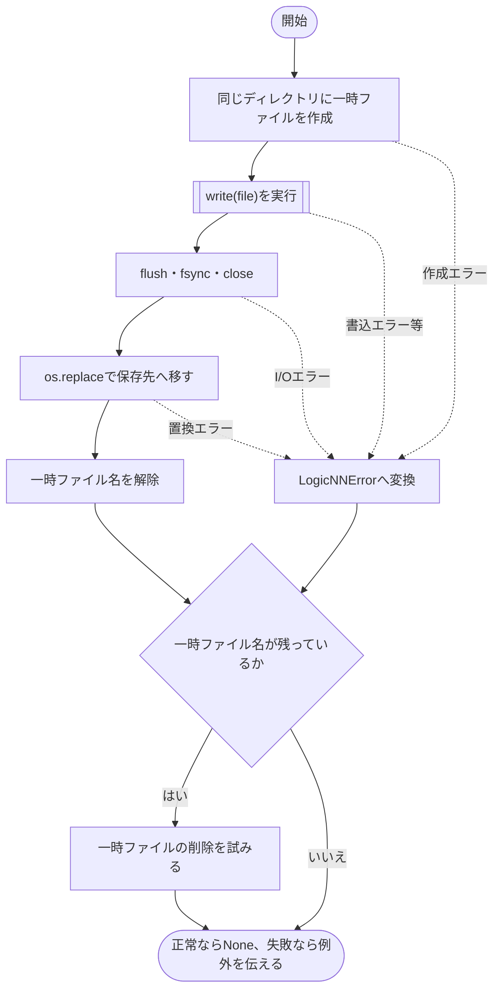

例外を変換する対象はOSError・ValueError・TypeError・RuntimeErrorです。finallyの削除処理は、それ以外の例外でも実行されます。削除時のOSErrorは無視します。

### 戻り値

型：`None`

`None`。

### 状態の変更・ファイル出力

- 成功時は同名の保存先を置き換えます。一時ファイルは失敗時にも削除を試みます。

### 例外・注意事項

- 一時ファイルを置き換える前に失敗した場合、既存の保存先は維持します。

### ソースコード

<details>
<summary>\_atomic\_write() の実装を開く</summary>

```python
def _atomic_write(path: Path, write: Callable[[BinaryIO], None]) -> None:
    """同じdirectoryの一時fileへ完成させ、成功時だけ既存成果物を置換する。"""
    path      = Path(path)
    temporary = None
    try:
        with tempfile.NamedTemporaryFile("w+b", dir=path.parent, prefix=f".{path.name}.", suffix=".tmp", delete=False) as file:
            temporary = file.name
            write(file)
            file.flush()
            os.fsync(file.fileno())
        os.replace(temporary, path)
        temporary = None
    except (OSError, ValueError, TypeError, RuntimeError) as error:
        raise LogicNNError("成果物を保存できません", detail=f"{path}: {error}", hint="保存先・空き容量・書込権限を確認してください") from error
    finally:
        if temporary is not None:
            try:
                os.unlink(temporary)
            except OSError:
                pass
```

</details>

{/* function: _write_json@160 */}

## \_write\_json() {/* #write-json */}

```python
def _write_json(path: Path, value: object) -> None:
```

### 機能概要

値をJSON互換形式へ変換し、インデント付きUTF-8 JSONのバイト列を完成させてから保存します。非ASCII文字はそのまま残し、末尾に改行を追加します。

### 引数

| 引数 | 型 | 既定値 | 説明 |
|---|---|---|---|
| `path` | `Path` | `必須` | JSONの保存先。 |
| `value` | `object` | `必須` | 保存するメタデータ。 |

### 処理の流れ

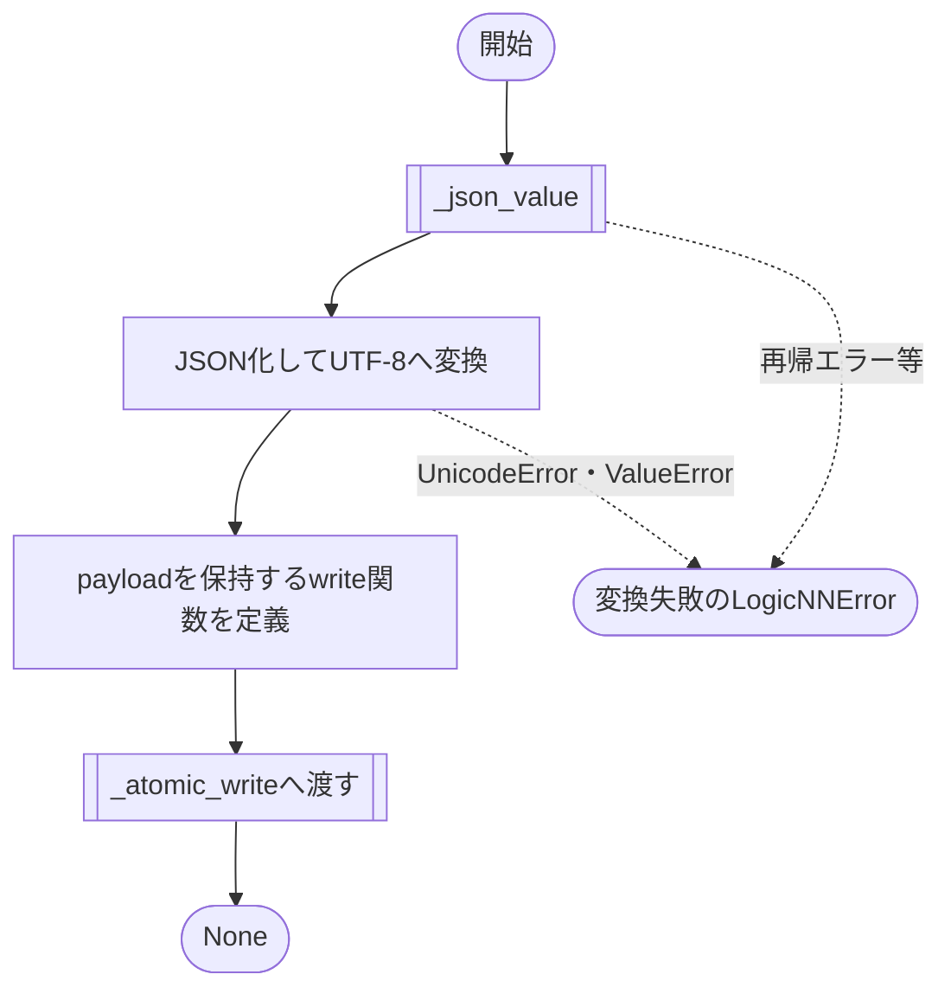

### 戻り値

型：`None`

`None`。

### 例外・注意事項

- UnicodeError・ValueError・RecursionErrorを変換失敗のLogicNNErrorにします。_json_valueが発生させるLogicNNErrorはそのまま伝わります。

### ソースコード

<details>
<summary>\_write\_json() の実装を開く</summary>

```python
def _write_json(path: Path, value: object) -> None:
    """JSON化を完了してからUTF-8で原子的に保存する。"""
    try:
        payload = (json.dumps(_json_value(value), ensure_ascii=False, allow_nan=False, indent=2) + "\n").encode("utf-8")
    except (UnicodeError, ValueError, RecursionError) as error:
        raise LogicNNError("成果物をJSONへ変換できません", detail=f"{path}: {error}", hint="有限値と循環しないJSON互換metadataを指定してください") from error

    def write(file: BinaryIO) -> None:
        """作成済みのJSON byte列を一時fileへ書く。"""
        file.write(payload)

    _atomic_write(path, write)
```

</details>

{/* function: _write_json.write@167 */}

## \_write\_json.write() {/* #write-json-write */}

```python
def write(file: BinaryIO) -> None:
```

### 機能概要

外側の_write_jsonが作成したpayloadを、渡されたファイルへ書き込む内部コールバックです。JSON変換はここでは行いません。

### 引数

| 引数 | 型 | 既定値 | 説明 |
|---|---|---|---|
| `file` | `BinaryIO` | `必須` | _atomic_writeが開いたバイナリ一時ファイル。 |

### 処理の流れ

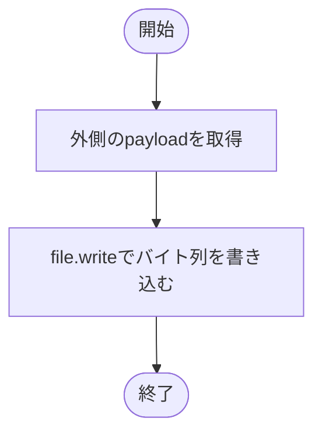

### 戻り値

型：`None`

`None`。file.writeの戻り値は使用しません。

### 状態の変更・ファイル出力

- 渡されたファイルに書き込みます。flush・close・保存先の置換は_atomic_writeが行います。

### ソースコード

<details>
<summary>\_write\_json.write() の実装を開く</summary>

```python
def write(file: BinaryIO) -> None:
    """作成済みのJSON byte列を一時fileへ書く。"""
    file.write(payload)
```

</details>

{/* function: save_resolved_config@174 */}

## save\_resolved\_config() {/* #save-resolved-config */}

```python
def save_resolved_config(run_dir: Path, config: AppConfig) -> None:
```

### 機能概要

AppConfigをJSON出力用の値へ変換し、実行ディレクトリのconfig.jsonへ保存します。通常はload_configで絶対パスに変換した設定を受け取ります。

### 引数

| 引数 | 型 | 既定値 | 説明 |
|---|---|---|---|
| `run_dir` | `Path` | `必須` | 実行ディレクトリ。 |
| `config` | `AppConfig` | `必須` | 保存する設定全体。 |

### 処理の流れ

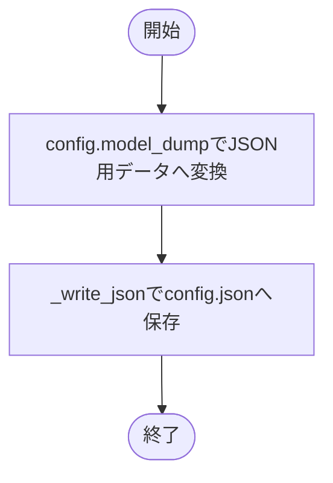

### 戻り値

型：`None`

`None`。

### ソースコード

<details>
<summary>save\_resolved\_config() の実装を開く</summary>

```python
def save_resolved_config(run_dir: Path, config: AppConfig) -> None:
    """解決済みAppConfig全体をconfig.jsonへ保存する。"""
    _write_json(Path(run_dir) / "config.json", config.model_dump(mode="json"))
```

</details>

{/* function: save_training_info@179 */}

## save\_training\_info() {/* #save-training-info */}

```python
def save_training_info(run_dir: Path, information: Mapping[str, object]) -> None:
```

### 機能概要

workflowが組み立てた実行情報をtraining_info.jsonへ保存します。実行情報の項目を新たに組み立てたり、特定の学習方式へ限定したりしません。

### 引数

| 引数 | 型 | 既定値 | 説明 |
|---|---|---|---|
| `run_dir` | `Path` | `必須` | 実行ディレクトリ。 |
| `information` | `Mapping[str, object]` | `必須` | ソフトウェア・モデル・データ・最適化などの実行情報。 |

### 処理の流れ

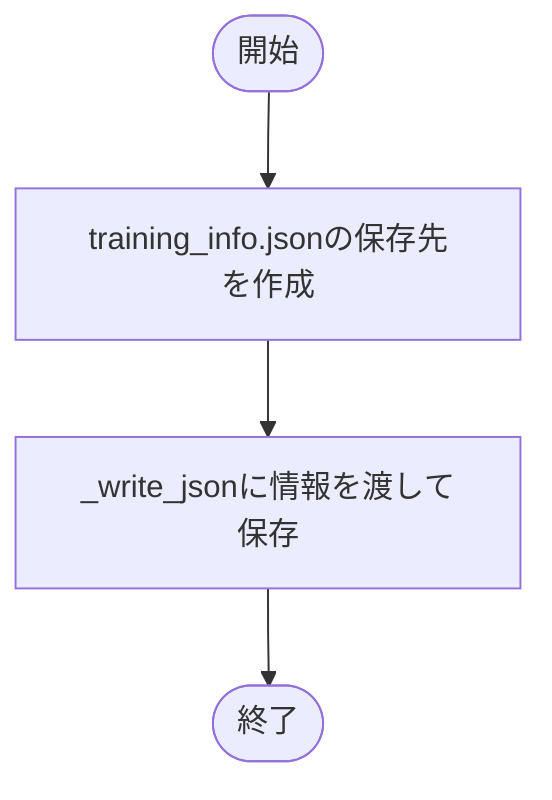

### 戻り値

型：`None`

`None`。

### ソースコード

<details>
<summary>save\_training\_info() の実装を開く</summary>

```python
def save_training_info(run_dir: Path, information: Mapping[str, object]) -> None:
    """workflowが組み立てた実行情報を、JSON化とファイル保存だけ行う。"""
    _write_json(Path(run_dir) / "training_info.json", information)
```

</details>

## 関連ファイル

- [utils/config/schema.py](/code-reference/utils/config/schema)
- [utils/exceptions.py](/code-reference/utils/exceptions)
