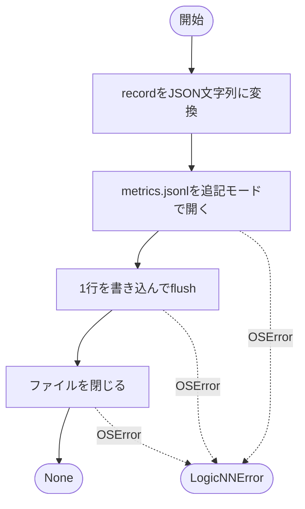
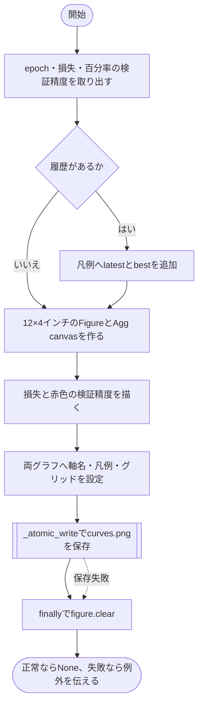
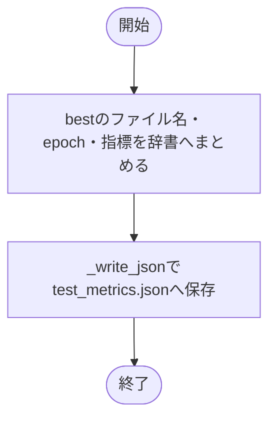

# metrics.py

`utils/results/metrics.py`

epoch履歴をJSONLへ追記し、損失と検証精度のグラフ、テスト結果を保存します。

{/* source-sha256: 67232438ce494f49f800eca81fd82f50278369c1b7185ee6ca8390e2dc6cb2dd */}

## EpochRecord {/* #epochrecord-class */}

1 epochの学習率・学習指標・検証指標です。

| 属性 | 型 | 既定値 | 説明 |
|---|---|---|---|
| `epoch` | `int` | `必須` | 1から始まるepoch番号。 |
| `learning_rate` | `float` | `必須` | 当該epochで使用した学習率。scheduler.step前の値。 |
| `train_loss` | `float` | `必須` | 学習の標本平均損失。 |
| `train_accuracy` | `float` | `必須` | 学習の正解率。0～1。 |
| `validation_loss` | `float` | `必須` | 検証の標本平均損失。 |
| `validation_accuracy` | `float` | `必須` | 検証の正解率。0～1。 |

`@dataclass` により、初期化などのメソッドが自動生成されます。表の属性は初期化時に指定します。

このクラスには独自の関数実装はありません。

<details>
<summary>EpochRecord の定義を開く</summary>

```python
@dataclass(frozen=True)
class EpochRecord:
    """1 epochで使用した学習率と学習・検証の平均指標を保持する。"""

    epoch: int
    learning_rate: float
    train_loss: float
    train_accuracy: float
    validation_loss: float
    validation_accuracy: float
```

</details>

{/* function: append_epoch_record@28 */}

## append\_epoch\_record() {/* #append-epoch-record */}

```python
def append_epoch_record(run_dir: Path, record: EpochRecord) -> None:
```

### 機能概要

EpochRecordを1行のJSONへ変換し、metrics.jsonlへ追記します。表示用に丸めることなく、記録内の数値をそのまま保存します。

### 引数

| 引数 | 型 | 既定値 | 説明 |
|---|---|---|---|
| `run_dir` | `Path` | `必須` | 保存先の実行ディレクトリ。 |
| `record` | `EpochRecord` | `必須` | 追記する1 epochの記録。 |

### 処理の流れ



### 戻り値

型：`None`

`None`。

### 状態の変更・ファイル出力

- 既存のmetrics.jsonlを維持して末尾へ追加します。ファイルがなければ新規作成します。

### 例外・注意事項

- JSON化はI/O用tryブロックの外です。NaNなどによる変換エラーはそのまま伝わります。

### ソースコード

<details>
<summary>append\_epoch\_record() の実装を開く</summary>

```python
def append_epoch_record(run_dir: Path, record: EpochRecord) -> None:
    """1 epochをJSONLの1行として追記し、既存履歴を維持する。"""
    path    = Path(run_dir) / "metrics.jsonl"
    payload = json.dumps(asdict(record), ensure_ascii=False, allow_nan=False) + "\n"
    try:
        with path.open("a", encoding="utf-8", newline="\n") as file:
            file.write(payload)
            file.flush()
    except OSError as error:
        raise LogicNNError("epoch履歴を保存できません", detail=f"{path}: {error}", hint="保存先と書込権限を確認してください") from error
```

</details>

{/* function: save_curves@40 */}

## save\_curves() {/* #save-curves */}

```python
def save_curves(run_dir: Path, history: Sequence[EpochRecord]) -> None:
```

### 機能概要

全履歴から、左に学習・検証損失、右に赤色の検証正解率を描きます。線の丸マーカーは付けず、凡例に最新値と最良値を記載します。独立したAgg canvasを使うため、プロセス全体のMatplotlib backendは切り替えません。

### 引数

| 引数 | 型 | 既定値 | 説明 |
|---|---|---|---|
| `run_dir` | `Path` | `必須` | curves.pngの保存先ディレクトリ。 |
| `history` | `Sequence[EpochRecord]` | `必須` | 表示する全epochの記録。空の履歴も受け取ります。 |

### 処理の流れ



### 戻り値

型：`None`

`None`。

### 状態の変更・ファイル出力

- curves.pngを置き換えます。Figureは保存の成功・失敗にかかわらずclearします。

### ソースコード

<details>
<summary>save\_curves() の実装を開く</summary>

```python
def save_curves(run_dir: Path, history: Sequence[EpochRecord]) -> None:
    """独立したAgg canvasで2列の学習曲線を保存し、プロセスのbackendを変更しない。"""
    from matplotlib.backends.backend_agg import FigureCanvasAgg
    from matplotlib.figure import Figure

    epochs                = [record.epoch for record in history]
    train_losses          = [record.train_loss for record in history]
    validation_losses     = [record.validation_loss for record in history]
    validation_accuracies = [100 * record.validation_accuracy for record in history]
    train_label           = "train"
    validation_label      = "validation"
    accuracy_label        = "validation acc"
    if history:
        train_label      += f" (latest: {train_losses[-1]:.4f}, best: {min(train_losses):.4f})"
        validation_label += f" (latest: {validation_losses[-1]:.4f}, best: {min(validation_losses):.4f})"
        accuracy_label   += f" (latest: {validation_accuracies[-1]:.2f}%, best: {max(validation_accuracies):.2f}%)"
    figure = Figure(figsize=(12, 4), layout="tight")
    canvas = FigureCanvasAgg(figure)
    axes   = figure.subplots(1, 2)
    axes[0].plot(epochs, train_losses, label=train_label)
    axes[0].plot(epochs, validation_losses, label=validation_label)
    axes[0].set(xlabel="epoch", ylabel="loss")
    axes[1].plot(epochs, validation_accuracies, label=accuracy_label, color="red")
    axes[1].set(xlabel="epoch", ylabel="accuracy (%)")
    for axis in axes:
        axis.legend()
        axis.grid(True)

    try:
        _atomic_write(Path(run_dir) / "curves.png", canvas.print_png)
    finally:
        figure.clear()
```

</details>

{/* function: save_test_metrics@74 */}

## save\_test\_metrics() {/* #save-test-metrics */}

```python
def save_test_metrics(run_dir: Path, epoch: int, metrics: EpochMetrics) -> None:
```

### 機能概要

model_best.pthを評価した結果として、best epochとテストの損失・正解率・件数をtest_metrics.jsonへ保存します。この関数自体は評価を実行しません。

### 引数

| 引数 | 型 | 既定値 | 説明 |
|---|---|---|---|
| `run_dir` | `Path` | `必須` | 保存先ディレクトリ。 |
| `epoch` | `int` | `必須` | 評価に使ったbestモデルのepoch。 |
| `metrics` | `EpochMetrics` | `必須` | テストの評価結果。 |

### 処理の流れ



### 戻り値

型：`None`

`None`。

### ソースコード

<details>
<summary>save\_test\_metrics() の実装を開く</summary>

```python
def save_test_metrics(run_dir: Path, epoch: int, metrics: EpochMetrics) -> None:
    """bestチェックポイントのepochと最終テスト指標を固定ファイル名で保存する。"""
    _write_json(Path(run_dir) / "test_metrics.json", {"checkpoint": "model_best.pth", "epoch": epoch, **asdict(metrics)})
```

</details>

## 関連ファイル

- [utils/exceptions.py](/code-reference/utils/exceptions)
- [utils/results/metadata.py](/code-reference/utils/results/metadata)
- [utils/trainer/epoch.py](/code-reference/utils/trainer/epoch)
