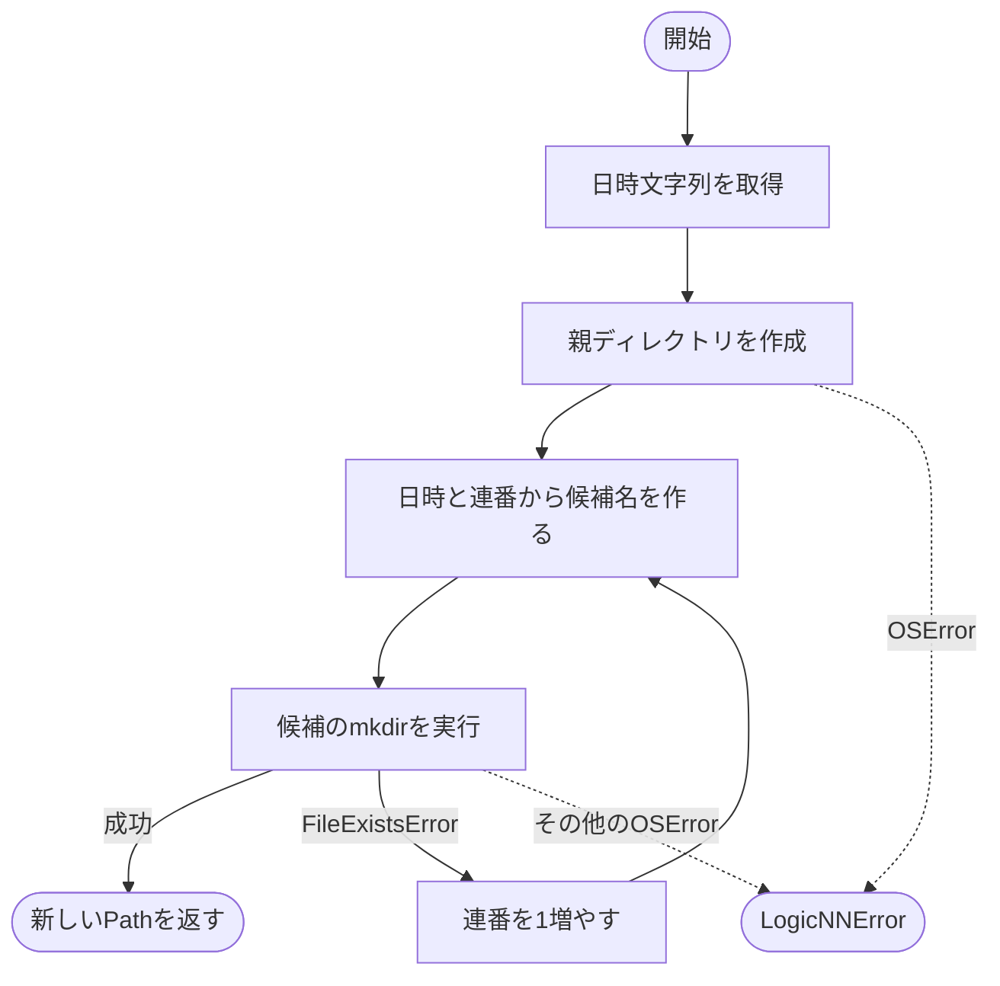

# run_directory.py

`utils/results/run_directory.py`

日時と連番を使い、既存成果物を上書きしない新しい実行ディレクトリを作成します。

{/* source-sha256: 39c4d1ebcdea6e2f22762c27f053055f52f8fd6da25a488068d6bc98008722a2 */}

{/* function: create_run_directory@9 */}

## create\_run\_directory() {/* #create-run-directory */}

```python
def create_run_directory(log_dir: Path) -> Path:
```

### 機能概要

ローカル日時のYYYYMMDD_HHMMSSを名前に使います。同名が存在した場合は_01、_02のように連番を増やし、mkdirが成功したディレクトリを返します。

### 引数

| 引数 | 型 | 既定値 | 説明 |
|---|---|---|---|
| `log_dir` | `Path` | `必須` | 実行ディレクトリを配置する親ディレクトリ。 |

### 処理の流れ



### 戻り値

型：`Path`

新しく作成したディレクトリのPath。相対パスを渡した場合は戻り値も相対パスです。

### 状態の変更・ファイル出力

- log_dirがなければ親階層を含めて作成し、その下に新しい空ディレクトリを作ります。

### ソースコード

<details>
<summary>create\_run\_directory() の実装を開く</summary>

```python
def create_run_directory(log_dir: Path) -> Path:
    """現在のローカル日時と衝突時の連番で新しい実行ディレクトリを確保する。"""
    log_dir = Path(log_dir)
    stamp   = datetime.now().strftime("%Y%m%d_%H%M%S")
    try:
        log_dir.mkdir(parents=True, exist_ok=True)
        index = 0
        while True:
            candidate = log_dir / (stamp if index == 0 else f"{stamp}_{index:02d}")
            try:
                candidate.mkdir()
                return candidate
            except FileExistsError:
                index += 1
    except OSError as error:
        raise LogicNNError("実行ディレクトリを作成できません", detail=f"{log_dir}: {error}", hint="保存先と書込権限を確認してください") from error
```

</details>

## 関連ファイル

- [utils/exceptions.py](/code-reference/utils/exceptions)
