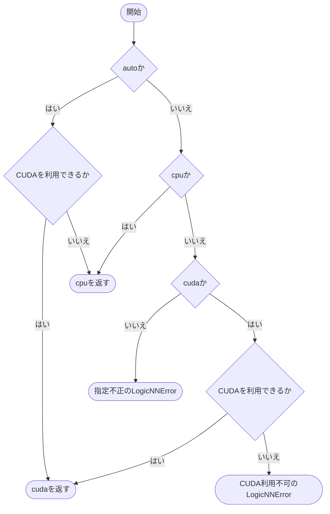

# device.py

`utils/runtime/device.py`

単一のCPUまたはCUDAデバイスを選択します。分散学習や複数GPUへの配置は行いません。

{/* source-sha256: 4b22f8ca08eaae0cab1e78e40af5713a67f4d07d9ceef74e62905dbd887886c5 */}

{/* function: select_device@10 */}

## select\_device() {/* #select-device */}

```python
def select_device(requested: str) -> torch.device:
```

### 機能概要

autoならCUDAが利用可能な場合にcuda、そうでなければcpuを選びます。cudaを明示した場合は、利用できなければエラーにします。

### 引数

| 引数 | 型 | 既定値 | 説明 |
|---|---|---|---|
| `requested` | `str` | `必須` | `auto`、`cpu`、`cuda` のいずれか。 |

### 処理の流れ



### 戻り値

型：`torch.device`

選択した `torch.device`。

### ソースコード

<details>
<summary>select\_device() の実装を開く</summary>

```python
def select_device(requested: str) -> torch.device:
    """設定値とCUDA可否から実際に使用する単一デバイスを返す。"""
    if requested == "auto":
        return torch.device("cuda" if torch.cuda.is_available() else "cpu")
    if requested == "cpu":
        return torch.device("cpu")
    if requested == "cuda":
        if torch.cuda.is_available():
            return torch.device("cuda")
        raise LogicNNError(
            "CUDAを利用できません",
            detail="run.deviceはcudaですが、PyTorchが利用可能なCUDAデバイスを検出できませんでした",
            hint="CUDA環境を確認するか、run.deviceをautoまたはcpuへ変更してください",
        )
    raise LogicNNError(
        "実行デバイスの指定が不正です",
        detail=f"run.device: {requested!r}",
        hint="run.deviceにはauto、cpu、cudaのいずれかを指定してください",
    )
```

</details>

## 関連ファイル

- [utils/exceptions.py](/code-reference/utils/exceptions)
