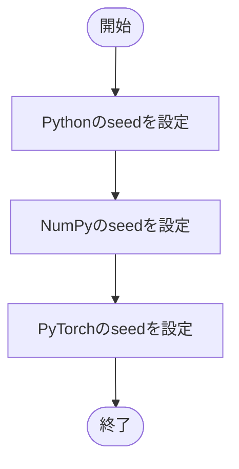

# seed.py

`utils/runtime/seed.py`

Python、NumPy、PyTorchで使用する乱数seedをまとめて設定します。

{/* source-sha256: 26e5664a7ec9ad01b618c1618dd35607aba00fe92614797dfda5f6fa116346ad */}

{/* function: set_seed@11 */}

## set\_seed() {/* #set-seed */}

```python
def set_seed(seed: int) -> None:
```

### 機能概要

random.seed、numpy.random.seed、torch.manual_seedを順に呼びます。学習の開始前に初期乱数状態を揃えるための関数です。

### 引数

| 引数 | 型 | 既定値 | 説明 |
|---|---|---|---|
| `seed` | `int` | `必須` | 各乱数生成器に共通で指定する整数。設定スキーマでは0～4294967295。 |

### 処理の流れ



### 戻り値

型：`None`

`None`。

### 状態の変更・ファイル出力

- プロセスの乱数状態を変更します。

### 例外・注意事項

- 決定論的アルゴリズムの強制設定は行いません。異なる環境・デバイス間で学習結果の厳密一致を保証するものではありません。

### ソースコード

<details>
<summary>set\_seed() の実装を開く</summary>

```python
def set_seed(seed: int) -> None:
    """Python、NumPy、PyTorch CPUおよび利用可能なCUDAへseedを設定する。"""
    random.seed(seed)
    np.random.seed(seed)
    torch.manual_seed(seed)
```

</details>
