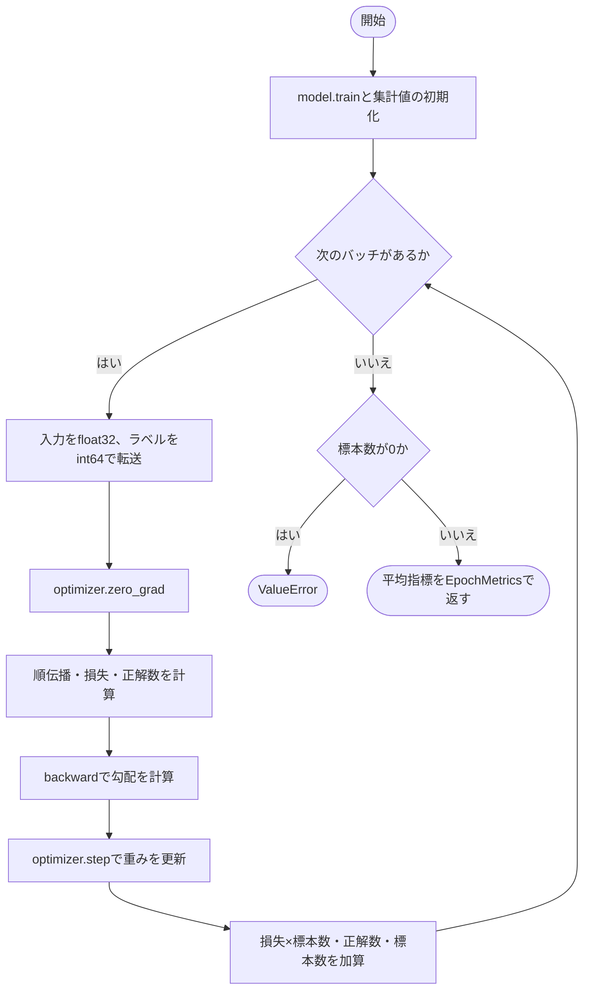
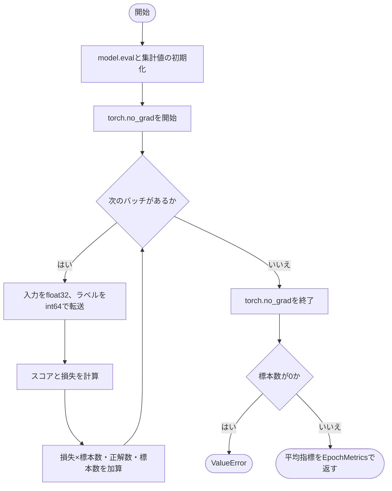

# epoch.py

`utils/trainer/epoch.py`

1 epochの学習と評価を行います。保存・表示・scheduler更新は含めず、標本数で重み付けした指標を返します。

{/* source-sha256: 0031c34ab3c3b9e22ba10f7691d7ef457e45a267e0693d2311262368167c6475 */}

## EpochMetrics {/* #epochmetrics-class */}

全標本を同じ重みで集計した結果です。正解率は百分率ではなく0～1で保持します。

| 属性 | 型 | 既定値 | 説明 |
|---|---|---|---|
| `loss` | `float` | `必須` | 標本平均の損失。 |
| `accuracy` | `float` | `必須` | 正解標本数を総標本数で割った値。 |
| `samples` | `int` | `必須` | 処理した標本数。 |

`@dataclass` により、初期化などのメソッドが自動生成されます。表の属性は初期化時に指定します。

このクラスには独自の関数実装はありません。

<details>
<summary>EpochMetrics の定義を開く</summary>

```python
@dataclass(frozen=True)
class EpochMetrics:
    """全標本を同じ重みで集計した損失・正解率・標本数を保持する。"""

    loss: float
    accuracy: float
    samples: int
```

</details>

{/* function: train_one_epoch@20 */}

## train\_one\_epoch() {/* #train-one-epoch */}

```python
def train_one_epoch(
    model: nn.Module, loader: Iterable[tuple[Tensor, Tensor]], loss: nn.Module, optimizer: Optimizer, device: torch.device,
) -> EpochMetrics:
```

### 機能概要

モデルを学習モードに切り替え、各バッチで順伝播、損失計算、逆伝播、optimizer更新を行います。各バッチの平均損失に標本数を掛けて集計するため、最後の端数バッチも正しく重み付けされます。

### 引数

| 引数 | 型 | 既定値 | 説明 |
|---|---|---|---|
| `model` | `nn.Module` | `必須` | 学習する分類モデル。出力は `[batch, classes]` のスコア。 |
| `loader` | `Iterable[tuple[Tensor, Tensor]]` | `必須` | `(inputs, targets)` を返す反復可能オブジェクト。targetsは `[batch]` のクラス番号。 |
| `loss` | `nn.Module` | `必須` | バッチ平均のscalar損失を返す関数。 |
| `optimizer` | `Optimizer` | `必須` | モデルのParameterを更新するoptimizer。 |
| `device` | `torch.device` | `必須` | 入力とラベルの転送先。 |

### 処理の流れ



### 戻り値

型：`EpochMetrics`

学習中に計算した損失・正解率・標本数。各バッチの正解率は、そのバッチの重み更新前のスコアに基づきます。

### 状態の変更・ファイル出力

- モデルを学習モードにし、勾配・重み・optimizer状態を更新します。終了時に元のモードへは戻しません。

### 例外・注意事項

- 空loaderはValueErrorです。入力やラベルの一般的な検証を繰り返す独自処理は設けていません。
- 損失関数は標本平均を返す必要があります。演算が受け付けない形状などはPyTorchの例外になります。
- ラベルは事前に整数のクラス番号で用意してください。この関数ではint64へ変換するため、小数を渡した場合は小数部が除かれます。

### ソースコード

<details>
<summary>train\_one\_epoch() の実装を開く</summary>

```python
def train_one_epoch(
    model: nn.Module, loader: Iterable[tuple[Tensor, Tensor]], loss: nn.Module, optimizer: Optimizer, device: torch.device,
) -> EpochMetrics:
    """全batchを順に学習し、更新前スコアから全標本重み付きの指標を返す。"""
    model.train()
    loss_total = 0.0
    correct    = 0
    samples    = 0
    for inputs, targets in loader:
        inputs  = inputs.to(device=device, dtype=torch.float32)
        targets = targets.to(device=device, dtype=torch.int64)
        optimizer.zero_grad(set_to_none=True)
        scores        = model(inputs)
        batch_loss    = loss(scores, targets)
        batch_correct = int((scores.argmax(dim=1) == targets).sum().item())
        batch_loss.backward()
        optimizer.step()
        count       = targets.shape[0]
        loss_total += float(batch_loss.detach().item()) * count
        correct    += batch_correct
        samples    += count
    if samples == 0:
        raise ValueError("DataLoaderが空です")
    return EpochMetrics(loss_total / samples, correct / samples, samples)
```

</details>

{/* function: evaluate@46 */}

## evaluate() {/* #evaluate */}

```python
def evaluate(model: nn.Module, loader: Iterable[tuple[Tensor, Tensor]], loss: nn.Module, device: torch.device) -> EpochMetrics:
```

### 機能概要

モデルを評価モードに切り替え、torch.no_grad内で全バッチの損失と正解数を集計します。学習率や保存状態は変更しません。

### 引数

| 引数 | 型 | 既定値 | 説明 |
|---|---|---|---|
| `model` | `nn.Module` | `必須` | 評価する分類モデル。 |
| `loader` | `Iterable[tuple[Tensor, Tensor]]` | `必須` | 入力と正解クラス番号のバッチを返す反復可能オブジェクト。 |
| `loss` | `nn.Module` | `必須` | バッチ平均のscalar損失を返す評価用関数。 |
| `device` | `torch.device` | `必須` | 入力とラベルの転送先。 |

### 処理の流れ



### 戻り値

型：`EpochMetrics`

全標本の平均損失、正解率、標本数を持つEpochMetrics。

### 状態の変更・ファイル出力

- モデルを評価モードにし、終了後もそのモードを維持します。backwardやoptimizer.stepは呼びません。

### 例外・注意事項

- 既存のParameter勾配をゼロにする処理はありません。空loaderはValueErrorです。
- ラベルは事前に整数のクラス番号で用意してください。この関数ではint64へ変換するため、小数を渡した場合は小数部が除かれます。

### ソースコード

<details>
<summary>evaluate() の実装を開く</summary>

```python
def evaluate(model: nn.Module, loader: Iterable[tuple[Tensor, Tensor]], loss: nn.Module, device: torch.device) -> EpochMetrics:
    """重みと勾配を変更せず全batchを評価し、全標本重み付きの指標を返す。"""
    model.eval()
    loss_total = 0.0
    correct    = 0
    samples    = 0
    with torch.no_grad():
        for inputs, targets in loader:
            inputs      = inputs.to(device=device, dtype=torch.float32)
            targets     = targets.to(device=device, dtype=torch.int64)
            scores      = model(inputs)
            batch_loss  = loss(scores, targets)
            count       = targets.shape[0]
            loss_total += float(batch_loss.item()) * count
            correct    += int((scores.argmax(dim=1) == targets).sum().item())
            samples    += count
    if samples == 0:
        raise ValueError("DataLoaderが空です")
    return EpochMetrics(loss_total / samples, correct / samples, samples)
```

</details>
