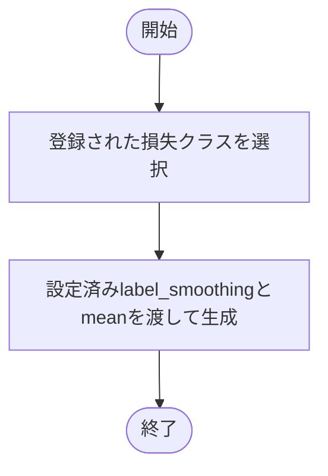
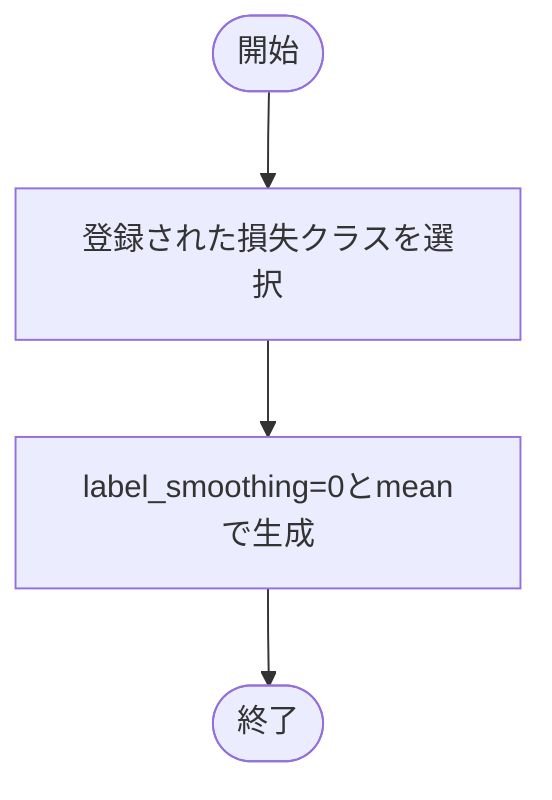

# loss.py

`utils/trainer/optimization/loss.py`

登録された損失関数を学習用と評価用に分けて生成します。現在の登録先はCrossEntropyLossです。

{/* source-sha256: e31b28ebcca08222bb07e813539b450903a01020976b490a9b37b00157374856 */}

{/* function: build_training_loss@9 */}

## build\_training\_loss() {/* #build-training-loss */}

```python
def build_training_loss(config: LossConfig) -> nn.CrossEntropyLoss:
```

### 機能概要

設定したlabel_smoothingを適用し、バッチ平均を返す学習用CrossEntropyLossを生成します。

### 引数

| 引数 | 型 | 既定値 | 説明 |
|---|---|---|---|
| `config` | `LossConfig` | `必須` | 損失関数の登録名とlabel_smoothing。 |

### 処理の流れ



### 戻り値

型：`nn.CrossEntropyLoss`

`reduction='mean'` のCrossEntropyLoss。

### 例外・注意事項

- 登録名が存在しない場合はKeyErrorです。通常の実行ではworkflowが先に登録名を確認します。

### ソースコード

<details>
<summary>build\_training\_loss() の実装を開く</summary>

```python
def build_training_loss(config: LossConfig) -> nn.CrossEntropyLoss:
    """学習用に、設定済みlabel smoothingを適用した損失関数を生成する。"""
    return LOSS_REGISTRY[config.name](label_smoothing=config.label_smoothing, reduction="mean")
```

</details>

{/* function: build_evaluation_loss@14 */}

## build\_evaluation\_loss() {/* #build-evaluation-loss */}

```python
def build_evaluation_loss(config: LossConfig) -> nn.CrossEntropyLoss:
```

### 機能概要

検証・テスト用に、label_smoothingを0.0に固定したバッチ平均の損失関数を生成します。学習用と異なる条件で損失を計算するため、別のインスタンスを作ります。

### 引数

| 引数 | 型 | 既定値 | 説明 |
|---|---|---|---|
| `config` | `LossConfig` | `必須` | 損失関数の登録名。label_smoothingは評価には適用しません。 |

### 処理の流れ



### 戻り値

型：`nn.CrossEntropyLoss`

`label_smoothing=0.0`、`reduction='mean'` のCrossEntropyLoss。

### ソースコード

<details>
<summary>build\_evaluation\_loss() の実装を開く</summary>

```python
def build_evaluation_loss(config: LossConfig) -> nn.CrossEntropyLoss:
    """検証・テスト用に、label smoothingを適用しない損失関数を生成する。"""
    return LOSS_REGISTRY[config.name](label_smoothing=0.0, reduction="mean")
```

</details>

## 関連ファイル

- [utils/config/schema.py](/code-reference/utils/config/schema)
