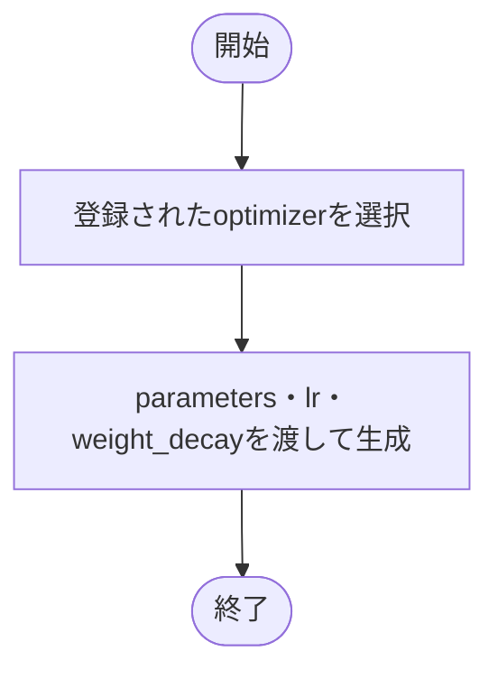

# optimizer.py

`utils/trainer/optimization/optimizer.py`

登録されたoptimizerへモデルの学習パラメータと設定値を渡します。

{/* source-sha256: 6f3ad5b4e251640c7de805ba2a82a42e75d21a757129f4bfcb832fb1cd86736c */}

{/* function: build_optimizer@12 */}

## build\_optimizer() {/* #build-optimizer */}

```python
def build_optimizer(config: OptimizerConfig, parameters: Iterable[nn.Parameter]) -> AdamW:
```

### 機能概要

登録名からAdamWを選び、初期学習率とweight_decayを指定して生成します。betasやepsなど、ここで渡していない値はPyTorchの既定値を使用します。

### 引数

| 引数 | 型 | 既定値 | 説明 |
|---|---|---|---|
| `config` | `OptimizerConfig` | `必須` | optimizer名、learning_rate、weight_decay。 |
| `parameters` | `Iterable[nn.Parameter]` | `必須` | 更新対象のモデルParameterの反復可能オブジェクト。 |

### 処理の流れ



### 戻り値

型：`AdamW`

更新対象のパラメータを保持するAdamW。

### 例外・注意事項

- この関数ではoptimizer.stepを呼ばないため、学習による重み更新はまだ行いません。

### ソースコード

<details>
<summary>build\_optimizer() の実装を開く</summary>

```python
def build_optimizer(config: OptimizerConfig, parameters: Iterable[nn.Parameter]) -> AdamW:
    """lrとweight decayを設定し、betas・eps等はTorch既定値のAdamWを作る。"""
    return OPTIMIZER_REGISTRY[config.name](parameters, lr=config.learning_rate, weight_decay=config.weight_decay)
```

</details>

## 関連ファイル

- [utils/config/schema.py](/code-reference/utils/config/schema)
