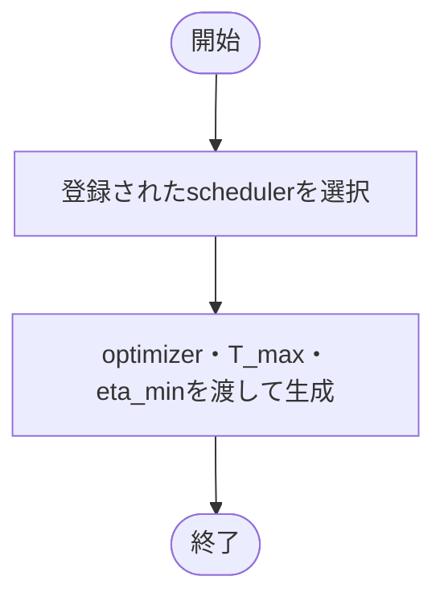

# scheduler.py

`utils/trainer/optimization/scheduler.py`

総epoch数をT_maxに設定したCosineAnnealingLRを生成します。

{/* source-sha256: d7d149392b7df00c88e4fb0c6310b6146e09b3f6a8c1e1e8e186e115f6c8a89c */}

{/* function: build_scheduler@10 */}

## build\_scheduler() {/* #build-scheduler */}

```python
def build_scheduler(config: SchedulerConfig, optimizer: Optimizer, epochs: int) -> CosineAnnealingLR:
```

### 機能概要

optimizerに対し、総epoch数と最小学習率を設定したcosine schedulerを作ります。各epoch終了後のstep呼び出しはworkflowで行います。

### 引数

| 引数 | 型 | 既定値 | 説明 |
|---|---|---|---|
| `config` | `SchedulerConfig` | `必須` | scheduler名と最小学習率。 |
| `optimizer` | `Optimizer` | `必須` | 学習率を調整するoptimizer。 |
| `epochs` | `int` | `必須` | T_maxに設定する総epoch数。 |

### 処理の流れ



### 戻り値

型：`CosineAnnealingLR`

CosineAnnealingLR。

### ソースコード

<details>
<summary>build\_scheduler() の実装を開く</summary>

```python
def build_scheduler(config: SchedulerConfig, optimizer: Optimizer, epochs: int) -> CosineAnnealingLR:
    """総epoch数と設定済み最小学習率を指定したcosine schedulerを作る。"""
    return SCHEDULER_REGISTRY[config.name](optimizer, T_max=epochs, eta_min=config.minimum_learning_rate)
```

</details>

## 関連ファイル

- [utils/config/schema.py](/code-reference/utils/config/schema)
