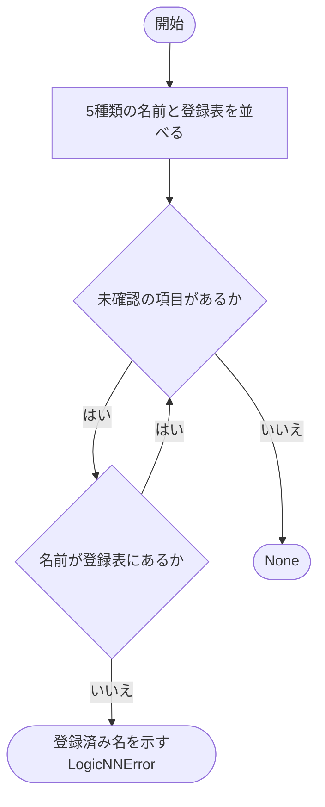
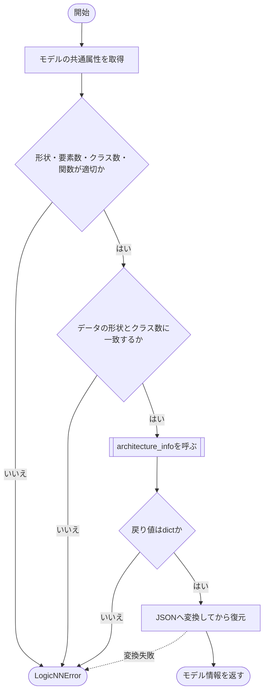
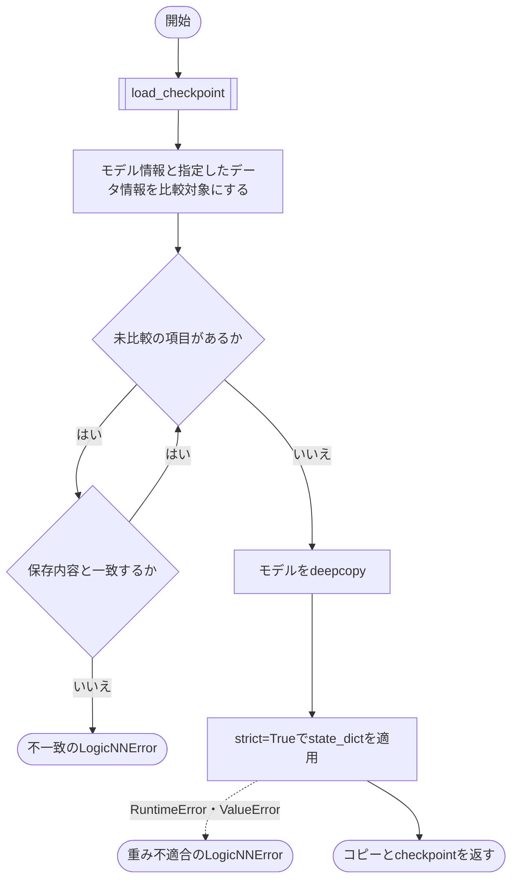
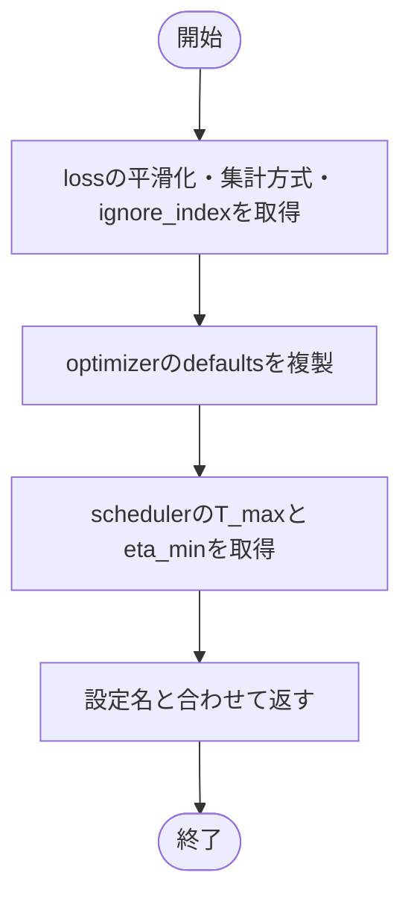
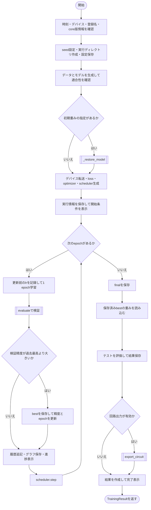

# workflow.py

`utils/trainer/workflow.py`

設定の検証から学習、毎epochの検証と保存、bestモデルでのテスト、任意の回路出力までを調整します。

{/* source-sha256: 1a1092042c75e7d4cb98fd831ce292f450f5914ba6d5b2ef1feb2d9042cf2d0d */}

## TrainingResult {/* #trainingresult-class */}

今回の学習の保存先と、最良モデルによる評価結果です。

| 属性 | 型 | 既定値 | 説明 |
|---|---|---|---|
| `run_dir` | `Path` | `必須` | 実行ディレクトリ。 |
| `best_epoch` | `int` | `必須` | 検証精度が最良だったepoch。 |
| `best_validation_accuracy` | `float` | `必須` | 最良の検証正解率。0～1。 |
| `test_metrics` | `EpochMetrics` | `必須` | 保存済みbestモデルのテスト結果。 |

`@dataclass` により、初期化などのメソッドが自動生成されます。表の属性は初期化時に指定します。

このクラスには独自の関数実装はありません。

<details>
<summary>TrainingResult の定義を開く</summary>

```python
@dataclass(frozen=True)
class TrainingResult:
    """今回の保存先と、保存済みbestによる最終評価結果を返す。"""

    run_dir: Path
    best_epoch: int
    best_validation_accuracy: float
    test_metrics: EpochMetrics
```

</details>

{/* function: _validate_registered_names@58 */}

## \_validate\_registered\_names() {/* #validate-registered-names */}

```python
def _validate_registered_names(config: AppConfig) -> None:
```

### 機能概要

データ、モデル、loss、optimizer、schedulerの登録名を、それぞれの登録表と照合します。未登録なら、保存先やモデルを作る前に停止できるようにします。

### 引数

| 引数 | 型 | 既定値 | 説明 |
|---|---|---|---|
| `config` | `AppConfig` | `必須` | 検証対象の設定全体。 |

### 処理の流れ



### 戻り値

型：`None`

`None`。

### ソースコード

<details>
<summary>\_validate\_registered\_names() の実装を開く</summary>

```python
def _validate_registered_names(config: AppConfig) -> None:
    """データやmodelの生成・保存先作成より前に、全登録名を検証する。"""
    selections = (
        ("data.name", config.data.name, DATASET_REGISTRY), ("model.name", config.model.name, MODEL_REGISTRY),
        ("train.loss.name", config.train.loss.name, LOSS_REGISTRY), ("train.optimizer.name", config.train.optimizer.name, OPTIMIZER_REGISTRY),
        ("train.scheduler.name", config.train.scheduler.name, SCHEDULER_REGISTRY),
    )
    for field, name, registry in selections:
        if name not in registry:
            available = ", ".join(sorted(registry))
            raise LogicNNError("未登録の名前です", detail=f"{field}: {name!r}\n登録済み: {available}", hint="対応する登録名を設定してください")
```

</details>

{/* function: _model_information@71 */}

## \_model\_information() {/* #model-information */}

```python
def _model_information(model: nn.Module, name: str, dataset: DatasetMetadata) -> dict[str, object]:
```

### 機能概要

モデルが共通属性と構造情報関数を備え、データセットの入力形状・クラス数に適合するかを確認します。構造情報をJSONへ変換して読み戻し、モデルから独立した保存用データにします。

### 引数

| 引数 | 型 | 既定値 | 説明 |
|---|---|---|---|
| `model` | `nn.Module` | `必須` | input_shape・input_size・num_classes・architecture_infoを持つモデル。 |
| `name` | `str` | `必須` | 記録とエラー表示に使用する登録名。 |
| `dataset` | `DatasetMetadata` | `必須` | 適合性を比較するDatasetMetadata。 |

### 処理の流れ



### 戻り値

型：`dict[str, object]`

name、input_shape、input_size、num_classes、architectureを持つ辞書。

### ソースコード

<details>
<summary>\_model\_information() の実装を開く</summary>

```python
def _model_information(model: nn.Module, name: str, dataset: DatasetMetadata) -> dict[str, object]:
    """モデル共通契約とデータ適合性を確認し、保存する構造情報を独立dictへ変換する。"""
    shape   = getattr(model, "input_shape", None)
    size    = getattr(model, "input_size", None)
    classes = getattr(model, "num_classes", None)
    describe = getattr(model, "architecture_info", None)
    if type(shape) is not tuple or not shape or any(type(value) is not int or value <= 0 for value in shape):
        raise LogicNNError("モデルの入力形状が不正です", detail=f"model={name}, input_shape={shape!r}", hint="モデル定義に正整数tupleのinput_shapeを定義してください")
    if type(size) is not int or size != math.prod(shape) or type(classes) is not int or classes <= 0 or not callable(describe):
        raise LogicNNError("モデル共通契約が不正です", detail=f"model={name}, input_size={size!r}, num_classes={classes!r}", hint="モデルの共通propertyと構造情報関数を確認してください")
    for field, expected, actual in (("input_shape", dataset.input_shape, shape), ("num_classes", dataset.num_classes, classes)):
        if actual != expected:
            raise LogicNNError(
                "モデルとデータセットが適合しません", detail=f"{field}: dataset={expected!r}, model={actual!r}",
                hint="入力形状とクラス数が一致するモデルとデータセットを選択してください",
            )
    architecture = describe()
    if type(architecture) is not dict:
        raise LogicNNError("モデル構造情報が不正です", detail=f"model={name}: architecture_infoはdictが必要です", hint="JSONで保存できる構造情報を返してください")
    try:
        architecture = json.loads(json.dumps(architecture, allow_nan=False))
    except (ValueError, TypeError, RecursionError) as error:
        raise LogicNNError("モデル構造情報を保存できません", detail=f"model={name}: {error}", hint="循環やTensorを含まない有限のJSON基本型を返してください") from error
    return {"name": name, "input_shape": list(shape), "input_size": size, "num_classes": classes, "architecture": architecture}
```

</details>

{/* function: _restore_model@97 */}

## \_restore\_model() {/* #restore-model */}

```python
def _restore_model(model: nn.Module, path: Path, information: Mapping[str, object], dataset: DatasetMetadata) -> tuple[nn.Module, dict[str, object]]:
```

### 機能概要

チェックポイントのモデル情報全項目と、データセット名・入力形状・クラス数・前処理を照合します。一致した場合のみモデルの独立コピーへstrict=Trueで重みを読み込みます。

### 引数

| 引数 | 型 | 既定値 | 説明 |
|---|---|---|---|
| `model` | `nn.Module` | `必須` | 複製元となる現在のモデル。 |
| `path` | `Path` | `必須` | 読み込む.pthファイル。 |
| `information` | `Mapping[str, object]` | `必須` | 今回のモデル情報。 |
| `dataset` | `DatasetMetadata` | `必須` | 今回のデータセット情報。 |

### 処理の流れ



### 戻り値

型：`tuple[nn.Module, dict[str, object]]`

`(重みを読み込んだモデルのコピー, チェックポイント辞書)`。元のmodelは変更しません。

### 例外・注意事項

- optimizer、scheduler、学習履歴は復元しません。データの分割seedや件数はこの適合性比較の対象外です。

### ソースコード

<details>
<summary>\_restore\_model() の実装を開く</summary>

```python
def _restore_model(model: nn.Module, path: Path, information: Mapping[str, object], dataset: DatasetMetadata) -> tuple[nn.Module, dict[str, object]]:
    """metadataを照合し、strict読込に成功した独立コピーだけを採用する。"""
    checkpoint = load_checkpoint(path)
    expected_dataset = json.loads(json.dumps(asdict(dataset)))
    comparisons = [(f"model.{field}", expected, checkpoint["model"][field]) for field, expected in information.items()]
    comparisons.extend(
        (f"dataset.{field}", expected_dataset[field], checkpoint["dataset"][field]) for field in ("name", "input_shape", "num_classes", "preprocessing")
    )
    for field, expected, actual in comparisons:
        if expected != actual:
            raise LogicNNError(
                "チェックポイントが実行対象と一致しません", detail=f"対象: {path}\n{field}\n期待値: {expected!r}\n実際値: {actual!r}",
                hint="同じモデル構造と前処理のlogicNNチェックポイントを指定してください",
            )
    candidate = deepcopy(model)
    try:
        candidate.load_state_dict(checkpoint["model_state_dict"], strict=True)
    except (RuntimeError, ValueError) as error:
        raise LogicNNError("チェックポイントの重みが適合しません", detail=f"対象: {path}\n{error}", hint="重みのキーと形状がモデル定義と一致するpthを指定してください") from error
    return candidate, checkpoint
```

</details>

{/* function: _training_information@119 */}

## \_training\_information() {/* #training-information */}

```python
def _training_information(config: AppConfig, loss: nn.CrossEntropyLoss, optimizer: Optimizer, scheduler: CosineAnnealingLR) -> dict[str, object]:
```

### 機能概要

設定上の名前だけでなく、生成済みloss・optimizer・schedulerが実際に持つ値を記録します。optimizer.defaultsは独立コピーにします。

### 引数

| 引数 | 型 | 既定値 | 説明 |
|---|---|---|---|
| `config` | `AppConfig` | `必須` | 今回の学習設定。 |
| `loss` | `nn.CrossEntropyLoss` | `必須` | 生成済みの学習用CrossEntropyLoss。 |
| `optimizer` | `Optimizer` | `必須` | 生成済みoptimizer。 |
| `scheduler` | `CosineAnnealingLR` | `必須` | 生成済みCosineAnnealingLR。 |

### 処理の流れ



### 戻り値

型：`dict[str, object]`

epochs、loss、optimizer、schedulerを持つ記録用辞書。

### ソースコード

<details>
<summary>\_training\_information() の実装を開く</summary>

```python
def _training_information(config: AppConfig, loss: nn.CrossEntropyLoss, optimizer: Optimizer, scheduler: CosineAnnealingLR) -> dict[str, object]:
    """明示設定とライブラリ既定値を含む、実際の最適化条件だけを記録する。"""
    return {
        "epochs": config.train.epochs,
        "loss": {"name": config.train.loss.name, "label_smoothing": loss.label_smoothing, "reduction": loss.reduction, "ignore_index": loss.ignore_index},
        "optimizer": {"name": config.train.optimizer.name, **deepcopy(optimizer.defaults)},
        "scheduler": {"name": config.train.scheduler.name, "T_max": scheduler.T_max, "eta_min": scheduler.eta_min},
    }
```

</details>

{/* function: run_training@129 */}

## run\_training() {/* #run-training */}

```python
def run_training(config: AppConfig, config_path: Path) -> TrainingResult:
```

### 機能概要

設定に基づく新しい学習をepoch 1から実行します。各epochで学習と検証を行い、検証精度が更新されたときにbestを保存します。全epoch終了後にfinalを保存し、保存済みbestを再読込してテストを一度行います。

### 引数

| 引数 | 型 | 既定値 | 説明 |
|---|---|---|---|
| `config` | `AppConfig` | `必須` | パス解決・スキーマ検証済みのAppConfig。 |
| `config_path` | `Path` | `必須` | 実行情報へ記録する設定ファイルのパス。この関数で設定を読み直すことはありません。 |

### 処理の流れ



図は正常に進む場合の処理順序です。途中の関数で例外が発生すると、残りの処理は実行せず呼び出し元に伝わります。bestの選択は厳密な `>` 比較で、同率なら先のepochを維持します。

### 戻り値

型：`TrainingResult`

保存先、best epoch、最良検証精度、テスト結果を持つTrainingResult。

### 状態の変更・ファイル出力

- 新しい実行ディレクトリへ設定、学習情報、epoch履歴、グラフ、best/final、テスト結果を保存します。回路出力が有効ならcircuitサブディレクトリも作成します。
- モデル重み、optimizer状態、scheduler状態、乱数状態を更新します。

### 例外・注意事項

- 初期チェックポイントを指定しても、学習回数・optimizer・schedulerは新規に開始します。
- 入力データのダウンロードやEarly Stoppingは行いません。モデル本体は戻り値に含めません。

### ソースコード

<details>
<summary>run\_training() の実装を開く</summary>

```python
def run_training(config: AppConfig, config_path: Path) -> TrainingResult:
    """新規学習をepoch 1から行い、保存したbestの公式テストと任意回路出力まで実行する。"""
    started = datetime.now().astimezone().isoformat()
    device  = select_device(config.run.device)
    _validate_registered_names(config)
    version = getattr(logicnn_core, "__version__", None)
    if type(version) is not str or not version.strip():
        raise LogicNNError("logicNN_coreの版情報がありません", detail="配布物の__version__を取得できません", hint="ローカルcore packageの導入状態を確認してください")
    set_seed(config.run.seed)
    run_dir = create_run_directory(config.run.log_dir)
    save_resolved_config(run_dir, config)
    bundle  = build_data_bundle(config.data, config.run.seed, device.type == "cuda")
    model   = build_model(config.model.name)
    model_information = _model_information(model, config.model.name, bundle.metadata)
    initialized = None
    if config.run.initial_checkpoint_path is not None:
        path = config.run.initial_checkpoint_path
        model, checkpoint = _restore_model(model, path, model_information, bundle.metadata)
        initialized = {
            "path": str(path.resolve()), "format_version": checkpoint["format_version"],
            "checkpoint_type": checkpoint["checkpoint_type"], "epoch": checkpoint["epoch"],
        }
    model      = model.to(device)
    train_loss = build_training_loss(config.train.loss).to(device)
    eval_loss  = build_evaluation_loss(config.train.loss).to(device)
    optimizer  = build_optimizer(config.train.optimizer, model.parameters())
    scheduler  = build_scheduler(config.train.scheduler, optimizer, config.train.epochs)
    training   = _training_information(config, train_loss, optimizer, scheduler)
    information = {
        "started_at": started, "config_path": str(Path(config_path).resolve()), "device": {"requested": config.run.device, "resolved": str(device)},
        "software": {
            "python": platform.python_version(), "pytorch": str(torch.__version__), "torchvision": str(torchvision.__version__), "logicnn_core": version,
        },
        "model": model_information, "dataset": asdict(bundle.metadata), "optimization": {name: training[name] for name in ("loss", "optimizer", "scheduler")},
        "evaluation_modes": {"train": "continuous", "validation": "discrete", "test": "discrete", "circuit": "discrete"},
        "initialized_from_checkpoint": initialized,
    }
    save_training_info(run_dir, information)
    show_start(config, run_dir, device)
    history: list[EpochRecord] = []
    best_validation_accuracy = -1.0
    best_epoch: int | None = None
    for epoch in range(1, config.train.epochs + 1):
        learning_rate = float(optimizer.param_groups[0]["lr"])
        train_metrics = train_one_epoch(model, bundle.train_loader, train_loss, optimizer, device)
        validation    = evaluate(model, bundle.validation_loader, eval_loss, device)
        if validation.accuracy > best_validation_accuracy:
            save_checkpoint(
                run_dir / "model_best.pth", model, checkpoint_type="best", epoch=epoch, model_metadata=model_information,
                dataset_metadata=bundle.metadata, training_metadata=training, validation_metrics=validation,
            )
            best_validation_accuracy = validation.accuracy
            best_epoch = epoch
        record = EpochRecord(epoch, learning_rate, train_metrics.loss, train_metrics.accuracy, validation.loss, validation.accuracy)
        append_epoch_record(run_dir, record)
        history.append(record)
        save_curves(run_dir, history)
        show_epoch(record, config.train.epochs)
        scheduler.step()
    save_checkpoint(
        run_dir / "model_final.pth", model, checkpoint_type="final", epoch=config.train.epochs, model_metadata=model_information,
        dataset_metadata=bundle.metadata, training_metadata=training, validation_metrics=validation,
    )
    assert best_epoch is not None
    model, _ = _restore_model(model, run_dir / "model_best.pth", model_information, bundle.metadata)
    test_metrics = evaluate(model, bundle.test_loader, eval_loss, device)
    save_test_metrics(run_dir, best_epoch, test_metrics)
    if config.circuit.enabled:
        export_circuit(model, bundle.metadata.input_shape, run_dir)
    result = TrainingResult(run_dir, best_epoch, best_validation_accuracy, test_metrics)
    show_complete(result)
    return result
```

</details>

## 関連ファイル

- [model/builder.py](/code-reference/model/builder)
- [utils/config/schema.py](/code-reference/utils/config/schema)
- [utils/console/\_\_init\_\_.py](/code-reference/utils/console/__init__)
- [utils/data/loader.py](/code-reference/utils/data/loader)
- [utils/data/types.py](/code-reference/utils/data/types)
- [utils/exceptions.py](/code-reference/utils/exceptions)
- [utils/export/\_\_init\_\_.py](/code-reference/utils/export/__init__)
- [utils/logicNN_core/src/logicnn_core/\_\_init\_\_.py](/code-reference/utils/logicNN_core/src/logicnn_core/__init__)
- [utils/results/\_\_init\_\_.py](/code-reference/utils/results/__init__)
- [utils/runtime/device.py](/code-reference/utils/runtime/device)
- [utils/runtime/seed.py](/code-reference/utils/runtime/seed)
- [utils/trainer/epoch.py](/code-reference/utils/trainer/epoch)
- [utils/trainer/optimization/loss.py](/code-reference/utils/trainer/optimization/loss)
- [utils/trainer/optimization/optimizer.py](/code-reference/utils/trainer/optimization/optimizer)
- [utils/trainer/optimization/scheduler.py](/code-reference/utils/trainer/optimization/scheduler)
