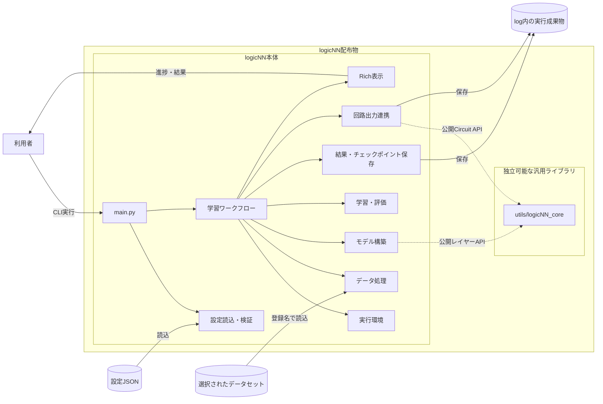
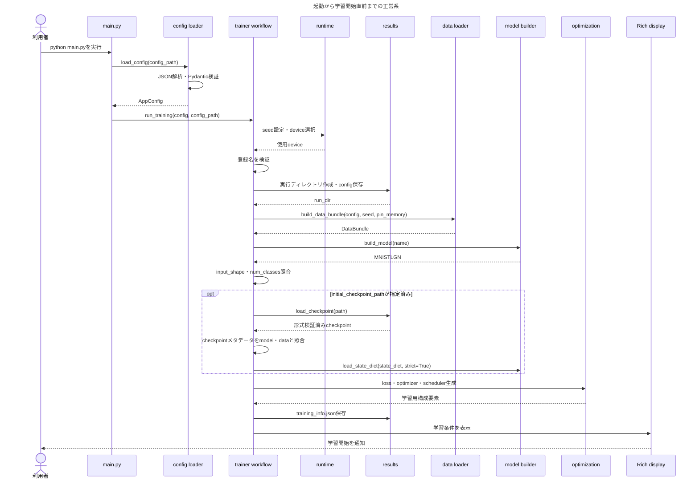
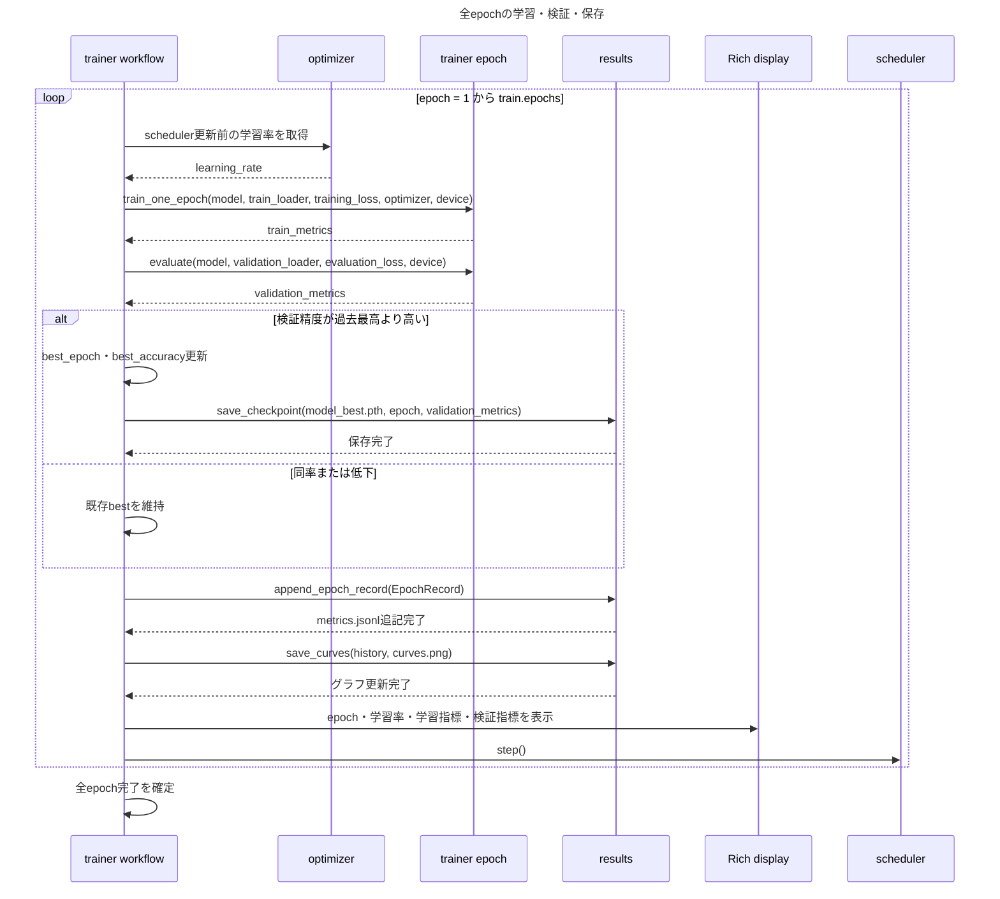
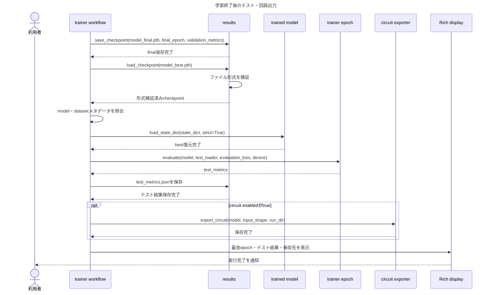

# logicNN 基本設計書

## 1. 文書情報

- 文書状態: 変更草案（logicNN_core再設計を反映）
- 作成日: 2026-09-12
- 承認日: 2026-09-12
- 変更日: 2026-09-12（torchlogix直接依存をlogicNN_coreへ差替え）
- 入力文書: `website/docs/specifications/requirements.md`
- 対象作業フォルダ: `logicNN/`

本書は、承認済み要件を実現するための全体構成、モジュール責務、依存方向および主要処理フローを定義する。関数、クラス、設定 JSON、成果物 JSON およびチェックポイントの詳細は、次工程の詳細設計で定義する。

## 2. 設計方針

1. `main.py` は CLI の入口と全体処理の開始だけを担当する。
2. データ、モデル、学習、保存、表示および回路出力の責務を分離する。
3. MNIST 固有処理を共通学習処理へ混在させない。
4. torchlogixの知識と有用な要素を再設計した汎用ライブラリ `logicNN_core` を `utils/` 内の独立パッケージとして管理する。
5. 不要なラッパーや一行関数を増やさず、意味のある責務単位でまとめる。
6. モデルは現行 `logicnn` と同じ builder 機構、データセットは loader を通して選択する。
7. 運用版から開発用テストコードを除外しても、仕様と検証結果から再作成できる状態を保つ。
8. 文書サイトは Python 本体から分離した Docusaurus docs-only 構成とする。

## 3. フォルダ構成

```text
logicNN/
├── main.py
├── README.md
├── pyproject.toml
├── uv.lock
├── config/
│   └── mnist_lgn.json
├── model/
│   ├── __init__.py
│   ├── builder.py
│   └── lgn/
│       ├── __init__.py
│       └── mnist_lgn.py
├── tools/
│   └── download_dataset.py
├── utils/
│   ├── exceptions.py
│   ├── config/
│   │   ├── loader.py
│   │   └── schema.py
│   ├── runtime/
│   │   ├── device.py
│   │   └── seed.py
│   ├── console/
│   │   └── rich_display.py
│   ├── results/
│   │   ├── run_directory.py
│   │   ├── metadata.py
│   │   ├── metrics.py
│   │   └── checkpoint.py
│   ├── export/
│   │   └── circuit_exporter.py
│   ├── trainer/
│   │   ├── workflow.py
│   │   ├── epoch.py
│   │   └── optimization/
│   │       ├── loss.py
│   │       ├── optimizer.py
│   │       └── scheduler.py
│   ├── data/
│   │   ├── loader.py
│   │   ├── types.py
│   │   ├── mnist.py
│   │   └── preprocessing.py
│   └── logicNN_core/
│       ├── pyproject.toml
│       ├── README.md
│       ├── LICENSE
│       ├── THIRD_PARTY_NOTICES.md
│       ├── src/
│       │   └── logicnn_core/
│       │       ├── functional/
│       │       ├── parametrizations/
│       │       ├── connections/
│       │       ├── layers/
│       │       ├── modules/
│       │       ├── circuit/
│       │       └── integrations/
│       └── examples/
│           └── reference_models/
├── data/
├── log/
└── website/
    ├── docs/
    │   ├── index.md
    │   ├── startup/
    │   │   ├── index.md
    │   │   ├── installation.md
    │   │   ├── dataset.md
    │   │   └── first-training.md
    │   ├── user-guide/
    │   │   ├── index.md
    │   │   ├── configuration.md
    │   │   ├── training.md
    │   │   ├── checkpoints.md
    │   │   ├── artifacts.md
    │   │   └── circuit-export.md
    │   ├── api/
    │   │   ├── index.md
    │   │   ├── cli.md
    │   │   ├── configuration.md
    │   │   ├── data.md
    │   │   ├── model.md
    │   │   ├── training.md
    │   │   └── circuit.md
    │   └── specifications/
    │       ├── requirements.md
    │       ├── basic-design.md
    │       ├── detailed-design.md
    │       ├── test-specification.md
    │       └── verification-result.md
    ├── src/
    │   └── css/
    │       └── custom.css
    ├── static/
    ├── docusaurus.config.ts
    ├── sidebars.ts
    ├── package.json
    ├── package-lock.json
    └── tsconfig.json
```

表示上のノイズを減らすため、各 Python package の `__init__.py` は構成図から省略している。

開発中は `tests/` を一時的に追加する。受入確認と検証結果の文書化が完了した後、運用版から `tests/` を削除する。

### 3.1 モデルの選択方法

現行 `logicnn` と同様に `model/builder.py` を採用する。builder は、`mnist_lgn` のような設定上の名前とモデルクラスを対応付ける `MODEL_REGISTRY`、登録名を検証する処理、およびモデルを生成する `build_model` を一つにまとめる。

新しいモデルを追加するときは、モデル定義ファイルを追加し、`builder.py` の `MODEL_REGISTRY` へ一項目を登録する。データセットは `utils/data/loader.py` が `data.name` と専用読込処理を対応付ける。

現行 builder の `parameters`、`input_size` および `num_classes` 引数は採用しない。`build_model(name)` は登録名だけからモデルを生成する。モデル構造を決める値、対応入力形状およびクラス数は各モデル定義ファイルに置く。

バッチサイズは DataLoader が決める実行時の値であり、モデル形状には含めない。モデルは可変長のbatch次元を受け付ける。`utils/trainer/workflow.py` はモデルが公開する入力形状・クラス数とデータセットのメタデータを比較し、不一致なら学習開始前にエラーにする。

### 3.2 正式版と旧版の配置

正式版の実装・開発用テスト・受入確認は `logicNN/` で行う。移行前の旧版は、精度比較などで参照する場合に限り `logicnn_old/` を使用する。コードはプロジェクトルートの絶対パスに依存させない。

`logicNN/` への名称変更は完了している。以後の仕様書、操作手順、コード例では、この正式名称を使用する。旧版の削除を行う場合は、比較の必要性と削除対象を別途確認する。

## 4. モジュール責務

| 配置 | 主な責務 | 担当しないこと |
|---|---|---|
| `main.py` | CLI 引数の取得、設定読込、ワークフロー開始 | 学習ループ、MNIST 処理、成果物形式の実装 |
| `config/` | 利用者が選択する設定 JSON | Python の設定検証ロジック |
| `model/` | builderによるモデル生成、MNIST モデル構造 | データ取得、学習、成果物保存 |
| `tools/` | データセット取得などの補助処理 | 通常学習ワークフロー |
| `utils/exceptions.py` | 利用者が修正可能な問題を表す共通例外 | エラー表示、tracebackの抑制判断 |
| `utils/config/` | 設定データ型、読込、厳格な検証 | モデル構築、データ読込 |
| `utils/runtime/` | seed、デバイス選択 | 学習やデータセット固有処理 |
| `utils/console/` | Rich による開始・進捗・終了・エラー表示 | 業務判断、ファイル保存 |
| `utils/results/` | 実行ディレクトリ、メタデータ、各種指標、グラフ、チェックポイント | 学習判断、Rich 表示 |
| `utils/export/` | 最良モデルを `logicnn_core.Circuit` へ渡し、logicNN成果物として保存 | 回路IR、簡略化およびコード生成アルゴリズム |
| `utils/trainer/` | 全体ワークフロー、epoch 単位の学習・評価、最適化方式の生成 | MNIST 固有処理、成果物形式の実装 |
| `utils/trainer/optimization/` | loss、optimizer、scheduler の登録・設定検証・生成 | epoch ループ、モデル構造 |
| `utils/data/` | 名前からのデータ読込、共通データ型、MNIST 分割・前処理 | 学習ループ、モデル定義 |
| `utils/logicNN_core/` | 汎用論理演算、LUT、接続、論理層、回路IR、簡略化、実行、JSON／C／Verilog | データセット、学習ループ、logicNN固有設定・ログ |
| `website/` | Docusaurus、要件、設計、テスト仕様、検証結果 | Python 実行コード |

## 5. 依存方向

### 5.1 原則

- `main.py` は設定読込と学習ワークフローだけを呼び出す。
- `utils/trainer/workflow.py` がユースケース全体を調整する。
- `utils/trainer/epoch.py` は共通形式の model と DataLoader だけを扱う。
- `utils/data/` は `utils/trainer/`、`utils/results/` および `utils/console/` に依存しない。
- `utils/results/` は MNIST や特定モデルに依存しない。
- `model/` と `utils/export/circuit_exporter.py` は `logicnn_core` の公開APIだけを利用する。
- `utils/logicNN_core/` はlogicNN本体、MNIST、設定、trainer、resultsおよびRichに依存しない。
- 下位モジュールから `main.py` または workflow への逆向き依存を禁止する。

### 5.2 システム構成図



`logicNN_core` はlogicNN配布物の内側に含まれるが、独自のpackage metadataと `src/logicnn_core/` を持つ。logicNN固有処理を混在させず、将来はディレクトリ単体で配布できる境界を維持する。利用者がtorchlogixをcloneまたは配置する必要はない。`main.py` は設定読込とワークフロー開始だけを担当し、実処理は責務別モジュールへ委譲する。

## 6. 通常学習のアクティビティ図

```mermaid
flowchart TD
    startNode(["python main.py"])

    subgraph startupPhase["起動・準備"]
        loadConfig["設定読込・実行前検証"]
        startupValid{"設定・環境・登録名は有効か"}
        createRun["実行ディレクトリ作成・設定保存"]
        prepareInputs["データ準備・モデル構築"]
        inputsValid{"データとモデルは適合するか"}
        hasCheckpoint{"初期チェックポイントあり"}
        loadCheckpoint["チェックポイント読込・検証"]
        prepareTraining["loss・optimizer・scheduler生成"]
    end

    subgraph trainingPhase["epoch反復"]
        trainEpoch["1 epoch学習"]
        validateEpoch["検証データ全件を評価"]
        isBest{"検証精度を更新したか"}
        saveBest["model_best.pth保存"]
        recordEpoch["指標・曲線・Rich表示を更新"]
        updateScheduler["scheduler更新"]
        moreEpochs{"残りepochあり"}
    end

    subgraph completionPhase["学習終了後"]
        saveFinal["model_final.pth保存"]
        reloadBest["model_best.pth再読込"]
        finalTest["公式テスト全件を評価・保存"]
        circuitEnabled{"回路出力は有効か"}
        exportCircuit["回路を簡略化して3形式を順次保存"]
    end

    showError["原因と修正方法をRich表示"]
    failureNode(["エラー終了"])
    showResult["最良epoch・テスト結果・保存先をRich表示"]
    successNode(["正常終了"])

    startNode --> loadConfig
    loadConfig --> startupValid
    startupValid -->|"No"| showError
    startupValid -->|"Yes"| createRun
    createRun --> prepareInputs
    prepareInputs --> inputsValid
    inputsValid -->|"No"| showError
    inputsValid -->|"Yes"| hasCheckpoint
    hasCheckpoint -->|"Yes"| loadCheckpoint
    hasCheckpoint -->|"No"| prepareTraining
    loadCheckpoint -->|"成功"| prepareTraining
    loadCheckpoint -->|"失敗"| showError
    prepareTraining --> trainEpoch
    trainEpoch --> validateEpoch
    validateEpoch --> isBest
    isBest -->|"Yes"| saveBest
    isBest -->|"No"| recordEpoch
    saveBest --> recordEpoch
    recordEpoch --> updateScheduler
    updateScheduler --> moreEpochs
    moreEpochs -->|"Yes"| trainEpoch
    moreEpochs -->|"No"| saveFinal
    saveFinal --> reloadBest
    reloadBest --> finalTest
    finalTest --> circuitEnabled
    circuitEnabled -->|"No"| showResult
    circuitEnabled -->|"Yes"| exportCircuit
    exportCircuit -->|"成功"| showResult
    exportCircuit -->|"失敗"| showError
    showError --> failureNode
    showResult --> successNode

    style startupPhase fill:#EAF4FA,stroke:#63A4C7
    style trainingPhase fill:#F3EEFA,stroke:#9A78C2
    style completionPhase fill:#EAF7EE,stroke:#69A97B
    style showError fill:#FDECEA,stroke:#C95050
    style failureNode fill:#FDECEA,stroke:#C95050
    style showResult fill:#E7F5EB,stroke:#4F9963
    style successNode fill:#E7F5EB,stroke:#4F9963
```



この図は通常実行の制御フローを示す。`initial_checkpoint_path` が指定されても過去のepochやoptimizer状態は復元せず、読み込んだ重みを初期値とする新しい学習として全epochを実行する。検証精度が同率の場合は既存のbestを維持するため、`model_best.pth` は厳密に精度が向上した場合だけ更新する。

想定済みエラーは `LogicNNError` として原因と修正方法をRichで表示する。図では主要な失敗境界だけを示し、想定外のプログラム不具合は握りつぶさずtracebackを残す。回路出力に失敗した場合も、完了済みの学習・テスト成果物と生成済みの回路成果物は削除しない。

## 7. システムシーケンス図

### 7.1 起動・初期化シーケンス図



この図の終了点では、DataLoader、モデル、学習用・評価用損失関数、optimizer、scheduler、実行ディレクトリおよび使用deviceが準備済みであり、最初のepochを開始できる。

設定、実行環境、登録名、データ、モデル、チェックポイントまたは最適化方式の検証に失敗した場合は、以降の呼出しを行わず `LogicNNError` を `main.py` まで戻す。`main.py` はRichで原因と修正方法を表示し、終了コード1を返す。実行ディレクトリ作成後の失敗では、その時点までに保存した調査用ファイルを残す。

### 7.2 学習シーケンス図



`Workflow` がepoch全体の順序を管理し、`Epoch` は1回分の学習または評価だけを担当する。`train_one_epoch()` 内部のバッチ処理と `evaluate()` 内部の評価処理は、後続の内部アクティビティ図で個別に定義する。

記録する学習率は `scheduler.step()` 前、すなわちそのepochで実際に使用した値とする。bestは検証精度が過去最高より厳密に高い場合だけ更新し、同率では先に保存したbestを維持する。成果物とRich表示を更新してから `scheduler.step()` を一度だけ呼び出し、Early Stoppingを行わず設定された全epochを実行する。

### 7.3 テスト・回路出力シーケンス図



テストと回路出力には、メモリ上に残った最終状態ではなく、保存済み `model_best.pth` を実際に再読込して使用する。これによりbestチェックポイントの保存形式と読込処理を通常ワークフロー内でも確認できる。公式テストはbest復元後に全件を一度だけ評価し、モデル選択には使用しない。

`circuit.enabled` がfalseの場合は `export_circuit()` を呼び出さず、`circuit/` も作成しない。trueの場合のコピー、CPU・評価モードへの切替、変換、簡略化および3形式の順次保存は、後続の `export_circuit()` 内部アクティビティ図で定義する。回路出力で失敗しても、それ以前に保存した学習・テスト成果物は削除しない。

## 8. 学習ワークフロー

### 8.1 開始前

1. 設定 JSON を厳格に検証する。
2. seed とデバイスを設定する。
3. 一意な実行ディレクトリを作成する。
4. データセット登録表からデータを準備する。
5. モデル登録表からモデルを構築する。
6. データ、モデルおよび任意の初期重みの整合性を確認する。
7. 実設定と学習情報を保存し、Rich で開始情報を表示する。

### 8.2 epoch 処理

1. scheduler更新前の学習率を取得する。
2. 連続緩和モードで学習データ全件を処理する。
3. 離散モードで検証データ全件を処理する。
4. 検証精度が過去最高より高い場合だけ `model_best.pth` を更新する。
5. epochの指標を `metrics.jsonl` へ追記する。
6. 学習曲線を更新する。
7. Richでepochの結果を表示する。
8. schedulerを一度更新する。

### 8.3 学習終了後

1. 最終状態を `model_final.pth` に保存する。
2. 最良状態を復元する。
3. 離散モードで公式テストデータ全件を一度評価する。
4. `test_metrics.json` を保存する。
5. `circuit.enabled` が有効な場合は最良状態から回路成果物を生成する。
6. Rich で最良 epoch、テスト結果および保存先を表示する。

## 9. logicNN_core境界

- `logicNN_core` は `utils/logicNN_core/` に配置し、logicNNと一緒に配布する。
- 内部に独自の `pyproject.toml` と `src/logicnn_core/` を持ち、logicNNからはローカルパス依存として通常importできるようにする。
- torchlogixは基礎資料と比較対象に限定し、利用者によるclone、個別配置、専用セットアップおよび実行時importを必要としない。
- coreはlogicNN固有のモデル、データセット、設定、trainer、成果物保存およびRich表示に依存しない。
- モデル定義は `logicnn_core.layers` の公開APIだけを利用する。
- logicNNの回路成果物保存は `utils/export/circuit_exporter.py` に集約し、回路変換・簡略化・コード生成は `logicnn_core.Circuit` が担当する。
- 回路JSONとCはGroupSumを含む完全な回路を表す。Verilogは回路規模を抑えるためGroupSumの加算・tau・biasを生成せず、最終論理層の生出力だけを端子へ接続する。
- 集約前の出力対応表はcoreが簡略化前に保存し、JSONにも含める。簡略化後も出力数・順序・値、定数および重複位置を維持する。
- coreの機能、内部構造、対応rank、回路schemaおよび単独配布要件は [logicNN_core専用仕様](./logicnn-core/index.md) を正本とする。
- torchlogix由来のコード・アルゴリズムにはMITライセンスと原著作者表示を残し、再設計内容を `THIRD_PARTY_NOTICES.md` に記録する。

## 10. Docusaurus 文書サイト

### 10.1 構成

- Docusaurus は `website/` に分離し、Python の依存関係と `main.py` の実行へ影響させない。
- classic テンプレートを基礎とした docs-only mode を使用し、blog を無効にする。
- 文書をサイトのルートから参照できるように `routeBasePath` を `/` とする。
- `@docusaurus/theme-mermaid` を使用し、設計書の Mermaid 図をサイト上で描画する。
- npm を使用する案とし、`package-lock.json` を保存して文書サイトの依存関係を再現する。

### 10.2 上部ナビゲーション

上部タブは次の順番とする。

1. ホーム
2. スタートアップガイド
3. ユーザーガイド
4. API
5. 仕様書

各タブは `website/docs/` の対応フォルダへリンクする。スタートアップガイド、ユーザーガイド、API および仕様書には個別のサイドバーを割り当てる。

### 10.3 文書の役割

| タブ | 主な内容 |
|---|---|
| ホーム | logicNN の概要、できること、各ガイドへの入口 |
| スタートアップガイド | インストール、MNIST 取得、最初の学習実行 |
| ユーザーガイド | 設定、学習、初期重み、成果物、回路出力、エラー対応 |
| API | CLI、設定、データ追加、モデル追加、学習、回路出力の公開インターフェース |
| 仕様書 | 要件定義、基本設計、詳細設計、テスト仕様、最終検証結果 |

API 文書は内部の全関数を列挙せず、利用者または将来の拡張実装者が直接使用する公開インターフェースだけを対象とする。

## 11. エラー処理方針

- 設定、データ、モデルおよびチェックポイントの問題は、可能な限り学習開始前に検出する。
- エラーには対象項目またはパス、原因および利用者が取るべき対応を含める。
- 途中で失敗した実行ディレクトリを既存の成功結果へ上書きしない。
- 例外を無条件に握りつぶさない。
- 同梱されるはずの `logicnn_core` を読み込めない場合は、配布物またはインストールが不完全であることを示すエラーを表示する。

## 12. 設計レビューの状態

責務別フォルダ構成、登録名だけを受け取る `model/builder.py`、`utils/trainer/workflow.py` を中心とする制御、モデル・データセットの適合性確認、システム単位の図および Docusaurus 構成は承認済みである。

従来のtorchlogix直接依存は撤回し、汎用ライブラリ `utils/logicNN_core/` とlogicNN固有の保存層 `utils/export/circuit_exporter.py` へ分離する変更草案とした。coreの公開APIと内部構造は専用仕様で確認し、承認後にcore実装単位C1から開始する。
