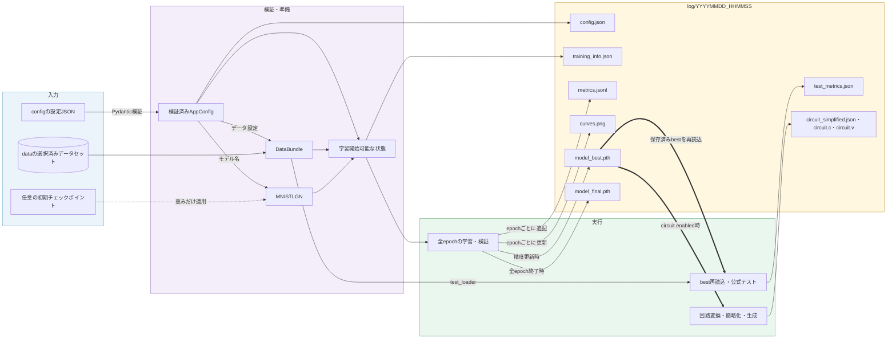
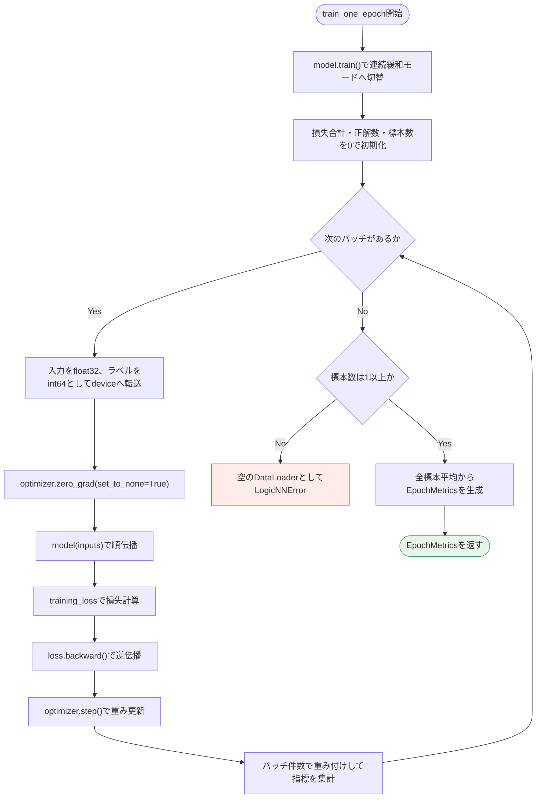
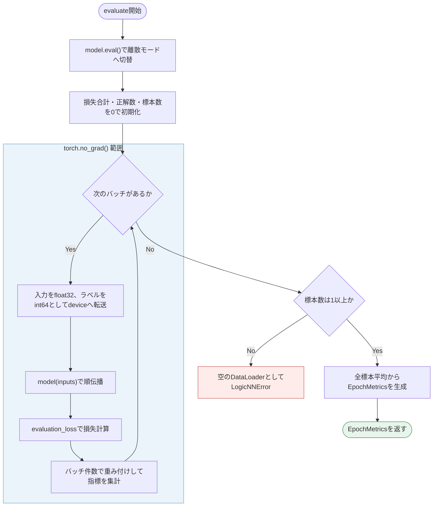
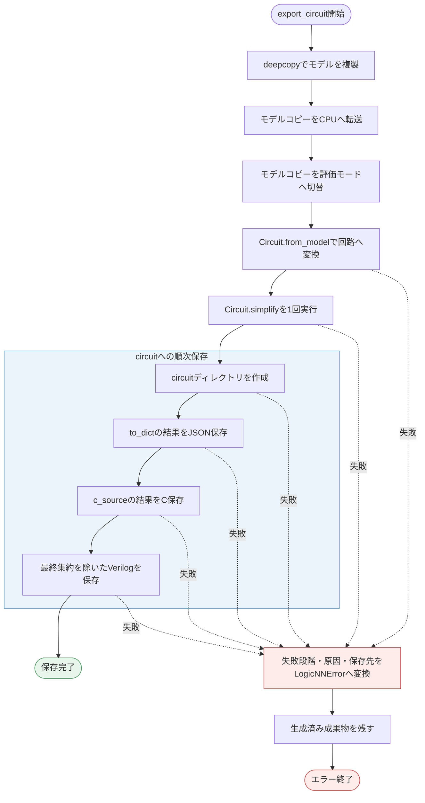

# logicNN 詳細設計書

## 1. 文書情報

- 文書状態: 変更草案（logicNN_core再設計を反映）
- 作成日: 2026-09-12
- レビュー日: 2026-09-12
- 入力文書: `website/docs/specifications/requirements.md`、`website/docs/specifications/basic-design.md`
- 対象作業フォルダ: `logicNN/`

本書は、承認済みの要件定義と基本設計を、実装可能な設定スキーマ、データ型、公開インターフェース、保存形式およびエラー仕様へ具体化する。

## 2. 詳細設計の対象

1. 設定 JSON のキー、型、値域、既定値および相互制約
2. モジュールごとのクラス、関数およびデータ型
3. `model_best.pth` と `model_final.pth` の共通チェックポイント形式
4. JSON、JSONL、PNG、C および Verilog 成果物の形式
5. 実行前検証、終了コードおよびエラーメッセージ
6. `logicNN_core` 公開APIとの境界

## 3. 設定スキーマ

### 3.1 設定区分

設定 JSON は責務ごとに次の5区分へ分ける。

| 区分 | 内容 |
|---|---|
| `run` | seed、デバイス、出力先、任意の初期チェックポイント |
| `data` | データセット登録名、保存先、DataLoader の実行設定 |
| `model` | builder に渡すモデル登録名 |
| `train` | epoch 数、損失関数、optimizer、scheduler |
| `circuit` | 学習後の回路成果物生成スイッチ |

### 3.2 JSON構造

```json
{
  "run": {
    "seed": 0,
    "device": "auto",
    "log_dir": "log",
    "initial_checkpoint_path": null
  },
  "data": {
    "name": "mnist",
    "root": "data",
    "batch_size": 128,
    "num_workers": 0
  },
  "model": {
    "name": "mnist_lgn"
  },
  "train": {
    "epochs": 100,
    "loss": {
      "name": "cross_entropy",
      "label_smoothing": 0.0
    },
    "optimizer": {
      "name": "adamw",
      "learning_rate": 0.01,
      "weight_decay": 0.0
    },
    "scheduler": {
      "name": "cosine_annealing",
      "minimum_learning_rate": 0.0001
    }
  },
  "circuit": {
    "enabled": true
  }
}
```

`validation_size`、`data.download`、`model.parameters`、`run.load_checkpoint` および個別の回路出力スイッチは設けない。`initial_checkpoint_path` が `null` ならランダム初期値、パスならそのlogicNNチェックポイントの重みを初期値として新しい学習を開始する。

### 3.3 確定事項

1. loss、optimizer、scheduler は、読みやすさを優先して `train` 直下の数値から独立したオブジェクトへ分ける。
2. 各方式に使える固有キーは登録名ごとに定義し、未知のキーを拒否する。
3. 相対パスは、実行時のカレントディレクトリではなく `main.py` があるプロジェクトルート基準で解決する。
4. 最上位および各区分に未知のキーが含まれている場合は、学習開始前に設定エラーとする。

### 3.4 設定項目の型・制約

| キー | 型 | 制約 |
|---|---|---|
| `run.seed` | integer | `0`以上、`4294967295`以下 |
| `run.device` | string | `auto`、`cpu`、`cuda`のいずれか |
| `run.log_dir` | string | 空でないディレクトリパス。存在しない場合は作成する |
| `run.initial_checkpoint_path` | string または null | nullまたは存在するlogicNN形式の`.pth`ファイル |
| `data.name` | string | 登録済みのデータセット名。初期版は`mnist` |
| `data.root` | string | 空でないディレクトリパス。対象データが取得済みであること |
| `data.batch_size` | integer | `1`以上 |
| `data.num_workers` | integer | `0`以上 |
| `model.name` | string | builderへの登録済みモデル名。初期版は`mnist_lgn` |
| `train.epochs` | integer | `1`以上 |
| `train.loss.name` | string | 登録済みの損失関数名。初期版は`cross_entropy` |
| `train.loss.label_smoothing` | number | `0.0`以上、`1.0`以下 |
| `train.optimizer.name` | string | 登録済みoptimizer名。初期版は`adamw` |
| `train.optimizer.learning_rate` | number | `0`より大きい値 |
| `train.optimizer.weight_decay` | number | `0.0`以上 |
| `train.scheduler.name` | string | 登録済みscheduler名。初期版は`cosine_annealing` |
| `train.scheduler.minimum_learning_rate` | number | `0.0`以上かつ`learning_rate`以下 |
| `circuit.enabled` | boolean | trueなら最良モデルから全回路成果物を生成する |

JSONのbooleanはintegerとして受け付けず、名前は大文字・小文字を区別する。`run.device`が`cuda`でCUDAを利用できない場合、登録名が存在しない場合、データセットとモデルが不適合な場合、および初期チェックポイントのメタデータや重み形状が不適合な場合は、学習開始前にエラーとする。

### 3.5 必須項目とライブラリ既定値

設定内容をファイルだけで把握できるように、3.2に示した項目は`initial_checkpoint_path`を含めてすべて記述必須とし、省略時の暗黙的な既定値を設けない。初期重みを使用しない場合は`null`を明記する。

初期版では、設定に公開していないAdamWの`betas`と`eps`はPyTorchの既定値を使用する。Cosine Annealingの`T_max`は`train.epochs`から自動設定する。これらの実値は`training_info.json`とチェックポイントへ記録する。

## 4. モジュール間の共通データ型

### 4.1 設定データ型

`utils/config/schema.py` ではPydantic v2の `BaseModel` を使用して次の設定型を定義する。

```text
AppConfig
├── RunConfig
├── DataConfig
├── ModelConfig
├── TrainConfig
│   ├── LossConfig
│   ├── OptimizerConfig
│   └── SchedulerConfig
└── CircuitConfig
```

全設定モデルに `extra="forbid"`、`strict=True` および `frozen=True` を適用する。型と単項目の値域は型注釈と `Field`、項目間の制約は `model_validator` で検証する。`utils/config/loader.py` は `AppConfig.model_validate_json()` による読込、`ValidationError` のRich向け整形およびプロジェクトルート基準のパス解決を担当する。構築後の設定は変更しない。

Pydanticは外部入力である設定JSONの境界だけに使用する。DataLoaderやPyTorchモデルを保持する `DataBundle` など内部の実行時データ型には標準 `dataclass` を使用する。環境変数や秘密情報から設定を組み立てないため、`pydantic-settings` は導入しない。

Pydanticの検証は設定値そのものを対象とする。CUDAの利用可否、データファイルの存在、登録表への登録状況、データセットとモデルの適合性およびチェックポイント内容など、実行環境や他モジュールに依存する確認は workflow の実行前検証で行う。

### 4.2 データセット共通型

`utils/data/types.py` に次の不変データ型を置く。

| 型 | フィールド | 用途 |
|---|---|---|
| `PreprocessingMetadata` | `name`、`parameters`、`output_dtype` | データセット固有の前処理名、JSON互換の設定値、出力型を記録する |
| `DatasetMetadata` | `name`、`input_shape`、`num_classes`、`class_names`、`train_size`、`validation_size`、`test_size`、`split_seed`、`preprocessing` | データセットの適合性確認と成果物記録に使用する |
| `DataBundle` | `train_loader`、`validation_loader`、`test_loader`、`metadata` | データセット固有処理から共通学習処理へ渡す |

`DatasetMetadata` は `input_shape` の各次元を掛けた値を返す、読み取り専用の `input_size` propertyも持つ。`input_size` を独立したフィールドや設定値にはせず、`input_shape` だけを定義元とする。バッチサイズはモデル入力形状やメタデータに含めず、各DataLoaderの実行時設定とする。

`PreprocessingMetadata.parameters` は `dict[str, JSON互換値]` とし、MNISTでは二値化の閾値と比較方法を保存する。`DatasetMetadata.split_seed` は、ランダムな分割を行わないデータセットでは `null` を許可する。これにより共通型をMNIST固有の二値化や分割方式へ固定しない。

### 4.3 モデル共通契約

登録されるモデルは `torch.nn.Module` を継承し、次の情報をモデル定義ファイル内に持つ。

| 要素 | 内容 |
|---|---|
| `input_shape` | バッチ次元を除いた対応入力形状 |
| `input_size` | `input_shape` の積から計算する読み取り専用property |
| `num_classes` | 出力クラス数 |
| `architecture_info()` | モデル構造と固定定数を成果物記録用の辞書として返す |
| `forward(inputs)` | `[batch, *input_shape]` から `[batch, num_classes]` のスコアを返す |

専用の抽象基底クラスは追加せず、builderへの登録時と開発用テストでこの契約を確認する。`build_model(name)` はモデル登録名だけを受け取り、新しいモデルインスタンスを返す。

`layers` はモデル内部で `forward()` を組み立てるために使用してもよいが、全モデルに要求する公開契約には含めない。回路出力では、二値化を含まないモデル全体のコピーを `logicnn_core.Circuit.from_model(model, input_shape)` に渡す。これによりexporterがモデル内部の層配置に依存しない。

## 5. 学習・評価の共通データ型

学習処理では、辞書や複数値のtupleを直接受け渡さず、次の標準 `dataclass` を各責務のモジュールに置く。

### 5.1 `EpochMetrics`

配置は `utils/trainer/epoch.py` とする。

| フィールド | 型 | 内容 |
|---|---|---|
| `loss` | float | 全標本の平均損失 |
| `accuracy` | float | `0.0`から`1.0`の正解率 |
| `samples` | int | 集計した標本数 |

学習、検証およびテストで同じ型を使用する。`samples` はバッチごとの平均を単純平均せず、最終バッチの件数も考慮した全標本平均を計算し、全件を評価したことを確認するために保持する。

### 5.2 `EpochRecord`

配置は `utils/results/metrics.py` とする。

| フィールド | 型 |
|---|---|
| `epoch` | int |
| `learning_rate` | float |
| `train_loss` | float |
| `train_accuracy` | float |
| `validation_loss` | float |
| `validation_accuracy` | float |

`learning_rate` はそのepochの学習に使用したscheduler更新前の値とする。1件を `metrics.jsonl` の1行として保存する。

### 5.3 `TrainingResult`

配置は `utils/trainer/workflow.py` とする。

| フィールド | 型 | 内容 |
|---|---|---|
| `run_dir` | `Path` | 今回の成果物ディレクトリ |
| `best_epoch` | int | 最良モデルを選択したepoch |
| `best_validation_accuracy` | float | 最良検証精度 |
| `test_metrics` | `EpochMetrics` | 最良モデルによる最終テスト結果 |

`main.py` とRich表示は `TrainingResult` を受け取る。モデル構造は `architecture_info()` から成果物へ記録するため、現行 `TrainingResult.model_parameters` は廃止する。個別成果物のパスは `run_dir` と固定ファイル名から決まるため重複保持しない。

### 5.4 数値表現

正解率は内部データとJSONでは `0.0` から `1.0` の比率で統一し、Rich表示とグラフの軸だけ百分率へ変換する。損失と正解率はPythonのfloat、件数とepochはintegerとして保存する。

## 6. チェックポイント形式

### 6.1 保存構造

`model_best.pth` と `model_final.pth` は、次の同一スキーマを `torch.save()` で保存する。`model_state_dict` だけがTensorを含み、それ以外は基本的なPython型で構成する。

```text
format_name: "logicNN_checkpoint"
format_version: 1
checkpoint_type: "best" | "final"
epoch: int
model_state_dict: dict[str, Tensor]
model:
  name: str
  input_shape: list[int]
  input_size: int
  num_classes: int
  architecture: dict
dataset: DatasetMetadataを辞書化した値
training:
  epochs: int
  loss: 実際に使用した名前と設定値
  optimizer: 実際に使用した名前と設定値
  scheduler: 実際に使用した名前と設定値
validation_metrics:
  loss: float
  accuracy: float
  samples: int
```

`model.name` はbuilderの登録名とし、Pythonクラス名は保存しない。`architecture` には `architecture_info()` の結果を保存する。クラス名は実装上の名前で変更される可能性がある一方、登録名と構造情報が再構築および適合性確認に必要なためである。

### 6.2 bestとfinalの差

スキーマ上の差は `checkpoint_type`、`epoch`、`model_state_dict` および `validation_metrics` の値だけとする。bestには最良検証精度を記録したepoch、finalには最終epochの情報を保存する。どちらも `initial_checkpoint_path` に指定できる。

### 6.3 保存しない状態

optimizer state、scheduler state、学習履歴および次に開始するepochは保存しない。一方、元の学習条件を確認できるように、実際に使用したloss、optimizerおよびschedulerの名前と設定値はメタデータとして保存する。チェックポイント読込後も、新しいoptimizer、schedulerおよび履歴を作り、epoch 1から指定回数を学習するためである。

### 6.4 読込と検証

チェックポイントは `torch.load(path, map_location="cpu", weights_only=True)` で読み込む。保存時の `model_state_dict` はCPU Tensorへコピーし、CPU・GPUのどちらからも読み込める形式とする。

重みをモデルへ適用する前に次を検証する。`load_checkpoint()` は1のファイル形式検証を担当し、workflowは2と3の実行対象との照合を担当する。4はworkflowがモデルへ適用するときに確認する。

1. 必須キー、型、`format_name` および `format_version` が正しいこと。
2. `model.name`、`input_shape`、`input_size`、`num_classes` および `architecture` が、現在選択したモデルと完全に一致すること。
3. datasetの登録名、入力形状、クラス数および前処理が、現在のデータセットと一致すること。
4. `model.load_state_dict(..., strict=True)` で全重みのキーと形状が一致すること。

不一致の場合は学習を開始せず、チェックポイントのパス、不一致項目、期待値および実際値をエラーに含める。旧 `logicnn` の生のstate dictや別形式へのフォールバック読込は実装しない。

## 7. 通常成果物の形式

### 7.1 実行ディレクトリ

実行開始時に `log/YYYYMMDD_HHMMSS/` を作成する。同じ秒に同名ディレクトリが存在する場合は `_01`、`_02` の連番を付け、既存結果を上書きしない。設定やデータの検証後に失敗した場合も調査に利用できるため、作成済みディレクトリとそこまでの成果物は残す。

### 7.2 `config.json`

Pydanticで検証し、プロジェクトルート基準でパスを解決した、実際の `AppConfig` 全体をJSONとして保存する。相対パスは解決後の絶対パスを記録し、キーの構造は入力設定JSONと同じにする。

### 7.3 `training_info.json`

次の情報をJSON objectとして保存する。

| 区分 | 内容 |
|---|---|
| `started_at` | タイムゾーンを含むISO 8601形式の開始日時 |
| `config_path` | 読み込んだ設定ファイルの絶対パス |
| `device` | 設定で要求したデバイスと実際に選択したデバイス |
| `software` | Python、PyTorch、TorchVisionおよびlogicNN_coreの版情報 |
| `model` | 登録名、入力形状、クラス数、`architecture_info()` の結果 |
| `dataset` | `DatasetMetadata` の全項目と前処理情報 |
| `optimization` | loss、optimizer、schedulerの名前と実際に使用した全設定値 |
| `evaluation_modes` | 学習は連続緩和、検証・テスト・回路出力は離散であること |
| `initialized_from_checkpoint` | 未使用ならnull、使用時は絶対パス、形式版、best/final種別、保存epoch |

環境固有で再現性に寄与しないホスト名やユーザー名は記録しない。`logicnn_core.__version__` を記録し、版情報を取得できない場合は配布物不整合として学習開始前にエラーにする。

### 7.4 `metrics.jsonl`

1 epochにつき1行、次の形式のJSON objectを追記する。キーと並び順は固定する。

```json
{"epoch": 1, "learning_rate": 0.01, "train_loss": 1.0, "train_accuracy": 0.8, "validation_loss": 0.9, "validation_accuracy": 0.82}
```

### 7.5 `test_metrics.json`

最良モデルによる一度だけの公式テスト結果を次の形式で保存する。

```json
{
  "checkpoint": "model_best.pth",
  "epoch": 42,
  "loss": 0.1,
  "accuracy": 0.97,
  "samples": 10000
}
```

### 7.6 `curves.png`

横軸をepochとする2列の画像とし、左に学習損失と検証損失、右に検証精度を表示する。損失は内部値、精度はパーセント表記とし、凡例、軸名およびグリッドを付ける。epochごとに同じファイルを更新し、学習終了時点で全履歴を含む画像を残す。

### 7.7 回路成果物

`circuit.enabled` がtrueの場合だけ、実行ディレクトリの `circuit/` 配下へ、`logicnn_core`が生成した内容を `circuit_simplified.json`、`circuit.c` および `circuit.v` として保存する。JSONとCはGroupSumを含む完全な回路を保持する。VerilogだけはGroupSumの加算・tau・biasを生成せず、最終論理層の生出力を端子へ接続する。回路IRとコード生成規則はcore専用仕様を正本とし、logicNNの保存層では意味を変更しない。

### 7.8 データ・成果物フロー図



実線は通常の必須データフロー、初期チェックポイントからモデルへの点線は任意入力を表す。初期チェックポイントを使用しても受け継ぐのはモデル重みだけであり、optimizer、scheduler、epoch番号および履歴は新規に作成する。

入力データはMNISTに固定せず、`data.name` とデータセット登録表で選択する。初期版で登録するのはMNISTだけだが、将来データセットを追加しても、このフローと学習・成果物処理は変更しない。

`config.json` と `training_info.json` は学習開始前、`metrics.jsonl` と `curves.png` はepochごと、`model_final.pth` は全epoch終了時に保存する。`model_best.pth` は検証精度更新時の成果物であると同時に、公式テストと任意の回路出力への入力となる。同じ実行で `model_final.pth` をテストや回路出力へ使用しない。

公式テストを完了して `test_metrics.json` を保存した後、`circuit.enabled` がtrueの場合だけ回路成果物を生成する。回路成果物は図ではまとめているが、実際にはJSON、C、Verilogの順で個別に保存する。

## 8. 公開関数インターフェース

### 8.1 CLI

通常実行は次の2形式とする。`--config` 以外の学習設定をCLI引数として重複定義しない。

```text
python main.py
python main.py --config config/mnist_lgn.json
```

`--config` の既定値は `config/mnist_lgn.json` とする。`main(argv=None) -> int` は引数解析、`load_config()` および `run_training()` の呼び出しだけを担当し、正常時は `0`、想定済みの利用者エラー時は `1` を返す。モジュール実行部は `raise SystemExit(main())` とする。

想定済みの利用者エラーはRichで原因と対応を簡潔に表示する。想定外のプログラム不具合は握りつぶさず、デバッグ可能なtracebackを残す。現行の `pretty_errors` は使用しない。

### 8.2 モジュール間で使用する関数

| 配置 | 公開関数 | 責務 |
|---|---|---|
| `utils/config/loader.py` | `load_config(path) -> AppConfig` | JSON設定の読込と検証 |
| `utils/data/loader.py` | `build_data_bundle(config, seed, pin_memory) -> DataBundle` | 登録名からデータセット専用処理を選択 |
| `model/builder.py` | `build_model(name) -> nn.Module` | 登録名から新しいモデルを生成 |
| `utils/trainer/optimization/loss.py` | `build_training_loss(config)`、`build_evaluation_loss(config)` | 登録名から学習用・評価用損失関数を生成 |
| `utils/trainer/optimization/optimizer.py` | `build_optimizer(config, parameters)` | 登録名からoptimizerを生成 |
| `utils/trainer/optimization/scheduler.py` | `build_scheduler(config, optimizer, epochs)` | 登録名からschedulerを生成 |
| `utils/trainer/epoch.py` | `train_one_epoch(...) -> EpochMetrics`、`evaluate(...) -> EpochMetrics` | 1 epochの学習または評価 |
| `utils/results/run_directory.py` | `create_run_directory(log_dir) -> Path` | 重複しない実行ディレクトリを作成 |
| `utils/results/metadata.py` | `save_resolved_config(...)`、`save_training_info(...)` | 解決済み設定と実行条件の保存 |
| `utils/results/metrics.py` | `append_epoch_record(...)`、`save_curves(...)`、`save_test_metrics(...)` | epoch履歴、グラフおよび最終テスト指標の保存 |
| `utils/results/checkpoint.py` | `save_checkpoint(...)`、`load_checkpoint(...)` | logicNNチェックポイントの保存・読込・ファイル形式検証 |
| `utils/export/circuit_exporter.py` | `export_circuit(model, input_shape, run_dir) -> None` | logicNN_coreによる全回路成果物の保存 |
| `utils/trainer/workflow.py` | `run_training(config, config_path) -> TrainingResult` | 実行前検証から最終表示までの全体調整 |

設定オブジェクトを受け取れる箇所で、設定値を多数の個別引数や `**kwargs` に展開しない。モジュール境界の引数と戻り値には型注釈を付け、内部補助関数は先頭を `_` としてAPI文書の対象外にする。

### 8.3 損失関数の使い分け

現行 `logicnn` の挙動を維持し、学習損失には設定された `label_smoothing` を適用する。検証およびテスト損失では `label_smoothing=0.0` とし、正解ラベルに対する通常の交差エントロピーを記録する。この差を呼出側のboolean引数で切り替えず、`build_training_loss()` と `build_evaluation_loss()` の明示的な2関数で表す。

## 9. エラー処理と実行前検証

2026-09-13承認: チェック機構は最低限にし、有効／無効スイッチは設けない。設定・データ読込・モデル適合性・checkpoint読込などの入口で確認し、内部処理で同じ情報を再検査しない。workflowが組み立てる実行metadataやcheckpointを保存する際に全schemaを再検証せず、読込側では従来の形式検証を維持する。JSON変換と書込失敗の診断、既存ファイル保護は残す。曲線描画では保存済みの全EpochRecordを毎回再検査しない。

分類epochでは標本数の集計が変わるshape、黙ったラベルの整数化・虚部除去、対象外クラス番号、非有限損失・勾配だけを計算の意味と更新保護に必要な条件として残す。入力・score全体の重複した有限値走査やTensor型・deviceの再検査は行わない。PyTorchが検出する不正入力は元の例外を伝播させる。

### 9.1 想定済みエラー

`utils/exceptions.py` に共通例外 `LogicNNError` を一つだけ定義する。細かな例外クラス階層は作らず、次の情報を保持する。

| フィールド | 内容 |
|---|---|
| `message` | 何が失敗したか |
| `detail` | 対象パス、不正項目、不一致の期待値と実際値など |
| `hint` | 利用者が次に行う修正 |

設定、データ、モデル、チェックポイントおよび回路出力の各境界で、利用者が修正可能な問題を `LogicNNError` に変換する。`main()` はこの例外だけを捕捉してRichで表示する。すべての `ValueError` や `RuntimeError` を一括捕捉せず、プログラム不具合を想定済みエラーとして隠さない。

Pydanticの `ValidationError` は `utils/config/loader.py` で捕捉し、すべての違反について `train.optimizer.learning_rate` のような設定パス、入力値および制約を列挙した一つの `LogicNNError` に変換する。

### 9.2 Rich表示形式

想定済みエラーは次の構造で表示し、通常はtracebackを表示しない。

```text
[ERROR] チェックポイントを読み込めません
対象: C:/.../model_best.pth
原因: model.input_shapeが一致しません
期待値: [1, 28, 28]
実際値: [3, 32, 32]
対応: 設定したモデルと同じ構造のlogicNNチェックポイントを指定してください
```

想定外の例外は捕捉せず、Pythonのtracebackを残す。`KeyboardInterrupt` だけは利用者による中断として短いRichメッセージを表示する。

### 9.3 終了コード

| 終了コード | 意味 |
|---|---|
| `0` | 正常終了、または `--help` の表示 |
| `1` | `LogicNNError` に分類される想定済みエラー |
| `2` | argparseによるCLI引数エラー |
| `130` | Ctrl+Cによる利用者中断 |

想定外の例外はPython標準の非0終了となる。

### 9.4 検証順序

学習の計算を始める前に、次の順番で検証する。

1. CLIと設定ファイルの存在を確認する。
2. JSON構文、Pydanticの型・値域・未知キー・項目間制約を確認する。
3. デバイス指定とCUDAの利用可否を確認する。
4. データセット、モデル、loss、optimizerおよびschedulerの登録名を確認する。
5. 実行ディレクトリを作成し、解決済み設定を保存する。
6. データファイルを確認し、`DataBundle` を生成する。
7. モデルを生成し、データセットとの入力形状・クラス数を確認する。
8. 初期チェックポイントがあれば形式、メタデータ、前処理およびstate dictを確認する。
9. loss、optimizerおよびschedulerを生成し、学習情報を保存する。

データセットがない場合は自動取得せず、`python tools/download_dataset.py` を案内する。回路出力時の失敗は学習完了後に起こるため、学習成果物を削除せず、回路出力だけが失敗したことを明示する。

### 9.5 実行環境の初期化

`run.device` が `auto` の場合は、`torch.cuda.is_available()` がtrueなら単一CUDA GPU、falseならCPUを選択する。`cuda`を明示した状態でCUDAを利用できない場合は、CPUへ暗黙に切り替えず、学習開始前に `LogicNNError` とする。`cpu`を指定した場合はCUDAの有無にかかわらずCPUを使用する。

`run.seed` はPython標準の乱数、NumPy、PyTorch CPUおよび利用可能なCUDAデバイスへ設定する。データ分割、学習DataLoaderのshuffleおよびworker初期化にも同じseedを起点とした専用generatorを使用する。再現性の目標は同一環境・同一設定での結果追跡とし、速度や対応演算を変える決定論的アルゴリズムの強制は行わない。

## 10. MNISTデータ処理

### 10.1 データ取得ツール

データ取得は通常学習と分離し、次の形式で実行する。

```text
python tools/download_dataset.py
python tools/download_dataset.py --dataset mnist --root data
```

`--dataset` の既定値は `mnist`、`--root` の既定値は `data` とする。データセット登録名から取得処理を選択し、MNISTは `<root>/mnist/` 配下へTorchVisionを使って取得する。取得済みの場合は再取得せず、保存先をRichで表示して正常終了する。

`main.py` はTorchVisionへ `download=False` を指定し、データがない場合は `LogicNNError` で取得コマンドを案内する。

### 10.2 MNIST前処理

公式画像を `ToTensor()` で `[0.0, 1.0]` の `float32` Tensorへ変換した後、`utils/data/preprocessing.py` の関数を使って次の二値化を行う。

```text
output = 1.0  if pixel > 0.0
output = 0.0  otherwise
```

学習、検証およびテストのすべてに同じ処理を適用する。モデルへ渡す入力は `float32` の `[batch, 1, 28, 28]`、正解ラベルは `int64` とする。前処理メタデータは `name="binary_threshold"`、`parameters={"threshold": 0.0, "comparison": "greater_than"}`、`output_dtype="float32"` とする。

### 10.3 学習・検証分割

MNIST公式学習用60,000件を、`run.seed`を設定した専用の `torch.Generator` と `random_split()` で学習用50,000件、検証用10,000件へ分割する。公式テスト用10,000件は分割しない。同じデータとseedでは同じ分割インデックスを再現する。

### 10.4 DataLoader

| 項目 | 学習 | 検証 | テスト |
|---|---|---|---|
| `batch_size` | `data.batch_size` | 同左 | 同左 |
| `shuffle` | true | false | false |
| `drop_last` | false | false | false |
| `num_workers` | `data.num_workers` | 同左 | 同左 |
| `pin_memory` | CUDA使用時のみtrue | 同左 | 同左 |
| `persistent_workers` | `num_workers > 0` | 同左 | 同左 |

学習用DataLoaderの並び替えには `run.seed` を設定した専用generatorを使用する。workerを使用する場合は、PyTorchが割り当てたworker seedを基にPythonとNumPyも初期化する。検証・テストは並び替えず、全標本を一度ずつ評価する。

### 10.5 データセット登録

`utils/data/loader.py` はデータセット名と専用のDataBundle生成関数を対応付ける内部登録表を持つ。初期版は `mnist` だけを登録する。将来の追加では専用モジュールと登録項目を追加し、workflowやepoch処理は変更しない。

## 11. MNISTモデル詳細

### 11.1 定義方法

`model/lgn/mnist_lgn.py` の `MNISTLGN` はコンストラクター引数を持たず、構造を決める値を同じファイル内の定数として定義する。`model/builder.py` は登録名 `mnist_lgn` から `MNISTLGN()` を生成する。

| 定数 | 値 |
|---|---|
| `input_shape` | `(1, 28, 28)` |
| `input_size` | `input_shape` から導出する `784` |
| `num_classes` | `10` |
| convolution kernels | `16` |
| tree depth | `2` |
| receptive field | `3 x 3` |
| convolution stride | `1` |
| convolution padding | `0` |
| OR pooling | kernel `2`、stride `2`、padding `0` |
| hidden size | 各LogicDenseで `4000` |
| GroupSum tau | `8.0` |

層構造は次の順番とする。

```text
LogicConv2d
→ OrPooling2d
→ Flatten
→ LogicDense(2704, 4000)
→ LogicDense(4000, 4000)
→ GroupSum(10, tau=8.0)
```

`2704` は `16 x 13 x 13` から導出し、利用者設定にはしない。二値化層はモデルに含めない。内部の層列名は `network` とし、外部モジュールから直接参照しない。

LUTと接続は旧MNISTLGNが使用する既定値を維持し、同じモデルファイル内の `LUTConfig()`／`ConnectionConfig()` 定数で明示する。Raw・rank 2・fixed・random接続、soft sampling・temperature 1・residual初期化・確率0.951・materialize無効は新coreの既定値とも一致する。別方式へ変更する利用者設定は追加せず、実際の設定を `architecture_info()` へ記録する。

#### 11.1.1 MNISTLGNモデル構造図

```mermaid
flowchart LR
    binaryInput[/"前処理済み二値画像 [batch, 1, 28, 28]"/]

    subgraph modelScope ["MNISTLGN"]
        direction LR
        convolution["LogicConv2d kernels=16, depth=2, field=3x3"]
        convolutionOutput["[batch, 16, 26, 26]"]
        pooling["OrPooling2d kernel=2, stride=2"]
        poolingOutput["[batch, 16, 13, 13]"]
        flatten["Flatten"]
        flatOutput["[batch, 2704]"]
        denseOne["LogicDense 2704→4000"]
        denseTwo["LogicDense 4000→4000"]
        groupSum["GroupSum k=10, tau=8.0"]

        convolution --> convolutionOutput --> pooling --> poolingOutput --> flatten --> flatOutput --> denseOne --> denseTwo --> groupSum
    end

    classScores["10クラスのスコア [batch, 10]"]

    binaryInput --> convolution
    groupSum --> classScores

    style modelScope fill:#EAF4FA,stroke:#63A4C7
    style binaryInput fill:#F3EEFA,stroke:#9A78C2
    style classScores fill:#E7F5EB,stroke:#4F9963
```



入力の二値化は `utils/data/preprocessing.py` で完了しており、MNISTLGNの層には含めない。`LogicConv2d` の出力空間は `28 - 3 + 1 = 26`、OR pooling後は `13 x 13` となるため、最初の `LogicDense` の入力数は `16 x 13 x 13 = 2704` となる。

`GroupSum` は4000個の値を10クラスへ400個ずつ集約し、`tau=8.0` で除算したクラススコアを返す。モデル内にSoftmax層は置かず、学習時の交差エントロピーがクラススコアを直接受け取る。

### 11.2 モデル情報

`architecture_info()` は、層の種類、順序、各固定定数、入力形状、入力要素数およびクラス数をJSON互換の辞書で返す。実装では同じ定数をモデル構築と情報生成の両方から参照し、値を二重定義しない。

### 11.3 動作モード

`model.train()` ではlogicNN_coreの連続緩和された論理演算を使用し、勾配を計算する。`model.eval()` では離散論理演算を使用する。検証、テストおよび回路出力前には必ず `eval()` を設定する。

## 12. 学習アルゴリズム詳細

### 12.1 1 epochの学習

`train_one_epoch()` は次の順番で処理する。

1. `model.train()` を呼び出す。
2. 入力を `float32`、正解ラベルを `int64` として選択デバイスへ転送する。
3. `optimizer.zero_grad(set_to_none=True)` を呼び出す。
4. 順伝播、損失計算、逆伝播、`optimizer.step()` を行う。
5. バッチ件数で重み付けした損失合計、正解数および標本数を集計する。
6. 全標本の平均損失、正解率および標本数を `EpochMetrics` で返す。

#### 12.1.1 `train_one_epoch()`内部アクティビティ図



正解率は順伝播で得たスコアの最大要素を予測クラスとして集計する。平均損失はバッチ平均を単純平均せず、各バッチの損失へそのバッチの標本数を掛けた合計を全標本数で割る。最後のバッチが設定バッチサイズより小さい場合も、全標本へ同じ重みを与えるためである。

学習用DataLoaderが空の場合は平均値を生成せず `LogicNNError` とする。通常のMNIST構成では発生しないが、将来データセットを追加した場合もゼロ除算や成功扱いを防ぐ。

### 12.2 検証とテスト

`evaluate()` は `model.eval()` と `torch.no_grad()` を使用し、optimizerやschedulerを変更しない。損失と正解率の集計方法は学習と同じとする。検証用・テスト用DataLoaderが空の場合は想定済みエラーにする。

#### 12.2.1 `evaluate()`内部アクティビティ図



`evaluate()` は検証と公式テストで共用し、呼出側が渡すDataLoaderだけが異なる。評価用損失は `label_smoothing=0.0` とし、学習用損失とは別に生成したものを受け取る。予測クラスと重み付き集計方法は `train_one_epoch()` と同じだが、逆伝播、`optimizer.step()` および `scheduler.step()` は一切行わない。

### 12.3 全epochの処理順

epochループ開始前に `best_validation_accuracy=-1.0`、`best_epoch=None` とする。正解率は `0.0` 以上であるため、最初のepochの検証結果は必ずbestとして保存され、それ以降の処理で `model_best.pth` が存在することを保証できる。

各epochは次の順番とする。

1. scheduler更新前の学習率を取得する。
2. 1 epoch学習する。
3. 検証データ全件を評価する。
4. 検証精度が過去最高より厳密に高い場合だけ `model_best.pth` を更新する。同率では更新しない。
5. `metrics.jsonl` を追記し、`curves.png` を更新してRich表示する。
6. `scheduler.step()` を一度呼び出す。

Early Stoppingは行わず、`train.epochs` 回を必ず完了する。

### 12.4 学習終了後

1. 最終epochの状態を `model_final.pth` に保存する。
2. 保存済み `model_best.pth` を読んで最良状態をモデルへ復元する。
3. 公式テストデータ全件を一度だけ評価し、`test_metrics.json` を保存する。
4. `circuit.enabled` がtrueなら、同じ最良モデルから回路成果物を生成する。
5. Richで最良epoch、テスト結果および保存先を表示する。

最良状態はメモリ内の別コピーではなく保存済みチェックポイントから復元し、保存形式と読込処理が通常ワークフローでも実際に使用されるようにする。

## 13. 回路出力詳細

### 13.1 出力手順

`circuit.enabled` がtrueの場合、保存済みbestを復元したモデルを使い、次の順番で処理する。

1. モデルをコピーし、CPU・評価モードへ切り替える。
2. `logicnn_core.Circuit.from_model(model_copy, input_shape=list(model.input_shape))` を呼び出す。
3. `Circuit.simplify()` を必ず一度呼び出す。
4. 実行ディレクトリに `circuit/` を作成する。
5. `to_dict()` の結果を `circuit/circuit_simplified.json` に保存する。
6. `c_source()` の結果を `circuit/circuit.c` に保存する。
7. `verilog_source()` で最終集約を除いた論理ゲート部分を生成し、`circuit/circuit.v` に保存する。

#### 13.1.1 `export_circuit()`内部アクティビティ図



モデルをコピーすることで、回路変換時のexport mode設定が学習・評価に使用したモデルへ影響しないようにする。3形式は記載順に生成・保存する。JSONとCは完全な回路を表す一方、Verilogはハードウェア規模を抑えるため最終集約を意図的に含めない。logicNNの保存層はcoreが返した内容を変更しない。

`export_circuit()` は固定された保存先へ成果物を書き込み、正常時は値を返さない。workflowは `run_dir` と固定ファイル名から保存先を把握できるため、同じパス情報を戻り値として重複保持しない。

### 13.2 失敗時の扱い

回路変換または3成果物のいずれかの生成・保存に失敗した場合は `LogicNNError` とし、正常終了にはしない。ただし、すでに完了している学習、best/finalチェックポイント、履歴、テスト結果および生成済みの回路成果物は削除しない。生成済みファイルから、どの段階まで成功したかを確認できるようにする。

回路成果物には一時ファイル、一括確定処理および失敗時のロールバックを設けず、`circuit/` へ順次保存する。

### 13.3 対応範囲

モデルにlogicNN_coreの回路変換が未対応の層・演算・LUT rankが含まれる場合は、対象node、演算、対応能力および修正方法を含むエラーを表示する。別演算への自動フォールバック、生成コードの事後修正、CコンパイルおよびVerilogシミュレーションは通常実行では行わない。構文確認や等価性確認は開発用テストで行う。

Verilog exporterは、回路構築時に簡略化より先に保存された `logical_outputs`（集約前の論理出力対応表）を読み、1 bitずつ `logic_output` へ接続する。簡略化後の `SumReduction.input_ids` から対応表を再生成しない。定数と同じwireの重複出力も省略せず、元の出力数・順序・値を維持する。元出力ごとの開始位置と要素数はcommentへ記録するが、adder、divider、scale回路は生成しない。型と簡略化時の保護規則は [core詳細設計9.6節](./logicnn-core/detailed-design.md#96-論理出力を保護する規則) を正本とする。

MNISTLGNでは `GroupSum(10)` の直前にある4,000個の論理値がVerilog出力となる。10クラスへの400個ずつの加算と `tau=8.0` によるscaleは、Verilog外のsoftwareまたは利用者が別途設計する外部回路で行う。

`circuit.enabled` がfalseの場合は `Circuit.from_model()` 以降の処理を一切呼び出さず、`circuit/` と回路成果物を作成しない。

### 13.4 logicNN_coreの読込

`pyproject.toml` は依存名 `logicNN-core` を `utils/logicNN_core/` のローカルパスへ対応付ける。logicNNと同時に環境構築できる一方、core側は独自のpackage metadataと静的versionを持ち、Git情報なしで単独build・installできる状態にする。

logicNNルートの `[project].dependencies` には `logicNN-core` を含め、uvのローカルソース対応は次の形とする。

```toml
[tool.uv.sources]
logicNN-core = { path = "utils/logicNN_core" }
```

coreの基本依存はPyTorchとNumPyとし、TorchVision、Rich、logicNN本体および開発専用toolを基本import経路に含めない。公開API、内部構造、対応rank、回路schemaおよび独立配布の詳細は [logicNN_core詳細設計](./logicnn-core/detailed-design.md) を正本とする。
