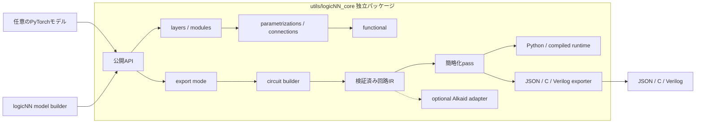
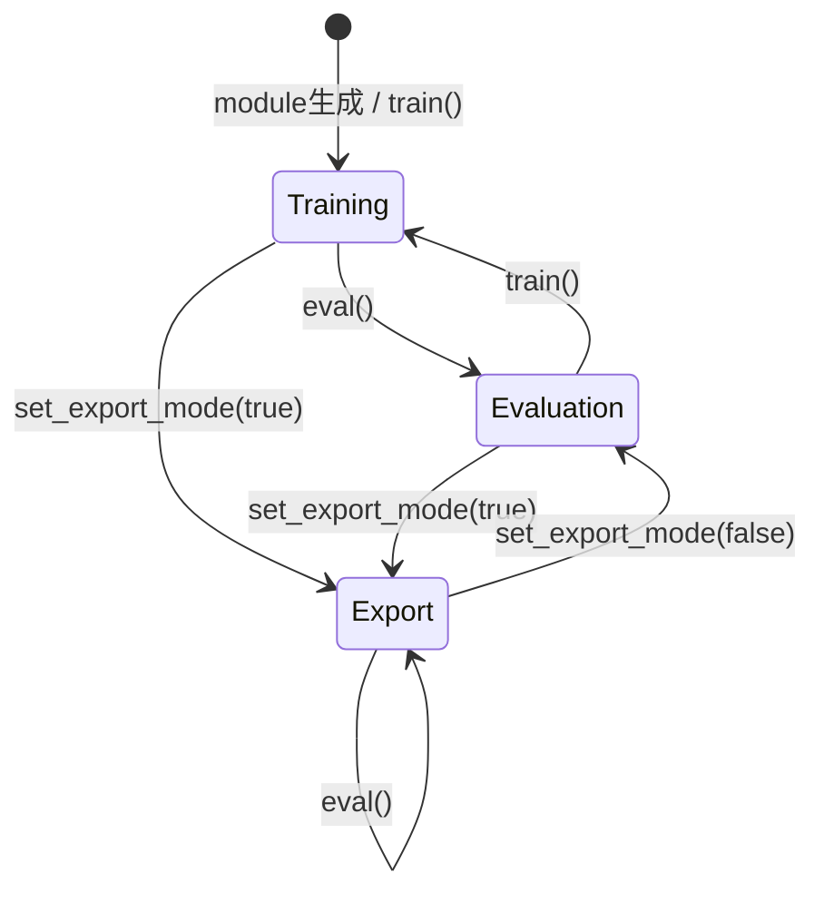
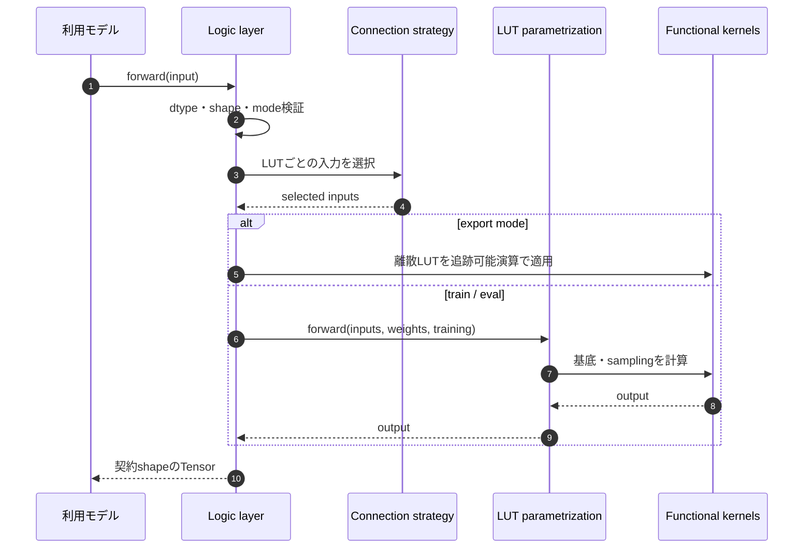
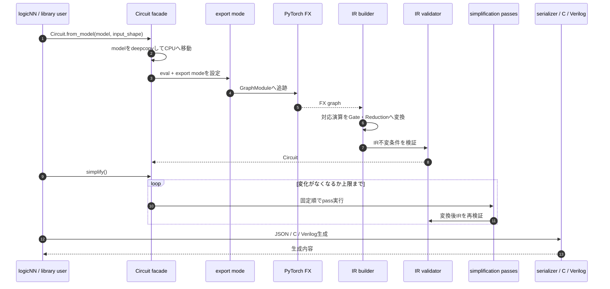

# logicNN_core 基本設計書

## 1. 文書情報

- 文書状態: 草案
- 作成日: 2026-09-12
- 入力: [logicNN_core 要件定義](./requirements.md)
- 対象配置: `utils/logicNN_core/`

## 2. 設計方針

1. 配置はlogicNNの `utils/` 配下とするが、Pythonパッケージとしては独立させる。
2. `src` layoutを採用し、作業ディレクトリが偶然import pathになる問題を防ぐ。
3. torchlogixの数学的機能と有用なAPI名を維持し、巨大ファイルと曖昧な責務を分割する。
4. 公開API、内部SPI、参照モデルを分ける。
5. train／eval／exportの意味をすべての対応層で統一する。
6. 回路IRを学習層やC／Verilog固有処理から独立させる。
7. logicNNアプリケーションは公開APIだけを使用し、core内部モジュールを直接importしない。
8. 未実装の維持対象は明示的に追跡し、空のstubを公開APIへ出さない。

## 3. フォルダ構成

```text
logicNN/
├── model/
├── utils/
│   ├── data/
│   ├── export/
│   │   └── circuit_exporter.py
│   ├── trainer/
│   └── logicNN_core/
│       ├── pyproject.toml
│       ├── README.md
│       ├── LICENSE
│       ├── THIRD_PARTY_NOTICES.md
│       ├── src/
│       │   └── logicnn_core/
│       │       ├── __init__.py
│       │       ├── exceptions.py
│       │       ├── layer_settings.py
│       │       ├── export_mode.py
│       │       ├── functional/
│       │       │   ├── logic.py
│       │       │   ├── sampling.py
│       │       │   ├── walsh.py
│       │       │   ├── combinatorics.py
│       │       │   └── regularization.py
│       │       ├── parametrizations/
│       │       │   ├── base.py
│       │       │   ├── builder.py
│       │       │   ├── raw.py
│       │       │   ├── warp.py
│       │       │   └── light.py
│       │       ├── connections/
│       │       │   ├── base.py
│       │       │   ├── builder.py
│       │       │   ├── dense.py
│       │       │   └── convolution.py
│       │       ├── layers/
│       │       │   ├── base.py
│       │       │   ├── dense.py
│       │       │   ├── convolution.py
│       │       │   ├── pooling.py
│       │       │   ├── binarization.py
│       │       │   └── group_sum.py
│       │       ├── modules/
│       │       │   └── residual.py
│       │       ├── circuit/
│       │       │   ├── circuit.py
│       │       │   ├── types.py
│       │       │   ├── builder.py
│       │       │   ├── validation.py
│       │       │   ├── simplification.py
│       │       │   ├── runtime.py
│       │       │   ├── compiled_runtime.py
│       │       │   ├── serialization.py
│       │       │   └── exporters/
│       │       │       ├── c.py
│       │       │       └── verilog.py
│       │       └── integrations/
│       │           └── alkaid.py
│       └── examples/
│           └── reference_models/
│               ├── dense.py
│               └── convolution.py
├── tests/
│   └── core/
└── website/
```

`tests/core/` は開発中だけlogicNN側に置き、運用版から削除する。単独パッケージの配布wheelにもテストを含めない。参照モデルはsource repositoryに残すが、`logicnn_core` のトップレベルAPIや基本wheelへ自動importしない。

## 4. レイヤー構造

### 4.1 公開層

利用者が直接組み合わせる領域である。

- `layers`: Dense、2D／3D Conv、OR Pooling、Binarization、GroupSum。
- `modules`: 複数層を組み合わせるResidual block。
- `Circuit`: モデルから回路IRを作り、簡略化、実行、保存、C／Verilog生成を行うfacade。
- `set_export_mode`: model tree全体へexport状態を適用する。

### 4.2 戦略層

論理層が差し替えて使用する領域である。

- `parametrizations`: LUT重み表現、初期化、連続forward、離散LUT抽出。
- `connections`: 各LUTへ入力特徴を割り当てる方式。

文字列registryはbuilder内に閉じ、層constructorは公開された型または登録名を受ける。登録表の変更がlayer本体へ条件分岐を増やさない構造にする。

### 4.3 数学基盤

`functional` はstateを持たないTensor演算だけを置く。単なる雑多なutilsにはせず、論理演算、sampling、Walsh、組合せ、正則化の5領域へ分ける。

`regularization.py` の領域は維持するが、補助正則化の方式名 `warp` は[承認済みの実装保留](./requirements.md#54-承認済みの実装保留)として扱う。`parametrizations/warp.py` の計算本体を保留する意味ではなく、フォルダ構成と依存方向は変更しない。

### 4.4 回路基盤

`circuit` はモデル学習から独立したIR領域である。

- `circuit.py`: 公開 `Circuit` class。構築・簡略化・実行・保存の窓口。
- `types`: gate、operation、sum reduction、論理出力対応表、回路データ。
- `builder`: FX graphをIRへ変換。
- `validation`: IR不変条件を検証。
- `simplification`: 集約後の出力と集約前の論理出力を保つ簡略化pass。学習用optimizerとは区別する。
- `runtime`: Python実行と共通の二値入力確認。
- `compiled_runtime`: 任意C compile、共有libraryの寿命、packed入力とCPU結果への変換。Python実行の数値処理とは分離する。
- `serialization`: 版付き辞書／JSON。
- `exporters`: CとVerilog。

公開 `Circuit` はこれらをまとめるfacadeとし、単一ファイルへ全アルゴリズムを戻さない。

`layer_settings.py` は `LUTConfig` と `ConnectionConfig` の設定型を置き、アプリケーションのJSON設定を読み込まない。名称とモデル定義内で設定する方式は承認済みである。公開 `Circuit` は `circuit/circuit.py` で定義し、利用者は `from logicnn_core import Circuit` で使用する。

## 5. システム構成図



logicNN固有のMNISTLGNは `model/` に置き、`logicnn_core.layers` を利用する。coreから `model/`、`utils/data/`、`utils/trainer/` への逆向き依存は禁止する。

## 6. 依存方向

| 呼出元 | 呼出可能 | 禁止する依存 |
|---|---|---|
| `functional` | PyTorch、Python標準 | layers、connections、circuit、logicNN本体 |
| `parametrizations` | functional | layers、circuit、logicNN本体 |
| `connections` | functional | layers、circuit、logicNN本体 |
| `layers` | parametrizations、connections、functional | circuit、logicNN本体 |
| `modules` | public layers | circuit、logicNN本体 |
| `circuit/types` | Python標準、NumPy／PyTorchの型境界 | layers、logicNN本体 |
| `circuit/builder` | PyTorch FX、export mode、circuit types | logicNN本体、C／Verilog exporter |
| `circuit/simplification` | circuit types、validation | layers、PyTorch model |
| `circuit/exporters` | 検証済みcircuit types | PyTorch model、logicNN本体 |
| `integrations` | 公開core API、任意依存 | logicNN本体 |

循環importを避けるため、public facadeの再exportは各packageの `__init__.py` だけで行い、下位実装からトップレベル `logicnn_core` をimportしない。

## 7. 公開API境界

### 7.1 維持する名称

- `LogicDense`
- `LogicConv2d`
- `LogicConv3d`
- `OrPooling2d`
- `OrPooling3d`
- `GroupSum`
- `Binarization`
- `FixedBinarization`
- `DummyBinarization`
- `SoftBinarization`
- `LearnableBinarization`
- `ResidualLogicBlock`
- `Circuit`
- `set_export_mode`

既存利用知識を活かせる名称は維持する。内部class、legacy alias、データセット別model classは公開互換の対象にしない。

### 7.2 APIの安定性

- `logicnn_core.__all__` と各公開subpackageの `__all__` にある名前だけを公開APIとする。
- 先頭が `_` の名前と、`functional`／`circuit`内部passはprivateとする。
- 公開constructorは位置引数を必要最小限にし、方式固有設定は型付きオプションまたは明示的keywordで受ける。
- `**kwargs` を階層間で無検証のまま転送しない。builder境界で許可項目を検証する。
- 互換性を壊す変更は独立配布開始後のmajor versionで行う。

## 8. 動作モード設計

### 8.1 三つの状態

| 状態 | `training` | `export_mode` | 用途 | 計算 |
|---|---:|---:|---|---|
| 学習 | true | false | forward／backward | 連続緩和またはstraight-through |
| 離散評価 | false | false | 検証・テスト | LUTと接続を決定的に選択 |
| 回路export | false | true | FX追跡・回路化 | bool／index中心の追跡可能演算 |

`export mode` を有効にすると必ず評価状態へ移す。export中の `train(True)` は `RuntimeError` にし、暗黙にexportを解除しない。`set_export_mode(model, False)` で通常評価へ戻した後に `model.train()` を呼ぶことで学習へ戻せる。最終挙動は詳細設計の状態契約を正本とする（2026-09-12承認済み）。

### 8.2 状態遷移図



## 9. 論理層forwardフロー



接続選択とLUT評価を分離することで、固定接続と学習可能接続、RawとWarp／Lightを直交して組み合わせられる。

CORE-DES-007の承認により、Warpの二値evalは基底和を再度閾値化せず、共通入口から生成したbool真理値表を参照する。表の生成はCPU float64・固定順FWHT、表の適用は評価deviceで行う。学習と連続入力のevalは従来の基底・sampling経路を維持する。C4のparametrizationは毎回最新の外部重みから生成し、層・回路での同じモデル状態と表の共有・保存は後続の統合で実装する。

## 10. 回路変換フロー



## 11. 回路IRの責務

### 11.1 データと処理の分離

`CircuitData` はgate、reduction、入出力、定数および `logical_outputs`（集約前の論理出力対応表）を持つ不変条件の対象とする。`Circuit` facadeは構築、簡略化、実行、保存を提供する。各簡略化passは入力IRを明示的に更新し、変更件数を返す。

対応表は回路構築中、sum reduction簡約より先に保存する。集約後の `output_ids` と集約前の `logical_outputs` は別々の出力契約であり、簡略化は両方を保護する。例えば `[a, 0, b, 1]` の加算を `a + b + 1` に簡約しても、Verilogの4出力位置は残す。これは出力配線の対応を残す設計であり、加算器を残す要求ではない。

外部FXの直接受入れは、簡略化前の出力対応情報を伴うことを必須とする（CORE-DES-011承認済み）。`from_model()` はライブラリ内部でこの情報を確保する。graphに残っていない元の本数・順序・定数位置を推測する経路は設けない。

### 11.2 簡略化順序

1. constant gate folding
2. sum reduction folding
3. wire bypass
4. NOT input fusion
5. duplicate gate elimination
6. dead gate elimination

一巡で変更があれば再実行し、変更がなくなった時点で終了する。利用者指定の最大反復数を超えた場合は無限処理を避けて明確なエラーにする。

不要gateの判定は両出力契約から参照をたどる。gateの統合・配線置換では対応表の参照先も更新し、定数出力・同じ信号の複数出力を省略しない。簡略化後のreduction入力から対応表を再生成することは禁止する。

### 11.3 エクスポート

JSONはGroupSumと論理出力対応表を含むIRの正本、Cは完全な回路の派生成果物、Verilogは最終集約を除いた論理ゲート部分の派生成果物とする。C／Verilog exporterは入力IRを変更しない。Verilog exporterは保存済みの `logical_outputs` を順序どおりに生出力へ展開し、adder、tau、biasおよびscore scaleを生成しない。bit packing、inlineなどの出力最適化は明示的オプションとし、既定動作の意味を変えない。

C・Verilogとも入力は二値化済みの0／1とし、画像のuint8値や浮動小数点値を二値化する前処理は外側で行う（CORE-DES-010承認済み）。論理入力のshape・順序と論理IRを共有し、Cのpacked入出力形式は別の明示オプションとして扱う。二値化前処理のC wrapperも今回生成しない。

## 12. logicNNアプリケーションとの境界

### 12.1 model

`model/lgn/mnist_lgn.py` は `logicnn_core.layers` だけをimportしてモデルを構築する。coreのparametrizationやconnectionのprivate classへ依存しない。

### 12.2 circuit exporter

`utils/export/circuit_exporter.py` は、bestモデルの保護、保存先、ファイル名およびlogicNN向けエラー変換を担当する。回路生成とコード生成そのものは `logicnn_core.Circuit` が担当する。

### 12.3 metadata

logicNNの `training_info.json` には、`logicnn_core` の版、公開設定、動作モードおよび回路schema versionを記録する。coreはlogicNNの成果物形式を知らない。

## 13. 独立配布設計

- distribution名は `logicNN-core`、import名は `logicnn_core` とする（承認済み）。
- `pyproject.toml` は静的versionを持ち、Git tag取得をビルド条件にしない。
- 基本依存は `torch` と `numpy`。
- `alkaid` はoptional extra、テスト・lint・buildはdev extra。
- `src` layoutとpackage discoveryをpackage内で完結させる。
- READMEの最小例は任意shapeのDenseモデルとし、MNIST専用の開始例にしない。
- LICENSEとTHIRD_PARTY_NOTICESをwheelとsource distributionへ含める。

## 14. 移行方針

1. 既存の `utils/external/torchlogix/` 採用決定を撤回する。
2. 旧 `logicnn_old/utils/torchlogix/` は基礎資料と比較対象として変更せず保持する。
3. `utils/logicNN_core/` を空の独立packageとして作成する。
4. 下位のfunctionalから一機能ずつ、テスト、実装、torchlogix比較、レビューを行う。
5. 公開層と回路縦経路が完成してからMNISTLGNをcoreへ接続する。
6. 全維持対象を実装・移行後、logicNNからtorchlogix参照が0件であることを確認する。
7. 受入後に旧logicnnを廃止する。基礎資料のLICENSEと由来情報は新パッケージへ残す。

## 15. 設計の確認状況

1. 承認済み: パッケージ表示名とimport名、層設定型、LUT入力本数の命名。
2. 承認済み: export中の `train(True)` は明示エラーにし、明示解除後に学習へ戻す。
3. 実行指示: 実装単位C1から、テスト仕様に従って実装・全体検証・レビューを繰り返す。テスト不備や仕様が明確な実装不具合は修正・再検証し、仕様変更または不明点がある場合に中断して報告する。

回路JSON schemaは初版を `1` とする。参照モデルとAlkaidは後続の必須実装単位とし、完了するまでcore全体を完成扱いにしない。
