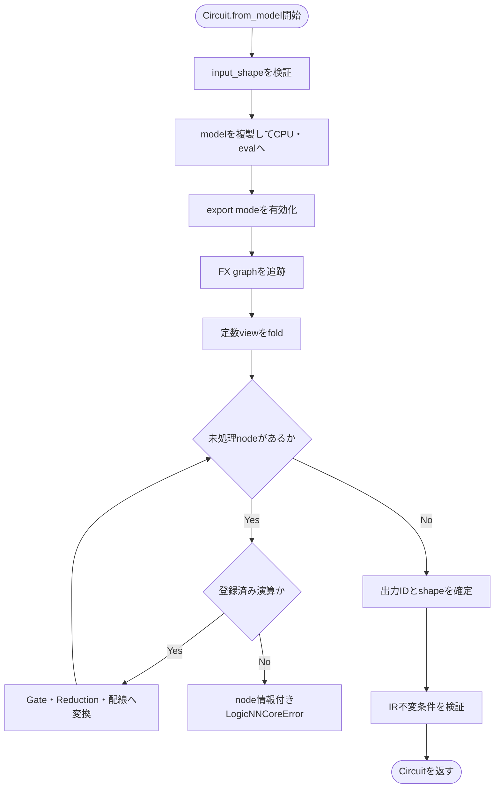

# logicNN_core 詳細設計書

## 1. 文書情報

- 文書状態: 草案
- 作成日: 2026-09-12
- 入力: [要件定義](./requirements.md)、[基本設計](./basic-design.md)
- 対象: `utils/logicNN_core/src/logicnn_core/`

本書のsignatureは実装開始前の公開契約案である。torchlogixの既存名称は可能な限り残す一方、`in_dim`、`out_dim`、`k`、無検証の `**kwargs` など、用途が分かりにくい箇所はPyTorchで一般的な名称と型付きspecへ整理する。

## 2. 命名と型の規則

### 2.1 名称

| 概念 | 採用名 | 旧名称との関係 |
|---|---|---|
| 入力特徴数 | `in_features` | `in_dim`を明確化 |
| 出力特徴数 | `out_features` | `out_dim`を明確化 |
| 入力channel | `in_channels` | `channels`を明確化 |
| 出力論理kernel | `out_channels` | `num_kernels`をPyTorchに合わせる |
| 畳み込み受容野 | `kernel_size` | `receptive_field_size`を簡潔化 |
| LUT入力数 | `num_inputs` | 1ゲートの入力本数。数学上のrankと同義 |
| GroupSum出力数 | `groups` | `k`を明確化 |
| ゲートの学習方式の設定 | `LUTConfig` | 文字列とkwargsの組を型付き化 |
| 入力の接続方式の設定 | `ConnectionConfig` | 文字列とkwargsの組を型付き化 |

class名は継続して `LogicDense`、`LogicConv2d` などを用いる。パッケージ内部だけで使う関数・classは先頭を `_` とし、公開 `__all__` に含めない。

### 2.2 型と検証

- shapeはbatch次元を含まないtupleで表す。
- public APIはPython 3.10以上の型注釈を持つ。
- size引数はintまたは次元数と一致する整数tupleを受理し、内部でtupleへ正規化する。
- 数、rank、temperature、stride、kernel、paddingおよびindex範囲はconstructorで検証する。
- 設定などを独自に検証する入口では `TypeError` または `ValueError` を使う。通常の演算でPyTorchが検出する誤りは、その例外をそのまま伝播させる。
- FX変換、IR検証、compileおよびexportの文脈付き失敗は `LogicNNCoreError` とする。
- `assert` は利用者入力の検証に使用しない。Python最適化の有無で動作を変えないためである。

2026-09-13承認: **チェックは最低限にし、計算本体を簡潔に保つ。** 通常forwardの型・layout・deviceの重複検査、固定接続や全重みの毎回の再検証を行わない。constructor、state_dict読込、truth table／export抽出では必要な検証を行う。構築済みCircuitの通常評価では全IRの再走査・全数値演算の事前試算を繰り返さず、簡略化の各passの検証は開発用テストに置く。外部JSON／FX・C ABIの安全性と、黙って意味が変わるshape・broadcast・bool・数値変換の最小条件は維持する。切替フラグやunchecked APIは増設しない。

### 2.3 承認済みの命名

ユーザーの「できるだけ分かりやすい名称」という方針に従い、次の命名を2026-09-12に承認した。後続節のsignatureと基本設計のファイル構成へ反映済みである。

1. パッケージの配置名は `utils/logicNN_core/` を維持し、配布名を `logicNN-core`、Pythonでのimport名を `logicnn_core` とする。
2. 層の設定型は `LUTConfig` と `ConnectionConfig`、配置ファイルは `layer_settings.py` とする。前者はゲートの学習方式、後者は入力の接続方式を指定する。アプリケーションのJSON設定ではなく、モデル定義ファイル内で作るPythonオブジェクトである。
3. 利用者が指定するLUTの入力本数は `LUTConfig.num_inputs` とし、内部の数学説明では `rank` と同義であることを明記する。層全体の特徴数である `in_features`／`out_features` とは区別する。

回路側の草案名は、出力対応表を `logical_outputs`、簡略化ファイルを `circuit/simplification.py`、公開 `Circuit` の定義ファイルを `circuit/circuit.py` として整理する。単なる名称整理で機能は削除しない。

## 3. パッケージ公開面

### 3.1 トップレベル

```python
from logicnn_core import Circuit, LogicNNCoreError, set_export_mode
from logicnn_core.layers import (
    Binarization,
    DummyBinarization,
    FixedBinarization,
    GroupSum,
    LearnableBinarization,
    LogicConv2d,
    LogicConv3d,
    LogicDense,
    OrPooling2d,
    OrPooling3d,
    SoftBinarization,
)
from logicnn_core.modules import ResidualLogicBlock
from logicnn_core.layer_settings import ConnectionConfig, LUTConfig
```

`functional`、`parametrizations`、`connections`および個別simplification passは上級者向けsubpackageとしてimport可能にするが、トップレベルから再exportしない。

### 3.2 `LUTConfig`

```python
@dataclass(frozen=True, slots=True)
class LUTConfig:
    kind: str = "raw"
    num_inputs: int = 2
    sampling: str = "soft"
    temperature: float = 1.0
    weight_init: str = "residual"
    residual_probability: float = 0.951
    materialize_basis: bool = False
```

制約は次のとおりとする。

| 項目 | 制約 |
|---|---|
| `kind` | `raw`、`warp`、`light` |
| `num_inputs` | 1以上。方式別制約を追加適用 |
| `sampling` | `soft`、`hard`、`gumbel_soft`、`gumbel_hard` |
| `temperature` | 0より大きい有限値 |
| `weight_init` | `residual`、`residual_catalog`、`random`のうち方式が対応するもの |
| `residual_probability` | 0より大きく1より小さい有限値。Raw＋residualの場合だけ追加で `7/15` より大きいことを要求 |

Rawは `num_inputs=2`、Warpは1／2／4／6、Lightは2／4／6を正式対応する。`residual_catalog` はWarpだけが受理する。本書の数学説明・内部shapeで使うrankは `num_inputs` と同じ値であり、利用者が別途指定する設定ではない。

`residual_probability` は初期化方式を比較する実験で変更する値であり、通常運用では既定値0.951を維持する。Raw＋residualの範囲外は設定型の生成時に `ValueError` とし、丸め・自動補正をしない。旧初期化式も変更しない（2026-09-12承認済み）。

### 3.3 `ConnectionConfig`

```python
@dataclass(frozen=True, slots=True)
class ConnectionConfig:
    kind: str = "fixed"
    init: str = "random"
    temperature: float = 1.0
    use_gumbel: bool = False
    num_candidates: int | None = None
    channel_group_size: int | None = None
```

`kind` は `fixed` または `learnable`、`init` は `random` または `random_unique` とする。畳み込みは初回正式版で `fixed` だけを受理する。学習可能接続固有値は `kind="learnable"` のときだけ使用し、それ以外で非既定値が指定された場合は無視せずエラーにする。

追加設定は2026-09-12に機能維持・重複防止の方針として承認済みである。

- `num_candidates`: 学習可能Denseの各入力端子が持つ候補特徴数。Noneなら全特徴を候補にする。指定する場合はboolではない正の整数とする。固定接続ではNone以外を拒否する。
- `channel_group_size`: 固定Convで1つの論理kernelが接続できる入力channel群の大きさ。Noneなら制限しない。指定する場合はboolではない正の整数とし、Conv構築時に入力channel数以下であることを検証する。DenseまたはlearnableではNone以外を拒否する。
- `learnable + random_unique` は正の `num_candidates` を必須とする。Noneを暗黙に別値へ変換しない。特徴数に依存する条件は6.2節に従って接続構築時に検証する。

## 4. Functional詳細

### 4.1 ファイルと公開関数

| ファイル | 主な関数 | 契約 |
|---|---|---|
| `functional/logic.py` | `apply_binary_lut(a, b, lut_id)` | ID 0〜15の二入力論理関数 |
|  | `all_binary_logic_outputs(a, b)` | 末尾に16関数の結果を並べる |
|  | `apply_export_luts(a, b, lut_ids)` | bool／integer Tensorで追跡可能にLUTを適用 |
| `functional/sampling.py` | `temperature_softmax(...)` | temperature付きsoft／hard選択 |
|  | `temperature_sigmoid(...)` | temperature付きsoft／hard二値化 |
|  | `gumbel_sigmoid(...)` | Gumbel付き二値化 |
|  | `scale_gradient(x, factor)` | forward値を変えずbackwardだけ係数適用 |
| `functional/walsh.py` | `fast_walsh_hadamard(x, rank)` | 最終次元のWalsh-Hadamard変換 |
|  | `walsh_basis(...)` | 対応rankの基底計算 |
|  | `light_basis(...)` | 対応rankのLight基底計算 |
|  | `weighted_walsh_basis_sum(...)`／`weighted_light_basis_sum(...)` | 全基底を保持しない縮約とmaterialize経路 |
| `functional/combinatorics.py` | `build_binomial_table(...)` | 組合せunranking用表 |
|  | `unrank_combinations(...)` | rankから組合せindex列へ変換 |
|  | `sample_unique_combinations(...)` | 重複しない接続tupleを生成 |
|  | `truth_table_from_id(...)` | LUT IDからbool真理値表へ変換 |
| `functional/regularization.py` | `regularization_loss(...)` | 対応する正則化値を返す。方式名 `warp` は実装保留としてValueError（17.4節） |
|  | `rescale_weights_(...)` | 明示的なin-place再スケール |

### 4.2 16論理関数のID

IDは入力順 `(False, False)`, `(False, True)`, `(True, False)`, `(True, True)` に対応する4ビット真理値表を整数化した値とする。既存回路との意味を維持するため、次の対応を固定する。

| ID | 演算 | 使用入力 |
|---:|---|---|
| 0 | false | なし |
| 1 | AND | a, b |
| 2 | a AND NOT b | a, b |
| 3 | a | a |
| 4 | NOT a AND b | a, b |
| 5 | b | b |
| 6 | XOR | a, b |
| 7 | OR | a, b |
| 8 | NOR | a, b |
| 9 | XNOR | a, b |
| 10 | NOT b | b |
| 11 | a OR NOT b | a, b |
| 12 | NOT a | a |
| 13 | NOT a OR b | a, b |
| 14 | NAND | a, b |
| 15 | true | なし |

浮動小数点入力に対するRaw連続基底は、各真理値表を積和標準形で連続化した結果と一致させる。bool入力では表の値と完全一致しなければならない。

### 4.3 shapeとdevice

functional関数はbroadcast可能なshapeを受理し、入力Tensorと同じdevice上で補助Tensorを生成する。dtype変換が必要な場合は、呼出側の計算dtypeへ明示的に揃える。CPU固定Tensorや暗黙の `.cuda()` を禁止する。

### 4.4 C2の公開引数と数値規則

実装した入口は `logicnn_core.functional` と各責務別moduleからimportできる。

```python
apply_binary_lut(a: Tensor, b: Tensor, lut_id: int) -> Tensor
all_binary_logic_outputs(a: Tensor, b: Tensor) -> Tensor
apply_export_luts(a: Tensor, b: Tensor, lut_ids: Tensor) -> Tensor
temperature_softmax(logits: Tensor, *, temperature: float = 1.0, dim: int = -1, hard: bool = False) -> Tensor
temperature_sigmoid(logits: Tensor, *, temperature: float = 1.0, hard: bool = False) -> Tensor
gumbel_sigmoid(logits: Tensor, *, temperature: float = 1.0, hard: bool = False, threshold: float = 0.5, generator=None) -> Tensor
scale_gradient(inputs: Tensor, factor: float) -> Tensor
```

- 通常論理演算はbool・標準整数・浮動小数点Tensorを受理する。入力同士をbroadcastし、PyTorchのdtype昇格規則に揃える。定数や片入力関数もbroadcast後のshapeを保つ。
- 単一 `lut_id` はbool以外のPython整数0〜15。exportの `a`／`b` はbool、`lut_ids` はuint8／int8／int16／int32／int64で、3入力をbroadcastする。範囲外IDは有効IDへ丸めたり定数へ置換したりしない。
- export用LUT演算はTensor値を `.item()`、`.tolist()` などでPythonへ取り出さず、`make_fx` の追跡後も異なる入力値・IDで再利用できる。ID範囲の検証はTensorのindex選択で行う。C9の通常回路構築は9.3節のとおりCPU上で行う。
- samplingのlogitsは浮動小数点Tensor。出力のshape・dtype・deviceを維持する。temperatureはbool以外の正の有限int／float、hardはboolに限定する。
- hard softmaxは元logitの最大indexを選び、同点なら先頭を選ぶ。hard sigmoidは計算した確率が0.5を厳密に超えるときに1とする。いずれもbackwardではsoft経路の勾配を使う。
- Gumbel sigmoidは一様乱数の `log(U)-log(1-U)` というLogisticノイズを使う。seedまたは明示generatorで再現でき、thresholdは任意の有限実数を受理する。乱数の端点だけを数値安定性のために制限し、指定temperatureを丸めない。
- factorは有限実数で、0や負値も数学的な勾配倍率として受理する。forward値は算術的な再計算をせず保持する。

### 4.5 C3の正則化・再スケールの公開引数

```python
regularization_loss(weights: Tensor, kind: str | None = None) -> Tensor
rescale_weights_(weights: Tensor, method: str | None = None) -> None
```

- `weights` は1次元以上で空ではない、stridedのfloat16／bfloat16／float32／float64 Tensor。末尾軸は係数、それ以外はゲートの軸とする。非有限値、不正shape・方式名はValueError、不正型はTypeError。
- 正則化はNone／`L2`／`abs_sum`を受理し、`warp`は17.4節の明示拒否とする。計算式と層内の平均方法は17.5節に従う。Noneもscalar Tensorを返し、入力が勾配を要求していればゼロ勾配を計算できる。
- 再スケールはNone／`clip`／`L2`／`abs_sum`を受理する。Noneは無変更、clipは各係数を[-1,1]へ制限する。L2は係数ベクトルのL2ノルム、abs_sumは係数の和の絶対値で除算する。abs_sumを絶対値の和へ変更しない。
- float16／bfloat16はfloat32で集計し、float64はfloat64で計算する。正則化の出力・再スケール後の重みは元dtypeを維持し、表現不能な非有限の結果は明示拒否する。
- 再スケールはno_grad内で候補結果を先に計算し、全分母・結果が有限かつ全分母が非ゼロであることを確認してから元Tensorへコピーする。epsilon補正は行わず、拒否時は正常行も含めて元の重みを変更しない。既存の勾配を消去・上書きしない。
- 再スケールで複数係数が同じ記憶位置を共有するTensorは、異なるゲートの結果を独立に保存できないため、書換え前にValueErrorとする。転置・間引き等の非連続だが重複しない配置は受理する。読取り専用のlossと更新しないNone指定は重複配置でも無変更のまま扱う。
- 層固有の全level集約と状態保護はC6／C7で実装する。C3に仮の層APIを追加しない。

### 4.6 C3のWalsh／Lightと組合せの公開引数

```python
fast_walsh_hadamard(inputs: Tensor, rank: int) -> Tensor
walsh_basis(inputs: Tensor, rank: int, *, input_dim: int = 1) -> Tensor
light_basis(inputs: Tensor, rank: int, *, input_dim: int = 1) -> Tensor
weighted_walsh_basis_sum(inputs, weights, contraction, rank, *, input_dim=1, materialize_basis=False) -> Tensor
weighted_light_basis_sum(inputs, weights, contraction, rank, *, input_dim=1, materialize_basis=False) -> Tensor

build_binomial_table(n: int, k: int, *, device=None) -> Tensor
unrank_combinations(n: int, k: int, ranks: Tensor) -> Tensor
sample_unique_combinations(n: int, k: int, sample_size: int, num_sets: int = 1, *, device=None, generator=None) -> Tensor
truth_table_from_id(lut_ids: Tensor, rank: int) -> Tensor
```

- FWHTは正規化しない。2回適用すると元入力の `2**rank` 倍になる。Walsh／FWHTはrank 1／2／4／6、Lightはrank 2／4／6。
- 基底関数は `input_dim` を取り除き、残りの次元順を保って末尾へ係数軸を追加する。Walshの2入力順は `[1, B, A, A*B]`。入力の `1-2*x` 変換は呼出側の責務で、基底内で重複適用しない。Lightは `[(1-A)*(1-B), (1-A)*B, A*(1-B), A*B]`。
- 重み付き関数は係数軸を末尾に持つweightsを受理し、旧層と同じ係数軸抜きのeinsum式を使う。例は `n,bn->bn`、`nc,bnc...->bc...`。materialize経路は未使用の英字を係数軸に使用し、既存の軸名と衝突させない。
- Walsh／Lightの入力はstridedの符号付き標準整数またはfloat16／bfloat16／float32／float64。非連続入力・空の先行軸を受理する。混在dtypeの縮約はPyTorchの昇格規則に従い、整数overflowは通常のTensor演算規則のままで飽和・自動補正しない。streaming経路は全基底を一括生成しないが、逆伝播用の中間値まで不要になるという保証ではない。
- 二項係数表は `(n, k+1)` のint64で、要素は `C(row, column)`。unrankingは旧combinadicのcolex順とし、出力は `ranks.shape + (k,)` の昇順tuple。`itertools.combinations` の列挙をcolex順に並べた独立基準で検証する。
- 組合せのn、k、件数は非負整数で `k <= n`。空入力とk=0を受理する。二項係数・総組合せ数・出力要素数のint64上限を検証し、overflowを丸めない。
- samplingの出力は `(num_sets, sample_size, k)`。各set内でのみ重複を禁止し、全候補に比例したrandpermを作らない。明示generatorは自身のdevice上で消費し、global乱数状態を変更せず、結果を要求されたdeviceへ移す。unrankingの整数探索はCPUで行い、GPU最適化済みとは扱わない。
- 整数LUT IDの展開はrank 1〜4を受理し、元IDのshape末尾へ `2**rank` のbool真理値表を付加する。入力の二進昇順に対応するMSB-firstとし、rank 2のIDは4.2節と一致する。より高rankでは整数IDでなく真理値表を直接扱う。

## 5. LUTパラメータ化詳細

:::info C4の検証完了
Warpの評価と真理値表抽出の数値境界について、[CORE-DES-007](#176-warpの二値評価とlut抽出の判定契約承認済み) の承認済み契約に沿って修正・回帰検証を完了した。層・回路側の共有と保存は後続の実装単位で統合し、C4だけで回路出力まで完成したとは扱わない。
:::

### 5.1 共通interface

```python
class LUTParametrization(nn.Module, ABC):
    def initialize(self, count: int, *, device: torch.device | None, dtype: torch.dtype | None) -> Tensor: ...
    def forward(self, inputs: Tensor, weights: Tensor, *, training: bool, contraction: str) -> Tensor: ...
    def truth_tables(self, weights: Tensor) -> Tensor: ...
    def truth_tables_with_ids(self, weights: Tensor) -> tuple[Tensor, Tensor | None]: ...
    def set_temperature(self, temperature: float) -> None: ...
```

`inputs` のrank軸はindex 1とし、残りのshapeはDenseとConvで異なる。`contraction` は内部層だけが渡し、一般利用者向けトップレベルAPIにはしない。

Warpの二値evalでは、1組の入力と1個のLUTの対応を維持するため、contractionの入力軸を出力へ残す。Denseの `n,bn->bn`、Convの `fc,bcsf->bcsf`、軸並替・broadcast・先行shapeの省略記号は受理する。一方、`nc,bnc...->bc...` のように複数ゲートの実数スコアを合算する操作は単独LUTの論理評価ではないため、二値の入力組が含まれるevalではValueErrorとする。省略記号で隠れた軸の還元も同様に拒否する。この制約はC3の汎用縮約、C4のtraining、全入力組が連続値であるevalには追加しない。

### 5.2 方式別重みshape

| 方式 | rank | 1 LUTあたりの重み数 | 離散化 |
|---|---:|---:|---|
| Raw | 2 | 16 | argmaxでLUT IDを選択 |
| Warp | 1／2／4／6 | `2**rank` | Walsh逆変換後を0で閾値化 |
| Light | 2／4／6 | `2**rank` | 係数を0で閾値化 |

高rankのLUT IDは整数表現が実用範囲を超えるため、`truth_tables_with_ids()` はrank 4以下でのみIDを返し、それより大きい場合は真理値表と `None` を返す。学習可能であることと、二入力gate IRへ直接展開可能であることを区別する。

### 5.3 sampling

- train＋soft: temperature付き連続値。
- train＋hard: straight-throughでRawのゲート選択、Lightの真理値表係数、Warpの最終活性値を離散化し、backwardは連続近似とする。
- train＋gumbel: PyTorch generator／seedに従う確率選択。
- eval: sampling指定に関係なく決定的な離散選択。
- export: 事前に抽出した真理値表またはLUT IDだけを使用する。

Raw／Lightは選んだ論理関数を連続入力へ適用するため、hardやevalでも出力が常に0／1になるとは限らない。例えば恒等関数へ0.3を入力すると0.3を返す。離散入力に対する真理値との一致を要求し、旧挙動にない最終閾値をRaw／Lightへ追加しない。Warpは最終活性値を閾値化する。

### 5.4 C4の構築と状態

`build_parametrization(config: LUTConfig)` は `raw`／`warp`／`light` を対応する `RawLUTParametrization`／`WarpLUTParametrization`／`LightLUTParametrization` へ対応付ける。登録表はbuilder内に閉じる。各classのconstructorも `LUTConfig` を受け取り、classとkindが一致しない場合はValueErrorとする。

- 不変の生成時configと、実行中のtemperatureを分離する。`set_temperature()` は正の有限実数だけを受理し、元configを変更せず実行用のPython属性を更新する。温度専用のpersistent bufferや学習再開状態は追加しない。
- パラメータ化classは計算方式を管理し、ゲートの学習weightは所有しない。`initialize()` が返すTensorを後続の論理層がParameterとして保持する。
- initializeのcountは正のPython整数。device／dtypeは省略時にPyTorchの既定値を尊重し、dtypeはfloat16／bfloat16／float32／float64を受理する。導出した初期値が非有限または指定dtypeで表現不能なら、黙って丸めずValueErrorとする。
- forwardの明示的なtraining引数で経路を選ぶ。入力はindex 1がnum_inputsのstrided Tensor、weightsは末尾が方式別の係数数である浮動小数点Tensorとし、同一deviceを要求する。入力は重みdtypeへ変換してから計算する。1次元weightsを互換目的で自動unsqueezeせず、指定したcontractionの軸に従う。
- truth_tablesは任意のゲート先行shapeを保ったbool Tensorを返す。IDはMSB-firstのint64でrank 4以下のみ返し、rank 6はNoneとする。

### 5.5 初期化の基準式

以下は参照元の初期化を維持するための定義である。pはresidual_probability、Tは実行中temperature、Eは `2**num_inputs` とする。

| 方式 | 初期化 | 基準 |
|---|---|---|
| Raw | residual | 全係数0、ID 3だけ `T * (log(15*p-7) - log(1-p))` |
| Raw | random | 標準正規乱数 |
| Warp | residual | 入力Aの恒等関数に対応するWalsh係数だけ `T * (log(p) - log(1-p))`、その他0 |
| Warp | residual_catalog | まず恒等関数の正規化Walsh係数を全ゲートへ置く。`round(count*(1-p))` 個の位置を再抽選し、ランダムな符号付き真理値表の非正規化FWHTをEで割った係数で置換 |
| Warp | random | 標準正規乱数 |
| Light | residual | 標準正規乱数の前半係数から3を引き、後半へ3を加える |
| Light | random | [0,1)の一様乱数 |

Warpのcatalog再抽選には恒等関数そのものと候補の重複を許すため、元と異なる関数の個数を厳密には保証しない。catalog係数へTやlogit(p)を追加乗算しない。Lightの初期化にはpやTを使わず、randomを標準正規乱数へ変更しない。乱数はPyTorchのseedに従う。

## 6. 接続詳細

### 6.1 `FixedDenseConnections`

- index shapeは `[rank, out_features]`。
- forward入力は `[..., in_features]`、出力はflattenしたbatchに対して `[batch_flat, rank, out_features]`。
- `random` は置換あり、`random_unique` は各LUT内で重複なしとする。
- `random_unique` では `in_features >= rank` を要求する。
- indexはpersistent bufferとしてstate dictへ保存する。

### 6.2 `LearnableDenseConnections`

- 接続logitは学習parameter、候補indexはbufferとする。
- train時も候補logit（Gumbel指定時はノイズを加算）のargmaxで接続先を1本選び、旧torchlogixの独自近似勾配で学習する。候補入力のsoft混合や通常のhard-softmaxの勾配へ置き換えない。eval時は乱数なしargmax。
- 同一LUT内の入力重複を許すかは `init` 規則で決まり、評価時も規則を破らない。
- 候補indexと接続logitのshapeは `[候補数, num_inputs, out_features]`。Noneによる全特徴候補の実際の候補数は `in_features` とする。
- `random` は入力端子間の候補重複を許す。`random_unique` では1ゲート内の各端子へ互いに重ならない候補集合を割り当て、`num_candidates * num_inputs <= in_features` を要求する。ゲート同士での候補共有は許す。
- 重複禁止は初期化だけでなく離散評価・exportにも適用する。候補indexは学習中に再抽選せず、どの端子も自身の候補集合からだけ選択する。勾配を配分するときも端子間の候補集合は共有しない。
- `set_temperature()` は0以下、NaN、無限大を拒否する。

CORE-DES-008で承認した学習計算を次のように定義する。bはbatch、cは候補、rはLUT入力端子、oは出力ゲート、fは元の入力特徴である。

```text
選択候補[c軸のargmax] = argmax_c(weights[c,r,o] + noise[c,r,o])
output[b,r,o]         = inputs[b, indices[選択候補,r,o]]

grad_weights[c,r,o] = sum_b((2*inputs[b,indices[c,r,o]] - 1) * grad_output[b,r,o])
probability[c,r,o]  = softmax_c((weights[c,r,o] + noise[c,r,o]) / temperature)
grad_inputs[b,f]    = sum_{c,r,o: indices[c,r,o]=f}(probability[c,r,o] * grad_output[b,r,o])
```

noiseは無効時0、有効時は旧式 `-log(-log(U + 1e-20) + 1e-20)` とする。forwardとbackwardで同じnoiseを使い、再抽選しない。同点は先頭候補を選ぶ。候補index・temperature・noise自体は学習parameterにしない。入力側の勾配は候補が同じ特徴を指す場合に加算する。独自勾配はforwardの通常の微分ではないため、数値微分ではなく上記の式と参照元の実装で検証する。

### 6.3 `FixedConvConnections`

- 2D入力shapeは `[batch, channels, height, width]`。
- 3D入力shapeは `[batch, channels, depth, height, width]`。
- 最初のtree levelは各受容野から葉を選び、後続levelは前levelのnodeをrank個ずつ集約する。
- 出力空間の各次元は `floor((input + 2*padding - kernel_size) / stride) + 1`。
- `kernel_size` は入力空間以下、strideは1以上、出力空間は各次元1以上を要求する。
- indexとkernel positionはpersistent bufferにし、state復元後に再抽選しない。
- `channel_group_size` の指定時は、各論理kernelの葉の入力channelを選択したchannel群内に限定する。値が入力channel数と同じ場合は全channelを対象にできる。random_uniqueではchannel制限後の受容野内に必要な数の異なる入力位置が存在するかも検証する。

### 6.4 C5の公開入口と状態

```python
FixedDenseConnections(in_features, out_features, *, num_inputs=2, config=ConnectionConfig(), device=None)
LearnableDenseConnections(in_features, out_features, *, num_inputs=2, config=ConnectionConfig(kind="learnable"), device=None, dtype=None)
FixedConvConnections(input_size, in_channels, out_channels, tree_depth, kernel_size, *, num_inputs=2,
                     stride=1, padding=0, conv_dimension=2, config=ConnectionConfig(), device=None)

build_dense_connections(in_features, out_features, *, num_inputs=2, config=ConnectionConfig(), device=None, dtype=None)
build_conv_connections(input_size, in_channels, out_channels, tree_depth, kernel_size, *, num_inputs=2,
                       stride=1, padding=0, conv_dimension=2, config=ConnectionConfig(), device=None)
```

共通基底は `Connections(nn.Module, ABC)`。内部builderは構造別の型付き入口とし、用途が分からないkwargsをそのまま転送しない。configは対応するConnectionConfigとし、各具象classの方式と一致しない設定を拒否する。

1. Denseの入力は `[..., in_features]`。1次元入力はbatch数1、空のbatchは0として扱い、出力は `[batch_flat, num_inputs, out_features]`。ゲートへのdtype変換は後段parametrizationに委ね、接続選択では元入力の値・dtypeを維持する。
2. 固定接続と学習可能接続のevalは、stridedのbool・標準整数・対応浮動小数点入力を受理する。学習可能接続のtrainingはfloat16／bfloat16／float32／float64を要求し、整数出力で勾配が失われる暗黙学習はしない。入力とindex・parameterのdeviceを一致させ、無断転送しない。
3. 学習可能接続のdtype指定は接続logitだけへ適用し、省略時はPyTorch既定dtypeを使用する。logitは旧と同じ[0,1)の一様乱数で初期化する。ノイズと勾配集計は低precisionではfloat32、float64を含む演算はfloat64を使い、勾配を各元Tensorのdtypeに戻す。
4. `indices` はint64 persistent buffer。学習可能Denseの `weights` はParameter。`get_indices()` は現在の乱数なし離散接続を `[num_inputs, out_features]` で返す。temperatureはconfigと分離した実行属性とし、更新で元configや乱数状態を変更しない。
5. Denseのrandomは範囲内の置換ありsampling、random_uniqueは各ゲート内で必要な個数を重複なしに選ぶ。旧コードの全入力coverage条件や全ゲート間の組合せ数上限は追加しない。学習方法の維持を理由に承認済みの汎用shape・候補規則を巻き戻さない。
6. 保存indexの型・shape・範囲とunique条件を復元前に検証する。直接変更された不正indexもforward／get_indicesで拒否する。渡された既存Tensorの不正を接続自身へコピーする前に検出するが、keyの欠落・未知keyや親子moduleを含む全失敗の原子性までは保証しない。これらのkey検査と部分更新はPyTorch標準のload_state_dictに従う。

### 6.5 Convの座標と各tree level

- `conv_dimension` は2または3。input_size／kernel_size／stride／paddingはintまたは次元数に等しいtupleへ正規化する。paddingは0以上、その他のsizeは正の整数とする。
- ゼロpaddingは接続の `forward(inputs, tree_level=0)` 内で1回だけ行う。入力shapeはpadding前の `[batch, in_channels, *input_size]` とし、C7のlayerは重複paddingしない。
- level0の出力は `[batch, num_inputs, out_channels, num_positions, num_inputs**(tree_depth-1)]`。level L>0は前段 `[batch, out_channels, num_positions, num_inputs**(tree_depth-L)]` から選択し、出力 `[batch, num_inputs, out_channels, num_positions, num_inputs**(tree_depth-L-1)]` を返す。rank軸は常にindex1とする。
- 局所 `kernel_coordinates` は `[num_inputs, out_channels, num_inputs**(tree_depth-1), conv_dimension+1]` で、末尾は空間座標列とchannel。`kernel_positions` は `[num_positions, conv_dimension]` のpadded空間における開始座標とする。
- `indices_0` は局所座標と開始位置を合成した `[num_inputs, out_channels, num_positions, node_count, conv_dimension+1]`。後段の `indices_L` は `[num_inputs, num_inputs**(tree_depth-L-1)]` で、前段node全体を1回ずつ参照する。初期順序は旧の連続したrank個ずつの組を維持する。
- 座標・位置・各level indexはpersistent bufferとし、`indices` propertyはそれらのlevel indexのtupleを返す。state復元では座標範囲・shapeだけでなく局所座標と開始位置からの合成関係を確認する。後段の不正な重複・欠落を拒否する。
- channel制限なしのrandom_uniqueは、1個のkernel内でrank要素の組を重複なしに選ぶ。組内は重複なし、異なる組同士での入力共有は許す。全組合せを一括列挙せずC3のsamplingを使う。
- channel_group_size指定時は連続channel窓をkernel番号で順番に割り当て、全葉 `num_inputs**tree_depth` をchannelへ等分する。割り切れない場合は明示エラー。uniqueならchannelごとの空間位置を重複なしに選び、group数が全入力channel数と同じ場合も受理する。
- これらは接続の仕様であり、C7の畳み込み層が完成したことを意味しない。

## 7. Layer詳細

### 7.1 共通基底

```python
class LogicLayer(nn.Module, ABC):
    def truth_tables(self) -> Tensor | list[Tensor]: ...
    def truth_tables_with_ids(self) -> tuple[object, object]: ...
    def regularization_loss(self, kind: str | None = None) -> Tensor: ...
    def rescale_weights_(self, method: str | None = None) -> None: ...
    def set_export_mode(self, enabled: bool = True) -> None: ...
```

共通基底は `LUTConfig` からparametrizationを生成し、`ConnectionConfig` の保存、gradient factor、export状態を管理する。層固有のweightとconnection生成はsubclassが担当する。

### 7.2 `LogicDense`

```python
LogicDense(
    in_features: int,
    out_features: int,
    *,
    lut: LUTConfig = LUTConfig(),
    connections: ConnectionConfig = ConnectionConfig(),
    gradient_scale: float = 1.0,
    device: torch.device | str | None = None,
    dtype: torch.dtype | None = None,
)
```

- 入力: `[..., in_features]`。
- 出力: `[..., out_features]`。
- `in_features`、`out_features`は1以上。
- 任意の先行次元を一時的にflattenし、処理後に復元する。
- exportは初回正式版ではrank 2だけを対象とし、それ以外は対応rankと必要条件を含むエラーにする。

#### 7.2.1 C6の所有状態と実行順

- `weight` はLUTのParameter、`connections` はC5の接続module、`parametrization` はC4の計算moduleとする。`lut_config` と `connection_config` は生成時設定を保持する。旧属性名のaliasは設けない。
- 通常forwardは、元の入力に `scale_gradient` を適用し、接続で入力を選び、parametrizationへ渡してから先行shapeを復元する。`gradient_scale` は有限値を受理し、入力に戻る勾配だけを倍率変更する。LUT重みと接続logitの勾配は倍率変更しない。
- 接続へ渡す前に入力をLUT重みのdtypeへ丸めない。Warpの二値判定は元入力の値で行い、通常出力はparametrizationのdtypeとする。
- `truth_tables()` と `truth_tables_with_ids()` は呼出時点の重みから生成する。通常evalの隠れたキャッシュは導入せず、外部から重みを書き換えた場合も次回呼出しに反映する。
- `regularization_loss()` と `rescale_weights_()` はLUT重みだけを対象とし、接続logitを混ぜない。保留中の `warp` 正則化はC3の明示エラーを伝える。
- export enableでは、その時点のLUT IDと離散接続を `_export_lut_ids`、`_export_indices` へ独立コピーする。この経路の入力はbool Tensorとし、連続値を暗黙に二値化しない。snapshotは再enableまたはstate復元時に更新する。
- export状態から保存したstateでも、通常層への復元では既知のexport派生bufferだけを無視し、LUT重みと接続を正として復元する。export層への復元ではchild接続の読込完了後に派生bufferを再生成する。未知keyは標準のstrict検査に残す。
- 層自身のexport中の `train(True)` を拒否する。PyTorchの親containerが子へ呼出しを伝えた途中で失敗した際、親や先行する兄弟のtraining flagまで巻き戻す独自機構は追加しない。

### 7.3 `LogicConv2d`／`LogicConv3d`

```python
LogicConv2d(
    input_size: int | tuple[int, int],
    in_channels: int,
    out_channels: int,
    tree_depth: int,
    kernel_size: int | tuple[int, int],
    *,
    stride: int | tuple[int, int] = 1,
    padding: int | tuple[int, int] = 0,
    lut: LUTConfig = LUTConfig(),
    connections: ConnectionConfig = ConnectionConfig(),
    gradient_scale: float = 1.0,
    device: torch.device | str | None = None,
    dtype: torch.dtype | None = None,
)
```

3D版は `input_size`、`kernel_size`、`stride`、`padding` が3要素になる。tree depthは1以上とし、levelごとのnode数とweight shapeをconstructorで確定する。出力は2Dが `[batch, out_channels, out_height, out_width]`、3Dが `[batch, out_channels, out_depth, out_height, out_width]`。

#### 7.3.1 C7の多段計算と状態

- `tree_weights` はlevel順のParameterListとし、各重みは `[node_count, out_channels, coefficients]`。node数は `num_inputs**(tree_depth-level-1)`。初期化は旧と同じnodeごとの `initialize(out_channels)` を維持し、residual_catalogの選択個数の丸めを変えない。旧コードとの同seedの乱数列一致は要求せず、新実装自身のseed再現性と同stateでの計算一致を検証する。
- 通常forwardは入力に勾配倍率を1回適用し、C5の各levelからの入力選択とC4の `fc,bcsf->bcsf` 計算を順に行う。paddingとrank軸の移動はC5が担当するので層では重ねて行わない。最後のnode軸だけを除き、出力空間shapeへ復元する。
- `truth_tables()` はlevel順のTensorリストを返す。各Tensorは `[node_count, out_channels, 2**num_inputs]`。IDもlevel順とし、高rankでは各要素をNoneにする。
- 正則化は全levelのゲートを結合してC3の全ゲート平均を計算する。再スケールは全levelの候補と書込先を検証してから一括でコピーし、Parameterと既存gradを保つ。外部差替によりlevel間で同じstorageを共有させた場合、非Noneの再スケールを明示拒否する。複雑な重複領域解析は導入しない。
- exportの派生bufferはlevelごとの `_export_lut_ids_0`、`_export_indices_0` から始める。enable時に現在の接続を検証して全levelを独立コピーし、export forwardでは保存indexだけで直接入力を選ぶ。この経路に限りpaddingとrank軸整列を直接1回実施し、値依存のPython検証をFX graphへ混ぜない。
- exportはrank 2・bool入力に限定し、未対応rankを状態変更前に拒否する。state復元・明示再enableでのsnapshot更新はDenseと同じ規則に従う。

### 7.4 OR Pooling

```python
OrPooling2d(kernel_size, stride=None, padding=0)
OrPooling3d(kernel_size, stride=None, padding=0)
```

通常modeは0／1上のmax pooling、export modeはboolの反復ORを用いる。入力が0／1であれば両経路は同値になる。`stride=None` はPyTorchと同様にkernel sizeを用いる。

通常modeでは旧実装と同様にfloat32へ変換してmax poolingし、連続入力も最大値として扱う。exportはboolのみを受理し、False paddingと窓ごとのORで計算する。引数は各空間次元に対応したintまたはtuple、paddingは0以上かつkernelの半分以下、出力寸法は正とする。空batchは空の出力shapeを維持する。export中の学習切替は共通の明示拒否規則に従う。

### 7.5 Binarization

```python
FixedBinarization(thresholds, *, feature_dim=-2)
DummyBinarization()
SoftBinarization(thresholds, *, temperature=0.1, feature_dim=-2)
LearnableBinarization(
    thresholds,
    *,
    feature_dim=-2,
    sampling_temperature=0.1,
    ordering_temperature=0.1,
    sampling="soft",
    max_gradient_norm=0.001,
)
```

threshold生成は `Binarization.initial_thresholds(dataset, bits, scope, method)` とし、scopeは `global`、`feature`、`channel`、methodは `uniform`、`quantile`。複数閾値の判定を指定次元へ結合する。CORE-DES-009の承認に従い、学習可能閾値はtorchlogixと同じく、学習時だけ後続差分をsoftplusで正にし、eval／exportでは生差分をそのまま累積する。評価時の昇順やthermometer順序は保証せず、暗黙のsort・clamp・閾値共通化は行わない。

#### 7.5.1 C8の閾値とshape

- `thresholds` は有限なfloat16／bfloat16／float32／float64 Tensorまたはlistを受理する。listはfloat32へ変換し、層は元データを変更しない独立コピーを保持する。末尾は1個以上の閾値で、globalは `[bits]`、featureは `[*入力の非batch shape, bits]`、channelは `[channels,bits]` とする。旧global形式 `[1,bits]` も共有閾値としてbroadcastできる。
- `feature_dim` は旧と同じく末尾へbit軸を追加した後の軸番号とする。既定値-2は元入力の末尾feature軸を意味する。選択した軸の各要素に対するbit列を隣接させて結合し、他の軸の順序を保つ。末尾のbit軸自身は結合先にできない。元の挙動どおりbatch軸の指定も許すが、通常はfeature／channel軸を指定する。1D入力 `[features]` には旧のbroadcastで利用できる `[features,bits]` の閾値も受理する。
- 3次元以上の入力に2次元の閾値 `[C, bits]` を与えた場合はchannel閾値としてaxis 1へbroadcastする。例えば `[B, C, L]` にも適用できる。末尾featureへ適用する場合は `[1, F, bits]` のように必要なsingleton軸を含める。任意形状のfeature閾値と共有閾値も扱い、MNISTの形状を仮定しない。forwardでは空batchを許すが、設定する閾値は空にしない。
- `initial_thresholds` のdatasetは有限・非空の対応浮動Tensorとする。globalは1次元以上、feature／channelはbatchと対象軸を持つ2次元以上。uniformは最小値と最大値の間を `bits+1` 等分し端点を除く。quantileは旧の補間しない方式で、昇順データの `floor(N*i/(bits+1))` 番目を選ぶ。global出力は両方式とも `[bits]` に統一する。
- Fixedの通常出力とSoft／Learnableのeval出力は旧と同じfloat32の厳密な `inputs > thresholds`。比較は元入力と閾値のdtypeで行い、その前にfloat32へ丸めない。SoftとLearnableの学習はC2の対応samplingを再利用し、温度を二重適用しない。旧hard出力がfloat32を含む演算で昇格するため、Learnableのhard／gumbel_hardではfloat16／bfloat16出力をfloat32に揃える。float64は維持する。Dummyの通常出力はshapeを変えないfloat32変換とする。

#### 7.5.2 学習・保存・export

- Learnableの `raw_diffs` は初期閾値の先頭に0を置いて差分を取り、そのままParameterにする。逆softplusを使う初期化へ変更しない。初期値を記録する `thresholds` bufferも保持するが、現在の判定は `raw_diffs` を正とする。
- 学習では先頭差分をそのまま用い、後続差分には旧の `(ordering_temperature+1e-6) * softplus(raw_diff/(ordering_temperature+1e-6))` を適用して累積する。evalはraw_diffsをそのまま累積する。単一閾値では両方式は同じである。
- 勾配clipは旧と同じくraw_diffs Parameterに対する合算後の勾配に1回適用する。normも元の勾配dtypeで計算し、max_gradient_normを超えた場合だけ `max_gradient_norm/(norm+1e-6)` 倍する。上限は有限の0以上とし、0なら非ゼロ勾配を0にする。forwardの中間値ごとのclipには置換しない。deepcopyやParameterを差し替えるstate復元後にもhookを維持する。
- exportではeval用の閾値を `_export_thresholds` に独立コピーし、同じ厳密比較でbool出力を返す。比較前の連続入力は受理する。Dummyだけは二値化を行う層ではないため、exportはbool入力をそのまま返し、連続入力を暗黙に二値化しない。
- 再enableとstate復元でsnapshotを更新する。既知のexport派生bufferだけを通常復元時に無視し、export受信側では復元した現在状態から再生成する。未知keyはstrict検査に残し、export中の `train(True)` は明示解除まで拒否する。

### 7.6 `GroupSum`

```python
GroupSum(groups: int, *, tau: float = 1.0, bias: float = 0.0)
```

入力末尾次元はgroupsで割り切れる必要がある。`[..., features]` を `[..., groups, features/groups]` へreshapeして末尾を合計し、biasを加え、tauで除算する。groupsとtauは0より大きく、biasとtauは有限値とする。

旧のdtypeを保つため、biasが0なら加算を、tauが1なら除算を省く。bool入力を既定設定で集約した結果は整数の個数となる。exportでも集約演算は維持し、Verilogに加算回路を生成しない処理は回路出力側の責任とする。export中の学習切替は同じ明示拒否規則を用い、集約時の入力はboolに限定しない。

合計とscaleはPyTorchの通常のdtype・数値範囲に従う。有限な設定値でも、そのdtypeで表現できない演算結果まで有限性を保証しない。極端なtauにepsilonを足したり、暗黙にfloat64へ昇格したりしない。

### 7.7 `ResidualLogicBlock`

Residual blockは、論理畳み込み系列とskip pathのshapeが一致する場合だけ生成する。poolingやchannel変更がある場合は明示的projectionを受け、暗黙のbroadcastを禁止する。block内部のすべての論理層へexport modeを伝播する。

```python
ResidualLogicBlock(
    input_size, in_channels, out_channels, *, tree_depth=3, kernel_size=3,
    padding=1, downsample=False, conv_dimension=2, projection=None,
    lut=LUTConfig(), connections=ConnectionConfig(), gradient_scale=1.0,
    device=None, dtype=None,
)
```

- `main` は旧と同じConv→poolまたはIdentity→Conv→poolまたはIdentity。downsample=Trueでは各Conv後にkernel=stride=2のOR poolingを置き、空間を2回縮小する。2つ目のConvのinput_sizeは実際の出力公式から求め、正方形や単純な整数除算を仮定しない。conv_dimensionは2または3。
- `shortcut` は利用者が指定したprojection、未指定時はIdentity。skip側へ暗黙のpoolやchannel変換を追加しない。旧の自動tree_depth=0 projectionは採用せず、承認済みの正のtree depthと明示projectionの規則を維持する。
- projectionはIdentity、対応次元のLogicConv／OR pooling、それらのSequential、および既知のResidualについて静的shapeを検証する。未知のcustom moduleは推測やdummy forwardで受理しない。constructorで計算式によるshape一致を確認し、forwardでは暗黙broadcastを防ぐ両branchのshape一致とexport時のboolだけを確認する。入力shapeは子Convに、device・Tensor型の不一致はPyTorchに任せる。
- 通常の合流は旧と同じ `main + shortcut - main * shortcut`。exportは両branchのbool出力をORで合流する。通常経路の連続値を勝手に二値化したり、broadcastでshapeを合わせたりしない。
- 公開 `set_export_mode` は共通の単一走査へ委譲し、内部 `_set_export_mode_local` は自己のflagだけを切り替える。shared／nested moduleでsnapshotを重複生成しない。export中の学習再開は他の層と同じく明示解除を要求する。

## 8. Export mode詳細

### 8.1 公開関数

```python
def set_export_mode(module: nn.Module, enabled: bool = True) -> None:
    """Recursively toggles export mode on supported child modules."""
```

module treeを一度走査し、`set_export_mode`を公開するchildへ一度ずつ適用する。shared moduleを複数回変更しないようobject IDを追跡する。enable時は対象model全体をevalにし、LUT IDなどのexport bufferをpersistent bufferとして登録する。disable時はexport bufferを削除し、評価状態のまま戻す。以前のtraining状態を暗黙に復元しない。

この共通関数はResidualが必要とするためC8で前倒し実装する。重複を除くPyTorchの `module.modules()` を用い、root自身も対象に含める。再帰するcontainerが `_set_export_mode_local` を持つ場合はその非再帰処理だけを呼び、子は同じwalkerが1回ずつ担当する。全setterの成功後にroot全体をevalへ切り替え、未対応の単一層を先にevalへ変更してしまうことを避ける。root公開はこの関数のみを遅延importし、設定だけのimportにPyTorchを要求しない。対応外rankなどで個別setterが失敗した場合に、全modelをtransactionとして巻き戻す保証は追加しない。Circuit本体は引き続きC9以降の対象である。

### 8.2 `train()`との関係

export中に `train(True)` を呼んだ場合はexport bufferと通常training経路の不整合を防ぐため `RuntimeError` とする。暗黙にexport modeを解除しない。利用者は先に `set_export_mode(model, False)` を呼んで通常評価へ戻し、その後 `model.train()` を呼ぶ。この規則は2026-09-12に承認済みである。

## 9. 回路IR詳細

### 9.1 型

```python
class GateOp(str, Enum):
    CONST_FALSE = "const_false"
    CONST_TRUE = "const_true"
    WIRE = "wire"
    NOT = "not"
    AND = "and"
    OR = "or"
    XOR = "xor"
    NAND = "nand"
    NOR = "nor"
    XNOR = "xnor"
    AND_NOT_B = "and_not_b"
    AND_NOT_A = "and_not_a"
    OR_NOT_B = "or_not_b"
    OR_NOT_A = "or_not_a"
```

`NOT_A` と `NOT_B` は入力位置をbuilderで正規化し、IRの正式opには含めない。これにより同じNOTを二重表現しない。

```python
@dataclass(frozen=True, slots=True)
class Gate:
    output_id: int
    op: GateOp
    input_ids: tuple[int, ...]

@dataclass(frozen=True, slots=True)
class SumReduction:
    output_id: int
    input_ids: tuple[int, ...]
    dtype: TensorDType = TensorDType.INT64
    operations: tuple[ScalarOperation, ...] = ()

@dataclass(frozen=True, slots=True)
class ScalarConstant:
    value: int | float
    tensor_dtype: TensorDType | None = None
    tensor_ndim: int = 0

@dataclass(frozen=True, slots=True)
class ScalarOperation:
    op: ScalarOp
    output_dtype: TensorDType
    operand: ScalarConstant | None = None
    scalar_first: bool = False
    alpha: int | float = 1
    input_ndim: int = 1

@dataclass(frozen=True, slots=True)
class LogicalOutput:
    node_ids: tuple[int, ...]

@dataclass(frozen=True, slots=True)
class FxSignalReference:
    node_name: str
    flat_index: int

@dataclass(slots=True)
class CircuitData:
    input_shape: tuple[int, ...]
    output_shape: tuple[int, ...]
    gates: list[Gate]
    reductions: list[SumReduction]
    output_ids: list[int]
    logical_outputs: list[LogicalOutput]
    output_dtype: TensorDType
```

入力wire IDは0から `prod(input_shape)-1`。gateとreductionのoutput IDは重複しない。gateはtopological orderで並び、各入力参照は入力wireか先行nodeでなければならない。

CORE-DES-012により、`TensorDType` はbool、uint8、int8／16／32／64、float16、bfloat16、float32、float64の文字列Enumとする。`ScalarOp` はadd、sub、mul、div、cast。sum後の演算を `operations` の保存順に実行し、従来のtau／biasへの式の統合は廃止する。各分岐は独立した不変の演算列を持つ。未配布の旧IRへの互換処理は追加しない。

`ScalarConstant` はPythonのint／floatと1要素Tensorを区別する。Python scalarはtensor_dtypeなし・tensor_ndim=0、Tensorは元dtypeとrankを保存する。rank 0とrank 1以上の型昇格の違いを失わない。Tensorの1要素値をPythonへ取り出しても、元の型情報を捨てたり一律に出力dtypeへ丸めたりしない。有限値を受理し、整数の値をfloatへ変換して保存しない。

`ScalarOperation` は元の左右関係、add／subのalpha、入力rankと演算結果dtypeも保存する。castはoperandなし・scalar_first=False・alpha=1とし、数値castを単なる配線として省略しない。各演算のdtypeは元rankを保つ代表Tensorで取得し、利用できるFX metadataとも照合する。cat等の暗黙の数値型昇格も必要なcastとして保存する。最終Tensorの型は `CircuitData.output_dtype` に保持する。

外部FXの追跡時と現在の既定浮動小数点dtypeが異なり、演算のmetadataを再現できない場合は、その不一致を明示拒否する。元graphやプロセス全体の既定dtypeを勝手に変更しない。生成済みIRの実行・C変換は記録済みの結果dtypeを基準にし、実行時の周囲の既定値へ再依存させない。

sumは0／1の個数を正確に数えられる既存の対応範囲を維持し、その出力dtypeを保存する。整数overflowや、入力本数がfloatの全整数表現範囲を超えるsumは引き続き明示拒否する。sumの再集約・数値結果の論理gate入力化・数値Tensor同士の四則演算は現対応外である。対応済みscalar演算は演算順を維持し、有限の設定値から発生するInf等を黙って有限値へ置換しない。

`logical_outputs` は元の最終出力位置ごとの、集約前の論理信号の対応表である。要素数は `prod(output_shape)` および `len(output_ids)` と一致させる。集約なしなら1要素の `node_ids`、集約ありなら簡略化前の集約入力を元の順序で保存した `node_ids` を持つ。各tupleは空にせず、参照先は入力wireまたは論理gate（定数gateを含む）に限定する。reductionの結果は論理bitとして参照しない。

同じIDの重複は有効な出力である。node IDは内部識別子なので置換してよいが、対応表の位置・各tupleの長さ・各位置の論理値は変更しない。集約結果が定数へ簡約されても、対応する `LogicalOutput` は削除しない。

`FxSignalReference` は外部FXの対応情報に使う型で、IRのnode IDとは異なる。`node_name` はgraph内のTensorを出力するnode名、`flat_index` はそのTensorを論理的なrow-major順にflattenした位置を指す。Tensorの元storage順ではない。外部対応表は最終出力位置ごとの `Sequence[Sequence[FxSignalReference | bool]]` とし、定数位置はbool literalを用いる。変換後の `LogicalOutput` ではすべてIR IDへ解決する。

### 9.2 `Circuit` facade

```python
class Circuit:
    @classmethod
    def from_model(cls, model: nn.Module, input_shape: Sequence[int]) -> "Circuit": ...

    @classmethod
    def from_fx_graph(
        cls,
        graph_module: GraphModule,
        input_shape: Sequence[int],
        *,
        logical_outputs: Sequence[Sequence[FxSignalReference | bool]],
    ) -> "Circuit": ...

    @classmethod
    def from_dict(cls, data: Mapping[str, object]) -> "Circuit": ...

    @classmethod
    def from_json(cls, path: str | Path) -> "Circuit": ...

    def validate(self) -> None: ...
    def simplify(self, *, max_passes: int = 1000) -> None: ...
    def evaluate(self, inputs: Tensor | ndarray, *, compiled: bool = False) -> Tensor: ...
    def compile(self, *, optimization_level: int = 1, pack_bits: int | None = None) -> None: ...
    def to_dict(self) -> dict[str, object]: ...
    def write_json(self, path: str | Path) -> None: ...
    def logical_output_ids(self) -> tuple[int, ...]: ...
    def evaluate_logical_outputs(self, inputs: Tensor | ndarray) -> Tensor: ...
    def c_source(self, *, inline_single_use: bool = False, pack_bits: int | None = None) -> str: ...
    def verilog_source(self, *, inline_single_use: bool = False) -> str: ...
    def write_c(self, path: str | Path, **options) -> None: ...
    def write_verilog(self, path: str | Path, **options) -> None: ...
```

旧 `__call__` は `evaluate()` のaliasとして残せるが、文書とlogicNNからは意味が明確な `evaluate()` を使用する。compile前に `compiled=True` を指定した場合は自動compileせず、手順を含むエラーにする。

`Circuit` の定義は `circuit/circuit.py` に置く。`logical_output_ids()` は保存済みの対応表をflattenしたtupleを返し、現在のreductionから再計算しない。`evaluate()` は集約後、`evaluate_logical_outputs()` は集約前の出力を評価する別の契約とする。

CORE-DES-013承認により、実行結果は入力形式とcompiled指定によらずCPUのPyTorch Tensorへ統一する。入力は `[batch, *input_shape]`、集約出力は `[batch, *output_shape]`、生出力は `[batch, 論理出力数]`。単独sampleもbatch=1を明示し、空batchは同型の空Tensorを返す。各sampleは独立に評価し、モデルのbatch間集約を再現するAPIとはしない。

入力はstrided Tensorまたは数値／boolのNumPy配列を受け、値が厳密に0／1であることを確認してCPUの論理値へ独立コピーする。整数や浮動小数点の0／1を受理するが、0.5等を閾値で二値化しない。Tensorの勾配追跡は行わず、元の入力・grad・deviceを変更しない。CUDA入力は明示されたCPU回路評価のためCPUコピーして扱う。meta・sparse・complex・object等の未対応入力は診断付きで拒否する。

スコアのdtypeは保存済み `output_dtype`、生出力はboolとする。演算の前にIRの構造と数値型の意味を検証し、周囲の既定dtypeを変更せず保存済み演算を再生する。`compiled=True` はC11で実装するcompile成功まで明示エラーとし、Python実行への暗黙fallbackや未実装compileのstubを追加しない。

Python runtimeは入力をsampleごとのbool列にしてgateを依存順に評価し、保存dtypeのsumと順序付きscalar演算を実行する。通常はbatchをまとめて計算し、元の数値Tensorがrank 0の演算だけは各sampleでrank 0を保つ。生出力だけの評価ではsumを実行しない。

整数とPython小数の計算・整数同士の除算など、既定dtypeに依存する昇格だけ保存済みの型を明示する。float32／64では入力をその型へ変換する。float16／bfloat16では通常のtyped scalarを使用し、右scalarの乗除算は入力の低精度丸めを保ってfloat32で1段を計算して戻す。これは低精度の1演算の作業型であり、演算列全体の高精度化ではない。typed Tensor定数や明示castは元の情報を使い、不正な結果dtypeを最後のcastで隠さない。代表例・境界例は開発テストで比較し、全CPU kernelのbit完全一致を保証しない。

CORE-DES-011により、外部 `from_fx_graph()` の利用には元の出力対応情報をkeyword-onlyの `logical_outputs` として必須にする。`FxSignalReference` は `logicnn_core.circuit` からimportする。`from_model()` の通常利用ではライブラリが自動記録するため、利用者に追加指定を要求しない。`Circuit` は独立コピーした `CircuitData` をprivateの `_data` に所有し、公開の読出し・保存は後続の `to_dict()` を用いる。未実装のC10以降のAPIをstubとして先に公開しない。

両生成APIの `input_shape` はbatchを除いた非空・正整数のshapeとする。外部FXの入力placeholderは1つで、追跡時のTensorは `(1, *input_shape)` とする。出力もこの先頭batch=1を取り除いた非空shapeとして保存する。batch軸を潰したscalar出力や、外部graphのshapeと異なる指定を推測して補正しない。

外部FXにはplaceholderの `meta["val"]` または `meta["tensor_meta"]` にshape・dtype情報が必要である。欠落時に入力形状の引数だけから元の演算dtypeを推測しない。入力はboolまたは0／1値を表すfloat16／bfloat16／float32／float64を対象とし、整数のbitwise演算をbool演算として読み替えない。内部のdtype変換は0／1の論理値や集約値の意味を保つ対応演算だけを受理する。

### 9.3 構築手順

1. modelをdeepcopyする。
2. 浮動小数点weightのdtypeを変えずCPUへ移動し、evalにする。
3. export modeを有効にする。
4. `(1, *input_shape)` のbool sampleを用いてFX graphを作る。0／1入力を前提とする契約であり、一般の画素値をboolへ暗黙に変換する処理ではない。
5. constant viewをfoldする。
6. 不要な副作用nodeを拒否する。
7. placeholder、getitem、index、select、reshape、permute、flatten、cat、clone、alias、unsqueeze、squeeze、flip、slice、pad、unfold、dtype変換、bitwise logic、定数、sum、四則演算のうち登録済み演算をIRへ変換する。
8. 出力shapeとoutput IDを確定し、集約入力が残っている段階で `logical_outputs` を保存する。対応表の保存より先にsum reductionの定数吸収・入力削除を行わない。
9. IR全体をvalidateする。

未対応nodeではFX node name、target、shape metadataおよび直前の処理段階を `LogicNNCoreError` に含める。

FX追跡・前処理でも最終集約前の出力境界を消さない。渡されたFX graphがすでに集約を簡約しており、元の論理出力を確定できない場合は、対応表を推測せず境界情報が不足している旨を報告する。

外部FXには簡略化前の出力対応情報を必須とし、対応情報なしのgraphを受理しない（CORE-DES-011承認済み）。元の出力位置ごとの区切り、各信号の参照、定数値、順序および重複を保持する。対応情報から参照する信号は、加工後もgraphに残すか、意味を保つ参照へ更新されていなければならない。欠落・無効参照・件数不一致は明示拒否し、集約式から元の出力を復元したことにしない。

### 9.4 構築アクティビティ図



### 9.5 簡略化pass

各passは `run(data: CircuitData) -> int` の内部契約を持ち、変更件数を返す。`simplify()` は固定順に全passを実行し、一巡の合計が0なら終了する。各pass後に軽量参照検証、各巡回後に完全検証を行う。max passesへ到達して変更が残る場合は未収束エラーとする。

公開 `Circuit.simplify()` は独立コピーで全passを実行し、成功した場合だけ所有IRを置き換える。未収束や検証失敗で、呼出前の回路を途中まで書き換えた状態にしない。整数sumから定数Trueを除去する場合は、除去した本数の同dtype整数ADDを元のoperationsより前へ保存する。元の浮動小数点演算列は変更しない。

### 9.6 論理出力を保護する規則

出力保護の方針は承認済みであり、次の具体的な型・処理を詳細設計案とする。

1. builderは最終出力順に、集約なしならその1 bit、集約ありなら集約前の入力bit列を `logical_outputs` へ保存する。
2. 定数畳み込みでgateが0／1になる場合も、対応表から参照できる定数gateを残す。同値な定数gate同士の共有は許す。
3. sumの定数入力を整理する場合も、対応表の定数位置を削除しない。`[a, 0, b, 1]` の4 bit対応は常に残す。CORE-DES-012により、後続の浮動小数点biasへ定数を吸収する処理は禁止し、型と演算境界を含む等価性が証明できる整数集約内だけで整理する。
4. wire bypass、NOT融合、重複gate除去などのID置換を、gate入力、reduction入力、`output_ids` および `logical_outputs` の全参照へ適用する。単にIDを削除しない。
5. 不要gate除去では `output_ids` と全 `logical_outputs.node_ids` の両方を起点として参照をたどる。集約計算で不要になっても論理出力に必要なgateは保持する。
6. 対応表をsetに変換したりsortしたりしない。1つのgateを複数出力端子へ接続することは有効である。
7. 0／1だけ、集約なし、論理出力と集約出力の混在、同じ信号の複数出力も同じ規則で扱う。

`validate()` は表の件数、空tuple、ID参照、論理値の参照先を検証する。簡略化前後の値の等価性は開発用テストで確認し、通常運用時に全入力テストやVerilogシミュレーションを追加しない。

出力対応の保証は内部gate数の固定を意味しない。ただし集約後の値だけを保つ簡略化に比べ、論理出力を保護するため必要なgateが残る場合がある。

## 10. JSON schema

初版schema案は次のとおりとする。

```json
{
  "format": "logicnn_core.circuit",
  "schema_version": 1,
  "input_shape": [4],
  "output_shape": [1],
  "output_dtype": "bool",
  "gates": [
    {"output_id": 4, "op": "and", "input_ids": [0, 1]}
  ],
  "reductions": [],
  "output_ids": [4],
  "logical_outputs": [
    {"node_ids": [4]}
  ]
}
```

- JSON objectの未知fieldはschema version 1では拒否する。
- ID、shape、enum、finite floatおよび参照整合性を読込時に検証する。
- gate、reductionおよび各reductionのoperationsの順序を保存し、save→load→saveで意味的に同じdictを生成する。sum dtype、typed scalar、alpha、左右関係、入力rank、各演算の出力dtype、最終output_dtypeを必須の数値情報として往復する。
- `logical_outputs` を必須fieldとして保存し、定数・重複・順序・元出力ごとの区切りを復元する。欠落時に簡略化済みreductionから補完しない。schemaは未配布の草案なので初版 `1` を更新し、旧草案への互換処理は設けない。
- 生成日時、ホスト名、絶対pathなど、回路の意味に不要な環境情報を含めない。
- logicNN側の成果物metadataはこのJSON外で管理する。

全階層のfieldを必須とし、dataclassの既定値を読込時の欠落補完に使わない。JSONの重複key、NaN／Infinity、型の暗黙変換を拒否し、数値型や元出力対応を推測しない。標準ライブラリだけのserializationは構造検証を行い、公開Circuitへの復元時に数値演算としてのdtypeも検証する。JSON書込は同じdirectoryの一時fileへ完了してから置換し、失敗時に既存fileを壊さない。保存先の親directoryは呼出側が用意する。

## 11. C生成

### 11.1 基本形式

Cも二値化済みの0／1を入力するモデルを対象とする（CORE-DES-010承認済み）。二値化前のuint8／浮動小数点入力を受ける前処理関数・wrapperは生成しない。通常のbool入力と、複数sampleの0／1をbit packingした入力を扱う。packedのuint8等は画素の0〜255の濃淡を表すものではない。

- `stdbool.h`、`stddef.h`および必要な固定幅整数headerだけを使用する。
- 入力はflattenした配列、出力は回路output shapeに従う配列とする。
- gate IDから衝突しないlocal名を生成する。
- bool経路では論理値、packed経路ではbitwise演算を使い分ける。
- 数値型を最大値だけで選ばず、IRに保存した型・演算順序・丸めを維持する。整数のカウントは値を変えない場合に限り内部の保存幅を縮められる。浮動小数点演算の並替え、逆数への置換、演算融合、fast-mathで結果を変えない。低精度型、alpha、overflow等を対象compilerで再現できない場合は、その組合せを診断付きで拒否し、無断で別precisionへ置換しない。具体的なC loweringと対応compilerの一致確認はC11で行う。
- inline optionは単一利用gateだけを対象とし、意味等価性を全入力で確認する。

### 11.2 bit packing

`pack_bits` は `8`、`16`、`32`、`64` または `None` を受理する。NOTはwordの未使用bitも反転するため、最終sample数に満たない末尾bitを出力比較対象から除外する。入力と出力のpacking規則を生成コードのcommentに記載する。

### 11.3 C11のABIと実行資源

- 生成する入口は `logicnn_evaluate(const INPUT_TYPE *inputs, OUTPUT_TYPE *outputs, size_t samples)`。出力は常にsample優先の非packed配列で、`samples * prod(output_shape)` 要素を呼出側が用意する。返却されるPython Tensorも同じshapeと保存dtypeとする。
- 通常入力はsample優先のbool配列。packed入力は `[ceil(samples/pack_bits), prod(input_shape)]` のunsigned word配列とし、wordのbit 0がそのgroupの先頭sample、bit kが続くsample k。端数bitは演算されても出力しない。
- 最適化レベルは0〜3の整数。Windowsはnative MSVC、その他の環境は利用可能なcc／gcc／clangを使用し、shell展開を必要とする利用者コマンド文字列は受け取らない。fast-mathと浮動演算の融合は有効にしない。toolは自動installしない。
- compileは独立した一時directoryで実行し、成功したlibraryと関数だけを回路へ取り付ける。再compile失敗時は以前の成功状態を維持する。簡略化が成功した場合は古いcompiled状態を無効化する。復元したJSONへcompiled状態を引き継がない。
- 外部compilerは90秒のtimeoutと終了コード・stderrを診断に使う。生成fileと共有libraryはcompiled状態の寿命に結び付け、他の実行や既存成果物を削除しない。外側アプリの永続Cファイルは明示したwrite先だけへ保存する。
- C11の初期loweringはbool・8／16／32／64 bit整数・float32／float64を対象とする。float16／bfloat16を含む数値演算、浮動値から整数へのcastなどcompiler間で再現を確認できていない組合せは、11.1節に従い対象dtypeと演算を示して拒否する。元IRやPythonでの対応を削除せず、別dtypeへ暗黙に置換しない。

## 12. Verilog生成

### 12.1 対象範囲

Verilog backendは学習済みAIモデルの論理ゲート部分だけを生成する。`GroupSum` に対応する `SumReduction` は回路IRとCには残すが、Verilogには加算器、除算器、bias加算器、score scaleおよびクラス順位回路を生成しない。この制限は一時的な未実装ではなく、回路規模を抑えるための正式仕様とする。

入力は外側で二値化を済ませた0／1信号とする。0〜255のuint8画素や浮動小数点値をそのまま受け、正規化や閾値比較を行う前処理回路は生成しない（CORE-DES-010承認済み）。入力端子数は二値化後の論理入力shapeから定める。Cも同じ論理入力範囲を別途承認済みである。

- clockとresetを持たない組合せ回路moduleとして生成する。
- input、gateおよびraw outputへ決定的で衝突しない識別子を割り当てる。
- 定数は `1'b0`／`1'b1`、論理gateはbitwise演算で表現する。
- inline optionの有無で最終論理層の生出力が変わらないことを保証する。
- `SumReduction` のtau、bias、signednessおよび出力bit幅を演算回路へ変換しない。

### 12.2 生出力への変換

Verilog exporterは、簡略化前に保存して各passで参照を更新した `logical_outputs` を使用し、次の規則で `logic_output` のbit列を作る。

1. `logical_outputs` と各 `node_ids` を保存順に走査する。現在の `SumReduction.input_ids` から出力対応を再生成しない。
2. 入力wireまたは論理gateの参照を1 bitずつ割り当てる。定数gateは `1'b0`／`1'b1` を直接接続してよい。
3. 同じnode IDを複数回参照していても、出力位置の意味を守るため重複を除去しない。すべて定数の場合も出力幅を維持する。
4. `logic_output[0]` から順番に連続して割り当て、元出力ごとの開始位置と要素数をsource commentへ記録する。flattenした列の要素 `i` は必ず `logic_output[i]` に対応させる。

この変換は保存済み対応表からVerilogの出力配線を作るだけで、`CircuitData`、JSONおよびCの集約後出力を変更しない。

`Circuit.logical_output_ids()` は対応表をflattenしたnode ID列をtupleで返す。`evaluate_logical_outputs(inputs)` は回路のgateを評価し、そのID列に対応する0／1値だけを同じ順番で返す。Verilog exporterとPython評価は同じ `logical_output_ids()` を使用する。ただし開発用テストの期待値は変換元モデルの集約前出力から独立に取得し、同じ対応表の不具合を両実装で見逃さないようにする。

### 12.3 MNISTLGN

MNISTLGNの最終 `LogicDense` は4,000個の論理値を出力し、`GroupSum(10)` が各クラス400個ずつを加算してtauでscaleする。Verilogでは `GroupSum` を除外し、4,000 bitの `logic_output` を生成する。クラススコアを求める場合は、Verilog外のsoftwareまたは利用者が別途用意する外部回路で、各400 bitのpopulation countとscaleを行う。

## 13. 対応能力表

| 機能 | 学習 | 離散評価 | export mode | 回路IR／C | Verilog |
|---|---|---|---|---|---|
| Raw rank 2 | 対応 | 対応 | 対応 | 対応 | 生論理出力まで対応 |
| Warp rank 1 | 対応 | 対応 | 要個別変換 | 段階実装 | 段階実装 |
| Warp rank 2 | 対応 | 対応 | 対応 | 対応 | 生論理出力まで対応 |
| Warp rank 4／6 | 対応 | 対応 | 真理値表展開を要検証 | 段階実装 | 段階実装 |
| Light rank 2 | 対応 | 対応 | 対応 | 対応 | 生論理出力まで対応 |
| Light rank 4／6 | 対応 | 対応 | 真理値表展開を要検証 | 段階実装 | 段階実装 |
| fixed Dense | 対応 | 対応 | 対応 | 対応rankの範囲 | 生論理出力まで対応 |
| learnable Dense | 対応 | 対応 | 離散接続へ変換 | 対応rankの範囲 | 生論理出力まで対応 |
| Conv2d／Conv3d | 対応 | 対応 | 対応 | 対応rankの範囲 | 生論理出力まで対応 |
| OR Pooling | 対応 | 対応 | 対応 | 対応 | 対応 |
| Binarization | 対応 | 対応 | 固定閾値へ変換 | 0／1入力域の判定のみ。画素値の前処理は対象外 | 二値化前処理は対象外。二値化済み0／1を入力 |
| GroupSum | 対応 | 対応 | 対応 | 完全対応 | 演算を生成せず入力bitを公開 |
| Residual | 対応 | 対応 | 対応 | 対応演算の範囲 | 生論理出力まで対応 |

「段階実装」は削除ではない。実装前に公開APIが成功を装わず、対応外理由を返す。各行の状態は実装完了時に検証結果へ移す。

## 14. 例外とエラー文

`LogicNNCoreError` は少なくとも次を保持する。

```python
class LogicNNCoreError(RuntimeError):
    message: str
    detail: str | None
    hint: str | None
```

例:

```text
回路へ変換できません
詳細: FX node 'mul_3' の演算 aten.pow.Tensor は未対応です
対応: 対応済みの論理層でモデルを構成するか、演算adapterを追加してください
```

logicNNアプリケーションの `utils/export/circuit_exporter.py` はこの例外を捕捉し、外側の `LogicNNError` へ変換する。coreはRichをimportせず、表示形式を決めない。

## 15. 版・保存・互換性

- package versionは `logicnn_core.__version__` から取得できる。
- state dictのpublic keyはclass設計の一部としてテストする。
- export専用bufferはstate dictへ含める場合でも、通常checkpoint読込時にexport modeが無効なら安全に無視または再生成できる規則を設ける。
- 回路JSONの `schema_version` とpackage versionを分離する。
- torchlogixチェックポイントを直接読み込む互換機能は、logicNN全体の後方互換なしという既決定に従って対象外とする。

## 16. ファイル別実装内容

| 実装単位 | ファイル群 | 完了条件 |
|---:|---|---|
| C1 | package metadata、exceptions、layer_settings | 単体buildとimportが成功 |
| C2 | functional/logic、sampling | 16関数、gradient、seedテスト合格 |
| C3 | functional/walsh、combinatorics、regularization | rank別基準値と承認済み数値契約のテスト合格。保留中のwarp正則化は計算の実装を要求せず、指定時の明示拒否を確認 |
| C4 | parametrizations | Raw／Warp／Lightのtrain／eval合格 |
| C5 | connections | fixed／learnable Dense、fixed Conv合格 |
| C6 | layers/base、dense | 汎用shape、勾配、state復元合格 |
| C7 | convolution、pooling、group_sum | 2D／3D shapeと等価性合格 |
| C8 | binarization、residual | 全方式とshape制約合格 |
| C9 | export_mode、circuit facade／types／validation／builder | 小型modelから出力対応表を含むIR生成合格 |
| C10 | circuit simplification／serialization／runtime | 集約後・集約前ともに簡略化前後とJSON往復が等価 |
| C11 | C／Verilog exporters | compile／simulation等価性合格 |
| C12 | Alkaid、参照モデル | optional importと参照forward合格 |
| C13 | logicNN model／export統合 | MNISTLGNと全体workflow合格 |

各単位はテストを先に作成し、本体実装、全既存テスト、lint、自己レビューの順で完了させる。仕様が明確なテスト・実装不具合は修正して再検証する。仕様変更が必要な場合や判断できない不明点が生じた場合は次の単位へ進まず報告する。

## 17. 詳細設計の確認状況

1. 承認済み: 配布名・import名、`LUTConfig`／`ConnectionConfig` をモデル定義内で指定する方式、`num_inputs` の命名。アプリケーションのJSON設定は追加しない。
2. 承認済み: export中の `train(True)` は明示エラーにし、明示解除後に学習へ戻す（8.2節）。
3. 実装・検証・レビューの開始指示を受領済み。残るconstructor引数・既定値、export bufferの保存復元規則、入出力契約などに不明点が判明した場合は、その実装単位で中断する。未確定事項まで承認済みとみなして独断で補完しない。

VerilogはGroupSumを回路化せず最終論理層の生出力だけを公開する。torchlogix互換変換toolは対象外とする方針を反映済みである。

### 17.1 C1開始前レビューでの中断事項

2026-09-12、設定型を実装する前のレビューで以下を確認し、一度中断した。その後CORE-DES-001〜003の修正方針がすべて承認され、3.2節・3.3節・6.2節・6.3節へ反映済み。C1の実装を再開する。

| ID | 不明点・矛盾 | 対応案と承認状態 |
|---|---|---|
| CORE-DES-001 | 旧草案は `0 < residual_probability < 1` を受理したが、旧Rawのresidual初期化式は `log(15*p - 7) - log(1-p)` であり、例えば `p=0.4` では定義されない | 承認済み。式を維持し、`kind="raw"` かつ `weight_init="residual"` の場合に `7/15 < p < 1` を追加検証する。既定値0.951は変更しない |
| CORE-DES-002 | 旧学習可能Denseの `num_candidates` と旧Convの `channel_group_size` が新設定型から漏れている | 承認済み。`ConnectionConfig` に両項目を追加する。前者は `int または None`（Noneは全特徴を候補）、後者も `int または None`（Noneはchannel制限なし）。方式に適用できない非既定値は拒否する |
| CORE-DES-003 | 学習可能接続の `random_unique` は評価時も重複禁止とする仕様だが、全特徴を各端子の候補にして独立argmaxすると同じ入力を選べる | 承認済み。`learnable + random_unique` では正の候補数を明示し、1ゲート内の入力端子間で候補集合を重ならせない。必要条件を `num_candidates * num_inputs <= in_features` とし、この方式の全特徴指定（None）は明示エラーにする |

旧コードの根拠は `logicnn_old/utils/torchlogix/src/torchlogix/parametrization.py` のRaw初期化（201行付近）、`connections.py` の学習可能Dense（204・223行付近）とConv（319行付近）、および `tests/test_connections.py` の候補数・channel groupケースである。

CORE-DES-001〜003を決めた後、設定型の方式別正常値・境界値・拒否条件をテスト仕様へ追加してC1を再開する。旧Lightの初期化では `residual_probability` が使われないことも確認済みであり、全方式で同じ効果があると解釈しない。

### 17.2 Raw初期化範囲の推奨理由

CORE-DES-001は承認済みである。「旧式と既定値0.951を維持し、Raw＋residualだけ `7/15 < p < 1` を検証する」方針とする。

二入力Rawの通常soft方式では、初期化直後の出力は入力Aに対して `y = (1-p) + (2*p-1)*A` となる。例えば既定値0.951なら、Aが0のとき0.049、Aが1のとき0.951になる。これは学習開始時に入力Aをそのまま通す状態に近づける設定であり、学習後の精度や出力値を保証する設定ではない。

`p` はidentity関数の選択確率そのものではない。旧式でidentity関数に割り当てるsoftmax重みは `(15*p-7)/8`、その他の各関数は `(1-p)/8` である。`p>0.5` でidentityを優先し、0.5では全関数同率になる。式の定義域内でも0.5未満ではidentityを優先しないため、通常利用は既定値0.951を維持する。

0.4など旧式が扱えない値を許すには、初期化のパラメータ表現や式そのものの再設計が必要になる。それは学習挙動の変更を伴うため、今回の許容範囲の修正とは分離する。範囲外の入力値を黙って丸めたり補正したりしない。

### 17.3 C3開始前の確認事項

2026-09-12、C2の実装中に次の単位を先行レビューし、正則化の返却・集約契約と旧実装の不一致について判断を求めた。その後、CORE-DES-005は補助正則化だけの実装保留、CORE-DES-006はゼロ分母なら書換え前に止める方針となった。続いて利用者がCORE-DES-004の層内全ゲート平均を承認し、C3の実装・テスト・レビューを再開した。新たな仕様変更や不明点が生じた場合は別途中断して報告する。

| ID | 不明点・根拠 | 対応と承認状態 |
|---|---|---|
| CORE-DES-004 | 旧 `L2` は `(1 - sum(w², axis=-1))²`、`abs_sum` は `(1 - abs(sum(w, axis=-1)))²`。ゲートごとのTensorを返すが、旧baseの説明はscalar。Convは異なるshapeのtree levelを直接加算している | 承認済み。ゲート単位の数式は維持し、全ゲートで平均したscalar Tensorへ統一する。無効時も入力と同じdevice・dtypeのscalar zeroとする。集約範囲は17.5節 |
| CORE-DES-005 | 旧コメントはnorm factorを大きくするとするが、実式は `mean(exp(-weights[:, -1]))`。現在のWarp重みは全要素がWalsh係数で、独立factorを持たない。Convでは最後のkernelの全係数が選ばれる | 承認済み。補助正則化 `warp` のみ実装保留とし、指定時は明示ValueError。Warpパラメータ化そのものは維持する。専用scale追加や別式への置換は行わず、目的と数式が定まってから再検討する（17.4節） |
| CORE-DES-006 | 旧 `rescale_weights` の `L2`／`abs_sum` は分母が0でも除算する。特にabs_sumは非ゼロ重みでも正負が相殺すると0になる | 安全対策の必要性は了承済み。方針はepsilonで黙って補正せず明示ValueErrorとし、in-place操作の前に全分母を検証すること。一部だけ書き換わった状態を残さない。C3のfunctional入口に実装・検証済み |

`L2` という名称でも通常のAdamWのweight decayとは別の式である。`abs_sum` も `sum(abs(w))` ではないため、名称から数学的意味を推測して変更しない。これらの補助機能は外側trainerでの採用・係数設定とも分離して扱う。

旧コードの根拠は `logicnn_old/utils/torchlogix/src/torchlogix/functional.py` 873〜902行、`parametrization.py` のWarp初期化・forward、`layers/base.py` の正則化の返却値説明、`layers/conv.py` 254行付近のlevel集約である。保留の拒否・scalar返却・集約・ゼロ分母の保護をテスト計画に反映し、独立した数式基準と照合する。

### 17.4 warp正則化の実装保留（承認済み）

1. 保留対象は補助正則化の方式名 `warp` である。`LUTConfig(kind="warp")` によるWarpパラメータ化は維持し、選択肢から削除しない。
2. `regularization_loss` の方式に `warp` を指定した場合、functional入口と論理層の公開入口は `ValueError` を送出する。メッセージに `warp` と実装保留であることを明示する。既存の値・非対応組合せの例外規則に合わせ、新しい例外型は追加しない。
3. 損失値0を返す仮実装、警告だけでの続行、他の正則化への暗黙置換は行わない。拒否によって重み、既存の勾配、学習・評価状態を変更しない。
4. C3でfunctional入口の拒否を、C6／C7でDense／Convの公開入口から同じ拒否が伝わることを検証する。未実装の公開入口をこのためだけにstubとして追加しない。
5. Warp本体、temperature／sampling、残差初期化、回路化、およびL2／abs_sum・再スケールは本保留の対象外とする。
6. 目的・計算式・独立した期待値・効果の確認方法が定まった段階で再提案する。期日や採用方式をここでは確約しない。

関連研究には、全体に作用する倍率による二値化、pass-through係数の初期化、係数群への正則化がある。しかし、調査範囲では旧exp式を裏付ける根拠は確認できなかった。作者の意図や不具合だという結論は断定しない。調査日時・対象版・出典・公開履歴はプロジェクトルートの `memo.md` に記録している。

### 17.5 正則化の返却・集約契約（承認済み）

CORE-DES-004は2026-09-12に承認済みである。旧ゲート単位の式を維持し、返す値のまとめ方を次のように統一する。

1. functional関数は末尾軸を係数軸、それ以外をゲートの軸として、全ゲートのペナルティを平均した1つのscalar Tensorを返す。例えば2ゲートのペナルティが0.2と0.4なら0.3を返す。
2. Denseは層内全ゲートの平均を返す。Convは全tree levelの全ゲートを同じ重みで平均する。levelごとの単純平均ではなく、各levelのゲート数で重み付けしてからまとめる。
3. 正則化なしの場合も、入力と同じdevice・dtypeのscalar zeroを返す。
4. 複数の層をモデル全体の学習lossにどう加えるかは呼出側が明示する。coreが自動的に全モデルへ適用したり、分類lossへ加算したりしない。

これはゲート数の増加だけで追加lossが大きくなりにくい、扱いやすい返却契約である。精度向上を保証する変更ではない。

### 17.6 Warpの二値評価とLUT抽出の判定契約（承認済み）

CORE-DES-007。2026-09-12、C4の追加レビューで検出した後、利用者が「それで実装してください。作業を続けて下さい」と回答し、学習式の維持、高精度・固定順の表生成、同じ出力表による二値評価と回路化、重み変更後の再生成を承認した。

1. Warpは係数と入力から計算した和の符号によって0／1を選ぶ。モデルのforward、真理値表抽出のFWHT、明示Hadamard行列積は数学的には同じ値を表すが、浮動小数点の加算順が異なる。
2. 例えばfloat32の係数 `[1, -1e-8, -1, -1e-8]` と二入力 `00` で、現forwardは1、現FWHTからの真理値表は0になる。これは真理値表の並び順の誤りではなく、0付近の丸めで符号が変わる問題である。
3. 旧torchlogixの `get_luts()` は既定で明示行列積を使い、この例ではforwardと同じ1を返す。旧既定にも同じ不一致があるとは断定しない。一方、新実装を明示行列積へ戻すだけでは、bfloat16のmaterialize／streaming間に残る不一致を解消できない。再現条件は [検証記録](./verification.md#二値評価と抽出lutの不一致) を参照する。
4. 承認した方針は、**0／1入力の離散評価と回路変換で、共通の規則から作る同じbool真理値表を使用する**こと。近接した連続値を別々に閾値化して判断を分けない。学習の数式・勾配はこの修正の対象にしない。
5. 数値境界で旧forwardと同じbitになることより、モデルの二値評価と回路出力の完全一致を優先する。生成済みの同じ表・接続・閾値を使う論理評価を一致対象とし、異なる環境で再生成した表や無限精度の数学値との完全一致は保証しない。
6. 高precision化だけで全条件の一致を保証できるとはしない。許容誤差を広げて異なるbitを合格にしたり、0近傍の重みを無断で禁止・丸めたりしない。

実装する生成・寿命の契約は次のとおりである。

1. `WarpLUTParametrization.truth_tables()` は重みをdetachし、CPU float64の独立コピーにしてから、C3のFWHTを用いて固定順で非正規化変換する。stageは隣接2係数、4係数、8係数の順に広げ、それぞれ前半と後半の和・差を並べる。非有限の重みと、途中overflowを含む非有限の変換結果をValueErrorにし、NaNをFalseへ変換して隠さない。途中のInf／NaNは後続の和・差でも残るため、変換後の全要素検証で検出する。
2. 最終値が厳密に負ならTrue、0（負の0を含む）以上ならFalseとする。真理値表のshape・MSB-first順を維持し、boolのまま元の重みdeviceへ戻す。学習weight・勾配・乱数・configを変更しない。
3. 二値入力のevalはこの入口から得た表を参照し、`materialize_basis` によって判定元を変えない。trainと連続入力のevalは従来の計算式とmaterialize設定を維持する。混在する入力では、各ゲートの全端子が元の入力dtypeで厳密に0／1の場合だけ表を使い、連続値を丸めて二値入力とみなさない。
4. C4のparametrizationは重みを所有しないため、内部キャッシュや新しいstate dict項目を追加せず、呼出しごとに最新の重みから生成する。返した表は独立したスナップショットとし、後から重みが変わっても過去の表を書き換えない。
5. C6／C7の層とC9以降の回路統合では、同じ重み・接続・二値化閾値から得た論理モデルのスナップショットを評価とexportで共有する。学習・重み読込み等でモデルが変わったら再生成し、古い表を流用しない。保存済みbool表を再利用できる構造とする。C4のテストだけでこれらの未実装箇所を合格にしない。
6. 表の生成コストと評価コストを分けて測定する。CPUで表を生成することは、評価入力を毎回CPUへ転送することを意味しない。

この契約に従ったC4の実装・回帰検証・独立レビューは完了した。結果は [実装・検証記録](./verification.md#c4追加修正-core-des-007の共通判定表) を参照する。接続の学習計算は別項のCORE-DES-008で承認された。

### 17.7 学習可能接続の旧計算との相違（承認済み）

CORE-DES-008。C5の読取り先行レビューで発見した後、利用者が「torchlogixと同じ手法にしてください」と回答し、旧hard forwardと独自勾配を維持する方針を承認した。6.2節に正式な学習計算を反映し、C5を再開する。

- 修正前の6.2節草案はtrain時にtemperature付きsoft／Gumbel選択を行うとしていた。一方、旧 `connections.py` の `LearnableConnectionFunction.forward()` は学習時もargmaxで候補を1本選び、逆伝播では独自の近似勾配を使う。
- 候補の入力値が0と1で同点なら、旧forwardは先頭候補の0を返す。通常のsoftな混合なら0.5となる。hard softmaxのstraight-throughを使っても、旧独自勾配との同一性は自動的には成立しない。
- 旧forwardと独自勾配を維持する。旧コードの説明文だけを根拠に「同じGumbel-Softmax」とみなして、別の勾配へ置き換えない。
- CORE-DES-003で承認済みの端子間候補の重複防止とは別の論点であり、その承認を学習計算変更の承認として流用しない。

承認した方針は、再設計で学習方式まで意図せず変えないよう、**学習中も候補を1本選び、旧独自勾配を維持する**ことである。新しいsoft混合方式より精度が優れると検証した結果ではなく、baselineの機能・学習挙動を維持するための決定である。

temperatureとGumbelは削除しない。旧temperatureは主に入力側へ戻す勾配の配分、Gumbelは学習中の候補探索へ使う。新設定の既定temperatureは1.0のままとし、旧既定0.001へ変更しない。旧実装はGumbel指定時のevalにも乱数を使うが、新要件CORE-FR-MODE-002の決定的評価に従って、eval／exportは乱数なしargmaxとする。これは既決定の要件であり、追加の方式選択とは区別する。

この方針をテスト仕様と実装へ反映し、旧コードおよび独立した式と照合する。新たな不明点や仕様変更が必要な場合は別の判断事項として中断・報告する。

### 17.8 学習可能二値化の閾値の不一致（旧方式の維持を承認）

CORE-DES-009。C8の実装前レビューで発見した相違に対し、利用者が「実装はtorchlogixと同じにしてほしい」と回答した。学習・評価の閾値を共通化する提案は採用せず、旧のモード別計算を維持することを承認した。接続方式CORE-DES-008や、既に承認済みのWarp二値表CORE-DES-007を巻き戻す指示ではない。

旧 `layers/binarization.py` の `LearnableBinarization.get_thresholds()` は、trainでは先頭以外の差分をsoftplusで正の値へ変換してから累積するが、evalでは変換せず `raw_diffs` をそのまま累積する。このため、同じ保存Parameterでもモード切替だけで閾値が変わり、負の差分があるとevalの閾値が逆順になる。この挙動を維持し、7.5節の旧草案「差分表現で昇順を保つ」を、学習時の変換と評価時の保証なしに分けて修正した。

旧式の最小再現: `raw_diffs=[0.3,-0.1]`、ordering temperatureが0.1の場合、旧の内部 `temperature+1e-6` を維持すると学習時の閾値は `[0.3,0.33132675096]`、評価時は `[0.3,0.2]`。入力0.25を厳密な `>` で二値判定すると、前者の閾値では `[0,0]`、旧evalでは `[0,1]` になる。これはsoftな学習出力とhardな評価出力の一般的な違いではなく、判定に使う閾値自体の不一致である。

当初提案した「共通の昇順閾値をeval／exportにも使用する」案は不採用とする。旧evalのraw cumsum、学習のsoftplus・累積和、初期差分、温度、sampling、勾配clipを維持する。閾値をsortしたり負の生差分を禁止したりして、旧の出力や勾配を変えない。

テストは旧trainと旧evalをそれぞれ独立した式で照合する。負の生差分の例では、学習の閾値が約 `[0.3,0.3313]`、eval／exportの閾値が `[0.3,0.2]` となることを正しい期待値として扱う。単一・複数閾値、save／load／exportのeval判定一致、勾配clipを含む学習の維持を検証する。ここで計画を記載しただけでは合格とは扱わない。

### 17.9 C9開始前の入力境界と外部FXの出力情報（承認済み）

C8の実装・検証後、C9の事前照合で次の2点を確認した。その後、利用者はVerilogの0／1入力と、外部FXの元出力対応情報の必須化を承認し、続けて「Cの方は2値化されたもの前提の入力のモデルとしてください」と回答した。C・Verilogとも二値化済み入力とする方針が確定し、C9を再開する。

#### CORE-DES-010: 回路に渡す入力の範囲

- 9.1節のIRは入力wireとbool gateを持ち、実数比較器や入力値の量子化形式を持たない。一方、13節のBinarization行はIR／C／Verilogを条件なしで「対応」としており、C8の連続入力に対する閾値比較まで回路に含むかが明確でない。
- ローカルの旧torchlogix `circuit.py` はboolのsampleでtraceする。旧builderには入力依存の `aten.gt.Tensor`／`aten.gt.Scalar` を回路化するhandlerがなく、未登録演算を読み飛ばす。したがって「旧が一般の実数閾値比較を回路化できる」とは扱わない。
- 外側logicNNの詳細設計では既に二値化を `utils/data/preprocessing.py` へ置き、二値化を含まないモデルを回路化する。このアプリケーション方針を、汎用coreの全利用者へ無断で拡張しない。
- 承認済み: Verilogは外側で二値化済みの0／1を入力する論理回路だけを生成する。uint8画素や浮動小数点値を二値化する前処理回路は含めない。二値化層と学習機能は削除しない。
- 承認済み: Cも二値化済み0／1入力を前提とする。uint8／浮動小数点値を二値化する前処理関数・wrapperは今回生成しない。Cは集約後の出力、Verilogは集約前の論理出力という既決定の区別を維持する。
- bool入力域でモデルに含まれる固定閾値比較は、その0／1での結果に従って配線・定数へ変換できる。これは0〜255の画素を受ける比較器や、二値化層の自動切離しを追加する意味ではない。

#### CORE-DES-011: 外部FXから失われた出力を判別する方法

- 9.3節は、既に簡略化されて元の論理出力境界が失われた外部FXを拒否すると定める。しかし、現 `from_fx_graph(graph_module, input_shape)` には元の出力対応や処理履歴を渡す契約がない。
- 例えば `sum([a, b]) + 1` というgraphだけでは、元から2 bitを集約してbiasを加えたものか、`sum([a, 0, b, 1])` の4 bitから定数を吸収したものか判別できない。どちらも数値は `a+b+1` だが、守るべきVerilogの出力幅は2 bitと4 bitで異なる。
- `from_model` で新しくtraceする処理は、簡略化より前に対応を保存できる。旧torchlogixにはこの独立した論理出力対応表がないため、新たな出力保護契約を旧挙動だけで補完することはできない。
- 承認済み: 通常は `from_model` を使い、外部FXを渡す場合は簡略化前の出力対応情報も必須にする。情報なしで過去の出力を推測しない。通常ルートではライブラリが自動記録する。9.1〜9.3節に `FxSignalReference` と必須のkeyword-only引数を具体化した。

これらは学習計算の変更提案でも、C8テストの不合格でもない。回路の入力対象と、外部の変換結果を受け入れるための情報契約についての判断事項である。

### 17.10 C9の集約計算と途中丸め（承認済み）

CORE-DES-012。2026-09-13、C9の小型モデル・構造検証後の境界診断で、旧草案の `SumReduction(input_ids, tau, bias)` だけでは、7.6節のGroupSumが保持するPyTorchの計算順序・dtype・途中丸めを表せないことを確認し、一度停止した。その後、利用者の「できるだけpytorchとCとverilogで同じ演算結果になるようにしたい」を受け、元の数値計算を保持する方針を承認済みとしてC9を再開する。

1. 修正前のbuilderは加算・乗除算を一つの `(sum(bits) + bias) / tau` へまとめていた。しかし、コンピューターの浮動小数点計算では、各演算のたびに保持できる桁へ丸められる。数学的に同じ式でも、式をまとめる前後で結果が変わる場合がある。
2. 通常の `GroupSum(1, bias=-1.0 + 1e-8, tau=1e-8)` でも、bool入力 `[[True]]` に対するCPU float32結果は `0.0` になる。一方、修正前IRの係数をPythonの浮動小数点で計算すると約 `1.000000005` になる。biasがfloat32では `-1` に丸められる途中段階を、修正前IRが記録していなかったためである。
3. 外部の追加演算でも、`(sum(bits) + 16777216.0) - 16777216.0` は同じ入力でPyTorchが `0.0`、修正前IRの統合式が `1.0` になる。非標準の演算列だけを拒否しても、前項の通常GroupSumの問題は残る。
4. これは0／1入力の承認を撤回する問題ではない。影響するのは集約スコアの数値契約であり、加算前の論理出力の数・順序・値を守る規則や、Verilogへ加算器を含めない規則は変更しない。Cコード生成は未実装なので、生成済みCの不合格とは扱わない。

**承認済み:** 回路データに集約の演算順序と各段階の数値型・丸めを保持できる情報を追加し、対応範囲でPyTorchの計算を保つ。Python実行、JSON往復、簡略化およびC出力が同じ規則を使う。9.1節にsum dtype・順序付きScalarOperation・typed scalarを具体化した。整数の和を表現する段階と、浮動小数点の加算・除算を混ぜて係数へまとめない。

比較する対象は、同じ重み・接続・閾値のスナップショットに基づくPyTorchの二値評価とする。Verilogは加算前の0／1列、Python／Cの集約結果はスコアとして別々に比較する。Verilogへ加算器を復活させない。0／1と整数は完全一致、浮動小数点はCORE-DES-014に従い元の演算順序・型を保った微小な丸め差を許容する。全device・compilerでの無条件なbit一致を約束せず、未検証と非対応を区別する。

数学的な統合式を正として元の結果との差を許す案は採用しない。許容誤差の拡大、GroupSumパラメータの新しい制限、暗黙のfloat64化、運用時の全入力列挙検査を独断では追加しない。

診断結果と修正後の合格を分けて [実装・検証記録](./verification.md#c9部分実装と数値契約の確認待ち) に残す。C9のIR修正完了だけで、後続のC／Verilog出力・JSON・簡略化まで検証済みとは扱わない。

### 17.11 C10の実行APIの返却形式（承認済み）

CORE-DES-013。返却型・device・実行時batchの未定義を確認した後、利用者がCPU Tensorへ統一する提案を承認した。旧torchlogixの通常経路はCPU Tensor、compiled経路はNumPy配列という違いを引き継がず、9.2節へ統一した契約を反映してC10を開始する。

承認済み:

1. `evaluate()` と `evaluate_logical_outputs()` は入力がTensorでもNumPyでも、CPU上のPyTorch Tensorを返す。将来のcompiled経路も同じ返却型とし、呼出側が実行方式ごとに型変換する必要をなくす。特に標準NumPyへ自動変換できないbfloat16を黙ってfloat32へ変えない。
2. 入力は `[batch, *input_shape]`、スコアは `[batch, *output_shape]`、生出力は `[batch, 論理出力数]` に統一する。1 sampleでもbatch=1を明示し、空batchは同じ型の空出力を返す。batchは独立したsample列であり、任意modelのsample間集約を保証する意味ではない。
3. スコアのdtypeは保存済み `output_dtype`、生出力はboolとする。これは数値計算を変える提案ではなく、結果を利用側へ渡すAPIの形式を確定するための確認である。

演算列の実行時は、手組みIRのdtypeが演算として成立するかを確認し、不正な型指定へ出力を強制castしない。また、周囲の既定dtypeが変わっても保存した数値契約で実行する。これらはCORE-DES-012の実装上の検証事項であり、新しい数学的方式の承認事項とは区別する。

### 17.12 C10の浮動小数点一致基準（承認済み）

CORE-DES-014。C10の数値実行方式を事前検証したところ、PyTorch CPUでは演算順序・dtype・Tensor rankが同じでも、Tensorの要素数によってscalar／vector計算経路の丸めが変わる例を確認した。その後、利用者は微小な丸め差の許容と、完全一致のためにコードを複雑化させない方針を承認した。他の小数計算にも適用できるが、「やりすぎないように、できるとこだけ」を優先する。CPU Tensor返却の承認は維持する。

基準環境PyTorch 2.14.0+cpuで、float32の各要素を `1e-8` として `torch.add(x, 0.1, alpha=0.1)` を計算した例:

| 入力shape | 各要素の結果 |
|---|---|
| `(1, 1)` | `0.010000010952353477` |
| `(1, 16)` | `0.010000010021030903` |

差は約 `9.3132e-10`、この値でのfloat32の1 ULP（隣り合う表現可能な値の差）である。Cへの変換前に、同じPyTorchの内部だけで生じる違いであり、元の式をまとめたCORE-DES-012の不具合とは分ける。

低精度でも、既定dtype=float16、int64で値2049のTensorに `torch.mul(3.0, x)` を適用すると、shape `(1,1)` は6148、`(1,2)` は6144になる例がある。この差も該当するfloat16表現では1 ULP。入力を先に出力dtypeへcastする案や、高精度で計算して最後だけcastする案も、すべてのscalar左右・型で元の結果を再現する方法にはならない。

現IRは演算順序・型・scalarの左右・rankを保持するが、元のTensor全体の要素数・演算groupやCPU kernelの実行経路までは保持しない。したがって、C9の小型例の完全一致をすべてのTensor処理のbit完全一致へ一般化しない。保存・簡略化の内部処理までで一度停止し、この承認に従ってC10の公開runtime統合を再開する。

**承認済み:** 0／1の論理出力と整数のカウントは完全一致を維持する。浮動小数点のスコアは元の演算順序・数値型を保ったうえで、その型の精度に応じた微小な丸め差を許容する。開発時の比較は `torch.testing.assert_close` の標準dtype別許容誤差を基本にする。以前の0と約1の不一致をこの理由で合格に戻したり、任意の大きな差・NaN・符号の違いを無条件に許したりしない。

元Tensorの計算groupやCPU kernelの模倣、特殊な補正、プロセス全体の既定dtype変更、独自の浮動小数点engineは導入しない。演算の再結合はせず、各段の出力dtypeを保ち、既定dtype依存の箇所だけ明示的な型で計算する。学習・評価等の既存処理を一括改造したり、既に合格する厳密なテストを一律に緩めたりしない。比較処理は開発テストに限定し、本番で元PyTorchモデルとの照合を行わない。
