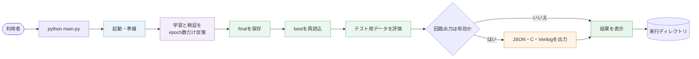
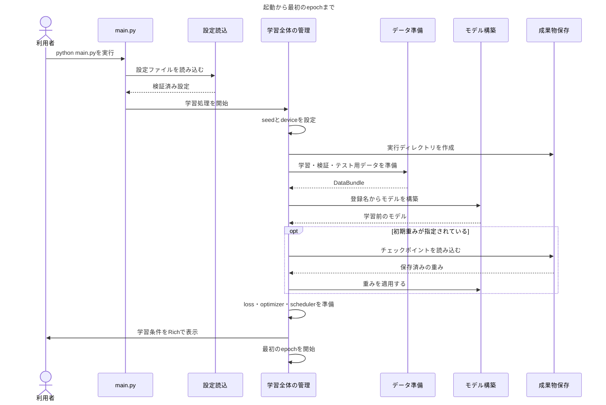
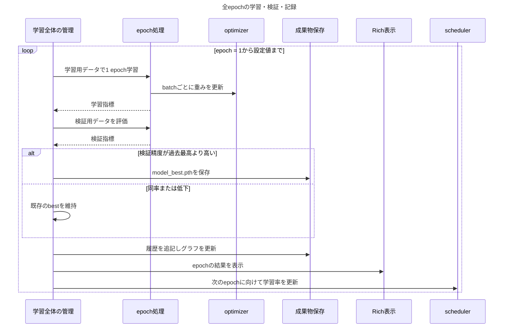
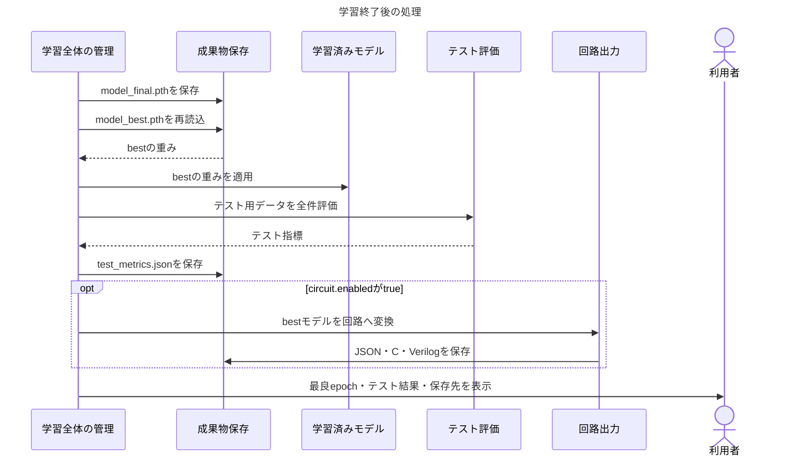
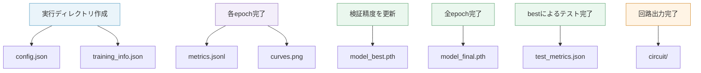

# 全体の処理フロー

このページでは、`python main.py`を実行してから結果が保存されるまでに、logicNNが何を行うかを順番に説明します。個々の設定方法ではなく、処理同士のつながりを把握するためのページです。

詳細なモジュール間の呼び出し順は[基本設計書](../specifications/basic-design.md)、関数内部の処理は[コードリファレンス](../code-reference/index.md)に記載しています。

## 1. 開始から完了まで

logicNNの通常実行は、起動・準備、epoch反復、学習終了後の処理という3段階で進みます。

| 段階 | 主な処理 | 利用者が確認するもの |
|---|---|---|
| 起動・準備 | 設定読込、実行環境の準備、データとモデルの構築 | 端末に表示される学習条件と実行ディレクトリ |
| epoch反復 | 学習、検証、best判定、履歴とグラフの更新 | epochごとのloss、accuracy、learning rate |
| 学習終了後 | final保存、best再読込、テスト、任意の回路出力 | テスト結果、保存先、回路成果物 |

:::note テストの意味

このページの「テスト」は、学習に使用しなかったテスト用データによる最終評価を指します。`pytest`などで実施する開発者用テストとは異なります。

:::

## 2. 起動して学習を始めるまで

起動直後は、学習を始めるために必要な設定、データ、モデルおよび最適化方式を準備します。

初期重みを指定した場合も、保存済みのoptimizerや途中のepochは復元しません。読み込んだ重みを開始地点として、epoch 1から新しい学習を行います。初期重みを指定しなければ、新しく初期化したモデルを使用します。

データセットのダウンロードは、この流れに含まれません。必要なデータは事前に取得してください。MNISTを使用する場合は[データセットのダウンロード](../startup/dataset.md)を参照してください。

## 3. 1 epochごとの学習と検証

準備が完了すると、設定したepoch数だけ学習と検証を繰り返します。

各epochでは、最初に学習用データでモデルの重みを更新し、続いて検証用データで現在のモデルを評価します。検証では重みを変更しません。

検証精度が過去最高を**上回った場合だけ**`model_best.pth`を更新します。同じ精度だった場合は、先に保存したbestを維持します。`model_final.pth`はこの段階では保存せず、すべてのepochが終了した時点の重みを後で保存します。

論理ゲートNNは、学習時には勾配を計算できる連続演算を使用し、検証時には選択済みゲートによる離散演算を使用します。このため、学習用データと検証用データの違いだけでなく、演算方法の違いによっても両者の指標に差が生じます。

## 4. 学習終了後のテストと回路出力

すべてのepochが終了した後は、最終状態と最良状態を区別して保存・評価します。

`model_final.pth`は最後のepochが終了した時点のモデル、`model_best.pth`は最も高い検証精度を記録したモデルです。最終テストと回路出力には、保存済みのbestを実際に読み直して使用します。finalとbestが同じepochになるとは限りません。

テスト用データはモデルの選択には使用せず、学習終了後に一度だけ評価します。回路出力を有効にした場合は、その評価後にJSON、C、Verilogを生成します。各形式の違いと出力範囲は[回路出力](./circuit.md)を参照してください。

## 5. 成果物が作られる時点

成果物は最後にまとめて保存するのではなく、処理の進行に合わせて順次保存します。そのため、エラーや中断が発生した場合でも、それ以前に保存を完了したファイルは実行ディレクトリに残ります。各ファイルの読み方は[ログと成果物](./outputs.md)で説明しています。

## 6. エラーと中断

設定値、登録名、データ、モデル、チェックポイントなどに問題がある場合は、その後の処理を開始せずエラーを表示します。実行ディレクトリの作成後に問題が発生した場合は、調査に使用できるよう、その時点までに作成した成果物を削除しません。

Ctrl+Cで中断した場合も、保存済みの成果物は残ります。ただし、中断した時点の重みを自動的に`model_final.pth`として保存する機能はありません。中断後の扱いは[学習の実行](./training.md#中断と再実行)、エラーの確認方法は[エラー対応](./troubleshooting.md)を参照してください。

## 7. 次に確認するページ

| 確認したい内容 | ページ |
|---|---|
| epoch数、バッチサイズ、学習率などの変更 | [設定ファイル](./configuration.md) |
| CPU・GPUの選択、指標、seed、中断 | [学習の実行](./training.md) |
| bestとfinal、初期重みの利用 | [保存済み重みの利用](./checkpoints.md) |
| 保存ファイルとグラフの読み方 | [ログと成果物](./outputs.md) |
| JSON・C・Verilogの出力範囲 | [回路出力](./circuit.md) |
| モジュール間の正式な呼び出し順 | [基本設計書](../specifications/basic-design.md#7-システムシーケンス図) |
| `run_training()`内部の処理 | [学習workflow](../code-reference/utils/trainer/workflow.md) |
